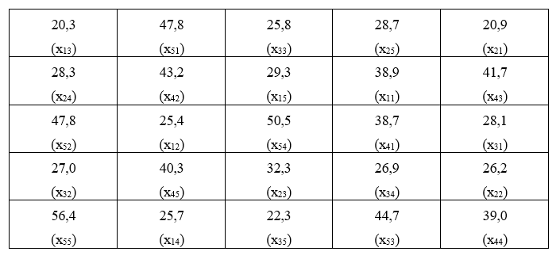

# Delineamento Inteiramente Casualizado

**Caracterização**

O delineamento inteiramente casualizado é o mais simples de todos os delineamentos experimentais, e os experimentos instalados de acordo com este delineamento são chamado de experimentos inteiramente casualizados ou experimentos inteiramente ao acaso (DIC).

Este delineamento apresenta as seguintes características:

1. Leva em consideração os princípios da **repetição** e da **casualização**, deixando de lado o princípio do controle local e, portanto, as repetições não são organizadas em blocos.

2. Os tratamentos são designados às parcelas de forma inteiramente casual, com qualquer número de repetições.

**As principais vantagens desse delineamento são as seguintes:**

1) Flexibilidade, uma vez que o número de repetições pode variar de um tratamento para outro, sem causar sérios problemas na análise.

2) Proporciona o maior número de graus de liberdade possível para o resíduo.
    
**As principais desvantagens desse delineamento são:**
   
1) As parcelas experimentais devem ser homogêneas.
  
2) Leva a uma alta estimativa da variância residual $QM_{Res}$, uma vez que todas as variações, exceto aquela devido ao efeito de tratamentos, são tomadas como variação do acaso.
  
  
Para a instalação desse experimento devemos ter certeza da homogeneidade das condições experimentais. Este delineamento é bastante utilizado em ensaios de laboratório e em ensaios com vasos, realizados dentro de casas de vegetação, em que as condições experimentais podem ser perfeitamente controladas.

A distribuição casual dos tratamentos a todas as parcelas do experimento é a principal característica deste delineamento. Por exemplo, num experimento no delineamento inteiramente casualizado com 5 tratamentos e 5 repetições, a casualização dos tratamentos seria feita sorteando-se para cada uma das 20 parcelas do experimento uma combinação de tratamento e repetição, ou seja:

$$
\begin{matrix}
A1 & A2 & A3 & A4 \\
B1 & B2 & B3 & B4 \\
C1 & C2 & C3 & C4 \\
D1 & D2 & D3 & D4 \\
E1 & E2 & E3 & E4 
\end{matrix}
$$

Assim, um sorteio para distribuição dos tratamentos às parcelas poderia ser o seguinte:

$$
\begin{matrix}
B4 & D1 & B1 & A2 & D4\\
D2 & A1 & C4 & D3 & B3\\
E1 & E3 & B2 & C2 & C2\\
A4 & C1 & E4 & E2 & E2
\end{matrix}
$$

**Modelo Matemático**

Todo delineamento experimental possui um modelo matemático que o representa, que deve ser levado em conta na análise de variância, **aceitando algumas hipóteses básicas necessárias para a validade da análise.** No caso do DIC.

$$
x_{ij}= \mu + \tau_i + \epsilon_{ij}
$$
onde:
$x{ij}$: é o valor observado na parcela que recebeu o tratamento *i* na repetição *j*,

$\mu$: é a média geral do experimento,

$\tau_i$ é o efeito devido ao tratamento *i* que foi aplicado à parcela,

$\epsilon_{ij}$ é o efeito dos fatores não controlados na parcela que recebeu o tratamento *i* na repetição *j*.

**Hipóteses básicas para aplicação da análise de variância**

As hipóteses básicas que devemos admitir para tornar válida a aplicação da análise de variância são as seguintes:

1) **Aditividade**: Os efeitos dos fatores do modelo são aditivos.
  
2) **Independência**: Os erros (desvios) $\epsilon_{ij}$, devido aos efeitos de fatores não controlados ou acaso devem ser independentes.
  
3) **Homocedasticidade (homogeneidade de variâncias)**: Os erros (desvios) $\epsilon_{ij}$, devido ao acaso devem possuir variância comum $\sigma^2$
  
4) **Normalidade dos desvios**: Os erros ou desvios $\epsilon_{ij}$ devido ao acaso devem possuir distribuição normal de probabilidades.

Uma forma resumida de apresentar estas quatro pressuposições é apresentada a seguir:

$$
\epsilon_{ij} \overset{iid}{\tilde{}} N(0,\sigma^2) \\
$$
  

**Exemplo de aplicação DIC**

Num experimento inteiramente casualizado, de competição de variedades de mandioca, realizado numa área perfeitamente homogênea quanto às condições experimentais, foram utilizadas 5 repetições das seguintes variedades:

1 - IAC 5

2 - IAC 7

3 - IAC 11

4 - IRACEMA

5 - MANTIQUEIRA

A designação dos tratamentos às parcelas no campo, juntamente com as produções, expressa em t/ha, foi a seguinte:



Com estes dados, podemos organizar o quadro seguinte:

Tratamentos|Rep.1|Rep.2|Rep.3|Rep.4|Rep. 5|Total
:---|:---:|:---:|:---:|:---:|:---:|:---:
1 - IAC 5|38,9|25,4|20,3|25,7|29,3|139,6
2 - IAC 7 |20,9|26,2|32,3|28,3|28,7|136,4
3 - IAC 11|28,1|27,0|25,8|26,9|22,3|130,1
4 - IRACEMA|38,7|43,2|41,7|39,0|40,3|202,9
5 - MANTIQUEIRA|47,8|47,8|44,7|50,5|56,4|247,2
**Total**||||||**856,2**

As hipóteses que desejamos testar são:

$H_0$: As variedades de mandioca testadas não são diferentes entre si quanto à produção.

$H_1$: As variedades de mandioca testadas diferem entre si quanto à produção.

**Aplicação no R - DIC**

Utilizando o R para obtermos o quadro da análise de variância, os dados estão disponíveis online em: [Mandioca](https://raw.githubusercontent.com/arpanosso/curso_GIEU/master/dados/mandioca.txt).


```{r,message=FALSE, error=FALSE, warning=FALSE}
# Carregando o pacote para a análise
library(ExpDes.pt)
```

```{r,message=FALSE, error=FALSE, warning=FALSE,echo=FALSE}
dic <-function (trat, resp, quali = TRUE, mcomp = "tukey", nl = FALSE, 
    hvar = "bartlett", sigT = 0.05, sigF = 0.05) 
{
    Trat <- factor(trat)
    anava <- aov(resp ~ Trat)
    tab <- summary(anava)
    t <- length(levels(Trat))
    r <- as.numeric(table(Trat))
    colnames(tab[[1]]) <- c("GL", "SQ", "QM", 
        "Fc", "Pr>Fc")
    tab[[1]] <- rbind(tab[[1]], c(apply(tab[[1]], 2, sum)))
    rownames(tab[[1]]) <- c("Tratamento", "Residuo", 
        "Total")
    cv <- round(sqrt(tab[[1]][2, 3])/mean(resp) * 100, 2)
    cat("------------------------------------------------------------------------\nQuadro da analise de variancia\n------------------------------------------------------------------------\n")
    print(tab[[1]])
    cat("------------------------------------------------------------------------\nCV =", 
        cv, "%\n")
    pvalor.shapiro <- shapiro.test(anava$residuals)$p.value
    cat("\n------------------------------------------------------------------------\nTeste de normalidade dos residuos \n")
    cat("Valor-p: ", pvalor.shapiro, "\n")
    if (pvalor.shapiro < 0.05) {
        cat("ATENCAO: a 5% de significancia, os residuos nao podem ser considerados normais!\n------------------------------------------------------------------------\n")
    }
    else {
        cat("De acordo com o teste de Shapiro-Wilk a 5% de significancia, os residuos podem ser considerados normais.\n------------------------------------------------------------------------\n")
    }
    if (hvar == "bartlett") 
        pvalor.hvar <- bartlett(trat, resp, t, r)
    if (hvar == "levene") 
        pvalor.hvar <- levene(trat, resp, t, r)
    if (hvar == "samiuddin") 
        pvalor.hvar <- samiuddin(trat, resp, t, r)
    if (hvar == "oneillmathews") 
        pvalor.hvar <- oneillmathews(trat, resp, t, r)
    if (hvar == "layard") 
        pvalor.hvar <- layard(trat, resp, t, r)
    cat("\n------------------------------------------------------------------------\nTeste de homogeneidade de variancia \n")
    cat("valor-p: ", pvalor.hvar, "\n")
    if (pvalor.hvar < 0.05) {
        cat("ATENCAO: a 5% de significancia, as variancias nao podem ser consideradas homogeneas!\n------------------------------------------------------------------------\n")
    }
    else {
        cat("De acordo com o teste de", hvar, "a 5% de significancia, as variancias podem ser consideradas homogeneas.\n------------------------------------------------------------------------\n")
    }
    if (tab[[1]][1, 5] < sigF) {
        if (quali == TRUE) {
            if (mcomp == "tukey") 
                tukey(resp, Trat, tab[[1]][2, 1], tab[[1]][2, 
                  2], sigT)
            if (mcomp == "duncan") 
                duncan(resp, Trat, tab[[1]][2, 1], tab[[1]][2, 
                  2], sigT)
            if (mcomp == "lsd") 
                lsd(resp, Trat, tab[[1]][2, 1], tab[[1]][2, 2], 
                  sigT)
            if (mcomp == "lsdb") 
                lsdb(resp, Trat, tab[[1]][2, 1], tab[[1]][2, 
                  2], sigT)
            if (mcomp == "sk") 
                scottknott(resp, Trat, tab[[1]][2, 1], tab[[1]][2, 
                  2], sigT)
            if (mcomp == "snk") 
                snk(resp, Trat, tab[[1]][2, 1], tab[[1]][2, 2], 
                  sigT)
            if (mcomp == "ccboot") 
                ccboot(resp, Trat, tab[[1]][2, 1], tab[[1]][2, 
                  2], sigT)
            if (mcomp == "ccf") 
                ccf(resp, Trat, tab[[1]][2, 1], tab[[1]][2, 2], 
                  sigT)
        }
        else if (nl == FALSE) 
            reg <- reg.poly(resp, trat, tab[[1]][2, 1], tab[[1]][2, 
                2], tab[[1]][1, 1], tab[[1]][1, 2])
        else if (nl == TRUE) 
            reg <- reg.nl(resp, trat)
    }
    else {
        cat("\nDe acordo com o teste F, as medias nao podem ser consideradas diferentes.\n")
        cat("------------------------------------------------------------------------\n")
        mean.table <- tapply.stat(resp, trat, mean)
        colnames(mean.table) <- c("Niveis", "Medias")
        print(mean.table)
        cat("------------------------------------------------------------------------\n")
    }
    out <- list()
    out$residuos <- anava$residuals
    out$gl.residual <- anava$df.residual
    out$coeficientes <- anava$coefficients
    out$efeitos <- anava$effects
    out$valores.ajustados <- anava$fitted.values
    out$medias <- tapply.stat(resp, trat, mean)
    if (quali == FALSE && tab[[1]][1, 5] < sigF) {
        out$reg <- reg
    }
    invisible(out)
}
```


```{r,message=FALSE, error=FALSE, warning=FALSE}
# Definindo o caminho dos dados
caminho<-"https://raw.githubusercontent.com/arpanosso/curso_GIEU/master/dados/mandioca.txt"

# Lendo o arquivo de dados
dados<-read.table(caminho, h=T, sep="\t")

# verificando os 6 primeiros registros
head(dados)

# Análise de variância e teste de Tukey com a função dic
trat <- as.factor(dados$Trat) # Criando o vetor de tratamentos
y <- dados$Y # Criando o vetor com a variável resposta

# Criando o modelo
mod <- aov(y ~ trat)
anova(mod)

# Utilizando a função dic - delineamento inteiramente casualizado
dic(trat, y, quali=TRUE, mcomp = "tukey")
```