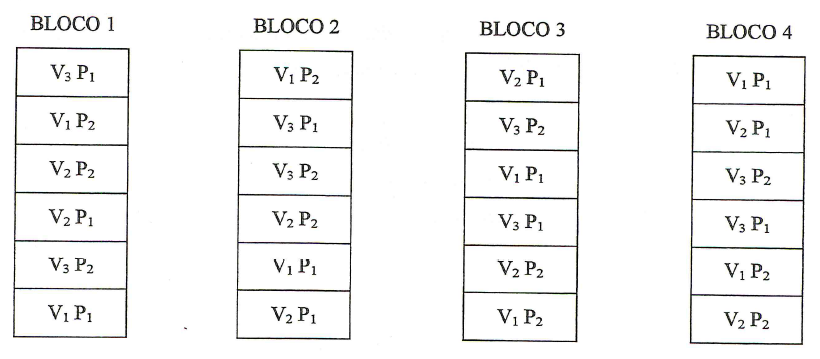

# EXPERIMENTOS FATORIAIS

## Introdução

Os experimentos simples, realizados de acordo com o delineamento interiamente casualizado ou em blocos casualizados, são utilizados para testar os efeitos de apenas um  tipo de **tratamento**, ou **fator**, sendo os demais mantidos constantes.

Assim, por exemplo, num experimento de comparação de inseticidas em relação ao controle de uma determinada praga, devemos manter constante a dosagem, o método de aplicação, os tratos culturas, etc.

Porém, há casos em que necessitamos testar simultaneamente os efeitos de dois ou mais tipos de tratamentos (fatores) para obtermos resultados de interesse prático. Por exemplo, supondo que desejamos testar 3 inseticidas, 2 métodos de aplicação e 4 dosagens, teremos então um experimento fatorial de $3\times2\times4$.

Os experimentos fatoriais são aqueles que nos permitem estudar, simultaneamente, os efeitos de dois ou mais tipos de fatores (tratamentos).  Assim, eles devem ser instalados em um dos delineamentos já estudados (DIC, DBC, etc.).

Estes experimentos são utilizados em quase todos os campos de investigação e são bastante úteis em pesquisas iniciais, nas quais pouco se conhece a respeito de uma série de fatores.  

**O número de tratamentos nos experimentos fatoriais consiste de todas as combinações possíveis dos níveis dos fatores**.

Por exemplo, se estamos interessados em testar o efeito de 3 inseticidas, cada um dos quais em 4 doses, teremos os 12 tratamentos seguintes.

$$
\begin{array}{} 
I_1 D_1  & I_2D_1  & I_3D_1 \\
I_1D_2  & I_2D_2  & I_3D_2 \\
I_1D_3  & I_2D_3  & I_3D_3 \\ 
I_1D_4  & I_2D_4  & I_3D_4 \end{array}
$$

Neste caso, representamos o esquema fatorial como: $\text{Fatorial }3 \times 4$ com 3 inseticidas e 4 dosagens.

**As subdivisões de um fator são denominados NÍVEIS desse fator**. Então, no exemplo anterior, o fator **Inseticida** ocorrem em **3 níveis**, e o fator **Dosagem** ocorre em **4 nívies**. Assim, no ensaio acima, podemos obter conclusões sobre a qual o melhor inseticida, qual a melhor dosagem e qual a melhor dosagem para cada inseticida.

## Classificação dos Experementos Fatoriais

**Fatoriais de série $2^N$**

Nesta série são enquadrados os experimentos fatoriais em que são estudados os efeitos de N fatores cada um em 2 níveis.

BASE = Nº de Níveis  
EXPOENTE = Nº de Fatores

Exemplos:
$$
2^2 \Rightarrow \text{2 Fatores em 2 Níveis} \\
2^3 \Rightarrow \text{3 Fatores em 2 Níveis} \\
2^4 \Rightarrow \text{4 Fatores em 2 Níveis} \\
$$

etc.

**Fatoriais de série**

Nesta série são enquadrados os experimentos fatoriais em que são estudados os efeitos de N fatores cada um em 3 níveis.

Exemplos:
$$
3^2 \Rightarrow \text{2 Fatores em 3 Níveis} \\
3^3 \Rightarrow \text{3 Fatores em 3 Níveis} \\
3^4 \Rightarrow \text{4 Fatores em 3 Níveis} \\
$$
etc.


**Fatoriais de série mista**

Nesta série são enquadrado os fatoriais em que os fatores ocorrem em número diferente de níveis:

Exemplo: 
$$
4\times 3\times 2 \Rightarrow \begin{cases} \text{1º Fator em 4 Níveis }\\ \text{2º Fator em 3 Níveis } \\ \text{3º Fator em 2 Níveis } \end{cases}
$$

## Casualização dos tratamentos

Para exemplificar a casualização dos tratamentos, vamos supor um experimento fatorial $3 \times 2$, com 3 variedades de milho ($V_1,V_2,V_3$) e 2 níveis de adubação dom $P_2O_5$ ($P_1 e\; P_2$). Se o experimento fosee instalado de acordo com o delineamento em blocos casualizados, com 4 repetições, teríamos:


## Análise de variância de um experimento fatorial com 2 fatores com interação não significativa

Para a obtenção da análise de variância, vamos utlizar os dados adaptados do trabalho "Ensaios em condições de casa-de-vegetação para controlo químico do 'damping-off' em *Eucalyptus saligna* Sm.", realizado por KRUGNER; CARVALHO (1971) e publicado em IPEF, n 2/3 p. 97-113. O ensaio foi realizado no delineamento inteiramente casualizado, com 3 repetições e foram estudados os efeitos sobre a altura média das mudas de *Eucalytus saligna*, do fatores:

**Tratamento do solo (S)**, sendo:  
$S_1=\text{Vapam}$  
$S_2=\text{Brometo de metila}$  
$S_3=\text{PCNB}$  
$S_4=\text{Testemunha}$  

**Pulverização** com fungicida em pós emergência, sendo:  
$F_0 = \text{Sem fungicida}$   
$F_1 = \text{Com fungicida}$

As alturas médias de mudas (cm) 28 dias após a semeadura foram:

|Tratamentos|Rep.1|Rep.2|Rep.3|Total
|:---|:---:|:---:|:---:|---:|
|$S_1F_0$|4,65|5,18|5,52|15,35
|$S_1F_1$|4,86|4,81|4,51|14,18
|$S_2F_0$|4,55|5,16|6,00|15,71
|$S_2F_1$|4,73|5,51|5,09|15,33
|$S_3F_0$|2,68|2,65|2,56|7,89
|$S_3F_1$|2,90|2,71|2,93|8,54
|$S_4F_0$|3,48|2,75|3,06|9,29
|$S_4F_1$|2,65|2,47|2,83|7,95
|**Total** ||||	**94,24**

Os dados podem ser encontrados online em [solofungi.txt](https://raw.githubusercontent.com/arpanosso/curso_GIEU/master/dados/solofungi.txt)


## Aplicação em R - Fatorial com Interação Não Significativa


**Utilizando as funções básicas e o pacote agricolae**
```{r}
# Carregando o pacote para análise de variância
library(agricolae)
library(tidyverse)

# Definindo o caminho do banco de dados
caminho<-"https://raw.githubusercontent.com/arpanosso/curso_GIEU/master/dados/solofungi.txt"

# Entrada da dados
dados<-read.table(caminho,h=TRUE)

#Guardando os fatores (tratamentos de solo e fungicidas) e a variável resposta (y)
solos<-as.factor(dados$S)
fungicida<-as.factor(dados$F)
y<-dados$y

# Gráfico da interação
dados %>% 
  group_by(S,F) %>% 
  summarise(Y = mean(y)) %>% 
  ggplot(aes(x=S, y=Y,col=as.factor(F)))+
  geom_line()+
  labs(x="Tratamentos do solo",y="Altura de plantas (cm)",col="Fungicida")

dados %>% 
  group_by(S,F) %>% 
  summarise(Y = mean(y)) %>% 
  ggplot(aes(x=F, y=Y,col=as.factor(S)))+
  geom_line()+
  labs(x="Fungicida",y="Altura de plantas (cm)",col="Tratamentos do solo")

```
**Analise considerando o delineamento de tratamentos**
```{r}
mod <- aov(y~solos+fungicida+solos:fungicida)
anova(mod)
```

**Medias dos efeitos principais e da interação**
```{r}
model.tables(mod,type="means")
```

**SE A INTERAÇÃO FOR NÃO SIGNIFICATIVA**

**Comparações múltiplas (Tukey) para os efeitos principais**

```{r}
HSD.test(mod,"solos",group=TRUE,console=TRUE)
HSD.test(mod,"fungicida",group=TRUE,console = TRUE)
```

**SE A INTERAÇÃO FOR SIGNIFICATIVA**

**Desdobramento de Tratamento de Solos dentro Fungicida**

```{r}
# Redefinindo o modelo para o estudo das interações
modab <- aov(y~fungicida/solos) # Colocar os Controles locais, blocos, se for o caso

# Observe a posição dos efeitos que tem a interação fungicida:solos
effects(modab)

### defina a lista que apresetam fungicida 0 e 1 nos efeitos abaixo
effects(modab)[3:8]
summary(modab,split=list("fungicida:solos"=list(Fung0=c(1,3,4), # tem fungicida 0
                                                Fung1=c(2,4,6)))) # tem fungicida 1
```

**Desdobramento de Fungicida dentro Tratamento de Solo**

```{r}
# Redefinindo o modelo para o estudo das interações
modba <- aov(y~solos/fungicida) # Colocar os Controles locais, blocos, se for o caso

# Observe a posição dos efeitos que tem a interação solos:fungicida
effects(modba)

### defina a lista que apresentam os solos 1 2 3 e 4 nos efeitos abaixo
effects(modba)[5:8]
summary(modba,split=list("solos:fungicida"=list(Tsolo1=1, # tem solo 1
                                                Tsolo2=2, # tem solo 2
                                                Tsolo3=3, # tem solo 3
                                                Tsolo4=4 # tem solo 4
                                                ))) 
```

**Utilizando ao pacrote ExpDes.pt, mais prático**

```{r}
# Carregando o pacote para análise de variância
library(ExpDes.pt)

# Definindo o caminho do banco de dados
caminho<-"https://raw.githubusercontent.com/arpanosso/curso_GIEU/master/dados/solofungi.txt"

# Entrada da dados
dados<-read.table(caminho,h=TRUE)

#Guardando os fatores (tratamentos de solo e fungicidas) e a variável resposta (y)
solos<-dados$S
fungicida<-dados$F
y<-dados$y

# Utilizando a função fat2.dic do pacote ExpDes.pt
fat2.dic(solos,fungicida,y,fac.names = c("Trat.Solo", "Fungicida"))
```


