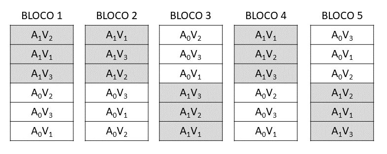
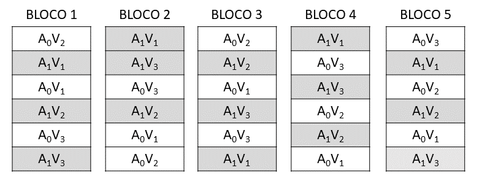

# Experimentos em Parcelas Subdivididas

**Introdução**

Os experimentos em parcelas subdivididas, também conhecidos como "Split-plot", são utilizados quando, num mesmo ensaio, queremos testar os efeitos de 2 ou mais fatores, mas em condições experimentais um pouco diferentes daquelas utilizadas nos experimentos fatoriais.

Por exemplo: 

* 4 Variedades e 3 Níveis de Adubação  
* 3 Níveis de Irrigação e 4 Níveis de Adubação  
* 3 Espaçamentos e 4 densidades de Semeadura  etc.  
      
As unidade experimentais ou parcelas, são divididas em partes menores e iguais, chamadas de subparcelas. 

As parcelas podem ser distribuídas de acordo com um delineamento qualquer, ou seja, inteiramente ao acaso ou blocos casualizados. A principal característica deste delineamento é a casualização dos tratamentos, que é feita em 2 estágios.

**1)** No primeiro estágio, é feita a casualização dos níveis do fator testado, nas parcelas, de acordo com o delineamento adotado.
  
**2)** No segundo estágio, em cada parcela, é feita a casualização dos níveis do fator que será testado nas subparcelas.
  
Denominamos de tratamentos principais ou tratamento primários, àqueles que são colocados nas parcelas, e de tratamento secundários ou subtratamentos àqueles que são colocados nas subparcelas.
  
Nesses experimentos, temos 2 resíduos: O **resíduo a**, que serve como base de comparação para os tratamentos principais, e o **resíduo b**, que serve como base de comparação para os tratamentos secundários e para a interação $P \times S$.
  
Em consequência do tipo de casualização feia, o erro experimental devido aos tratamentos secundários (QM Resíduo b), geralmente é menor que o erro experimental devido aos tratamentos principais (QM Resíduo a).
  
Dessa maneira, os efeitos dos tratamentos principais são determinados com menor precisão que os efeitos dos tratamentos secundários.
  
Assim, por exemplo, num experimento em parcelas subdivididas, com os fatores: Adubação (tratamento principal-I) e Variedades (tratamento secundário-K), sendo utilizados 2 níveis de Adubação ($A_0\; e\; A_1$) e 3 Variedades ($V_1\;V_2\;e\; V_3$), o esquema de casualização os tratamento, se o experimento fosse montado de acordo com o DBC, com 5 blocos (J), seria o seguinte.


**Observação**: Caso este mesmo ensaio fosse montado de acordo com o esquema fatorial $2 \times 3$ em 5 blocos, a casualização seria feita de modo diferente e, como exemplo, apresentamos o sorteio do delineamento seguinte:



**Exemplo de Aplicação**

Para a obtenção da análise de variância de um experimento em parcelas subdivididas, vamos utilizar os dados obtidos do trabalho intitulado "Efeito de épocas de plantio, sobre várias características agronômicas na cultura da soja (*Glycine max*. (L.) Merril), variedades Santa Rosa e Viçoja, e Jaboticabal, SP", realizado por K. YUYAMA (1976). Foram utilizadas 8 épocas de plantio (20/10/74, 30/10/74, 10/11/74, 20/11/74, 30/11/74, 10/12/47, 20/12/74 e 30/12/74) e duas variedade de soja ($V_1$ = Viçoja e $V_2$ = Santa Rosa). O ensaio foi montado de acordo com o delineamento em parcelas subdivididas, com as épocas de plantio nas parcelas, e as variedades nas subparcelas. Os resultados obtidos para produção de grãos ($t\;ha^{-1}$), foram os seguintes:

|Tratamentos|Bloco 1|Bloco 2|Bloco 3|Total|
|:---|:---:|:---:|:---:|:---:|
|$E_1V_1$|2,9166|2,8833|2,4750|8,2749|
|$E_1V_2$|2,6416|3,6666|3,6166|9,9248|
|$E_2V_1$|3,4889|3,5833|3,3333|10,4055|
|$E_2V_2$|4,0583|4,3000|2,9083|11,2666|
|$E_3V_1$|2,3166|2,8666|2,4916|7,6748|
|$E_3V_2$|3,4500|3,7666|3,5333|10,7499|
|$E_4V_1$|2,7916|2,7583|3,1916|8,7415|
|$E_4V_2$|3,4166|2,7416|3,5083|9,6665|
|$E_5V_1$|3,5583|3,1583|2,7916|9,5082|
|$E_5V_2$|3,5000|3,1166|3,0916|9,7082|
|$E_6V_1$|2,7833|2,5166|2,1250|7,4249|
|$E_6V_2$|2,5583|2,5666|2,0416|7,1665|
|$E_7V_1$|2,3000|2,2083|2,0666|6,5749|
|$E_7V_2$|1,4250|1,9166|1,8750|5,2166|
|$E_8V_1$|1,1666|1,6916|1,4666|4,3248|
|$E_8V_2$|2,0083|1,7833|1,7416|5,5332|
|Total|44,3800|45,5242|42,2576|**132,1618**|

os dados estão disponíveis online em: [sojapsub.txt](https://raw.githubusercontent.com/arpanosso/curso_GIEU/master/dados/sojapsub.txt).

**Aplicação em R - Parcelas Subdivididas**


```{r}
require(ExpDes.pt)
caminho<-"https://raw.githubusercontent.com/arpanosso/curso_GIEU/master/dados/sojapsub.txt"
d<-read.table(caminho,h=T)
psub2.dbc(d$E,d$V,d$Bloco,d$Y,fac.names = c("Épocas","Variedades"))
```


