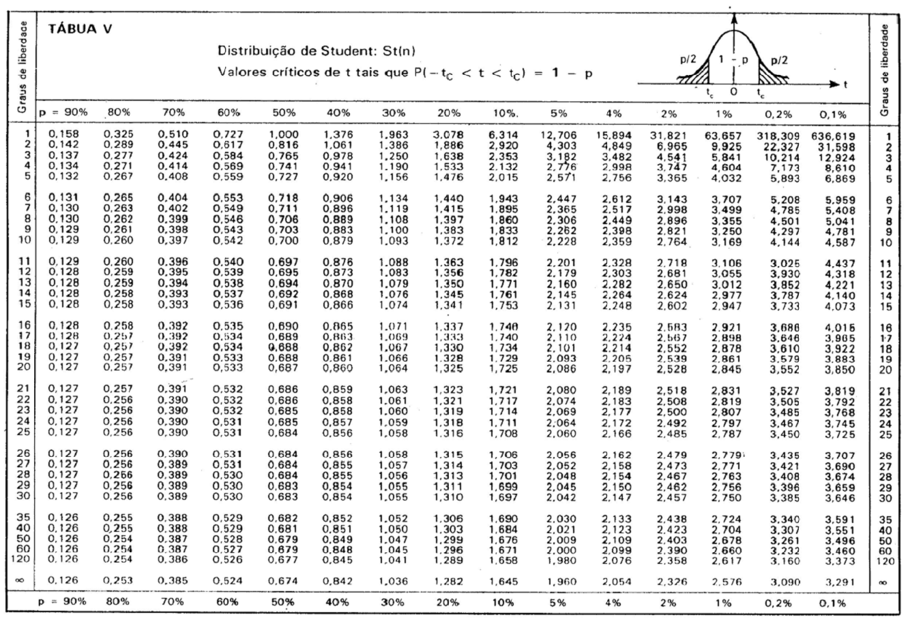
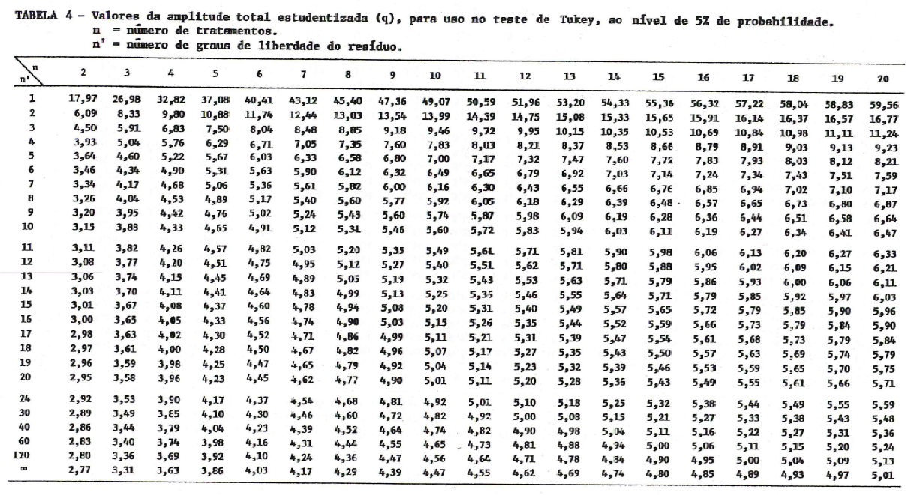
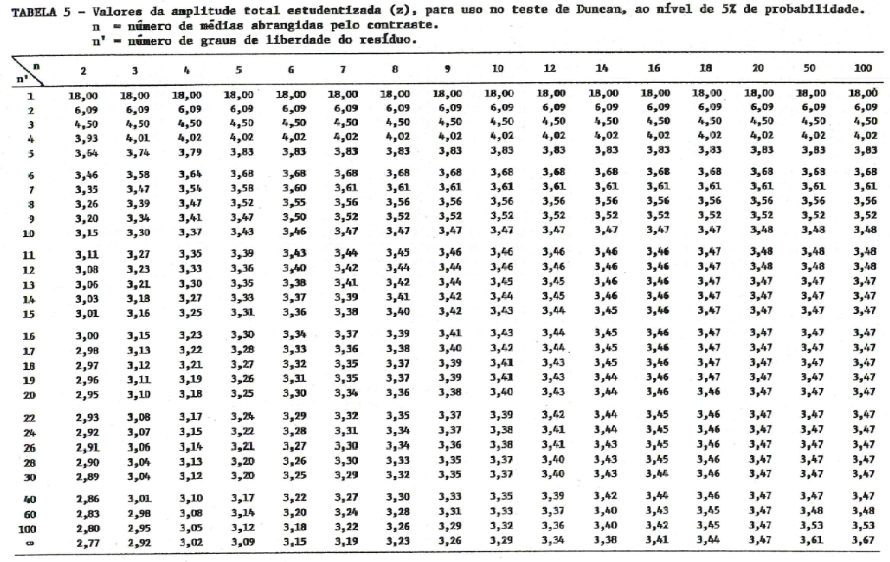
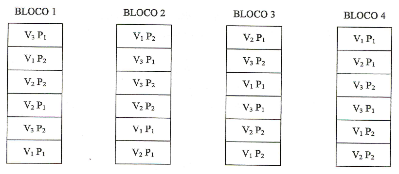

--- 
title: "Curso do R do GIEU"
author: "Alan R. Panosso"
date: "`r Sys.Date()`"
site: bookdown::bookdown_site
documentclass: book
bibliography: [book.bib, packages.bib]
biblio-style: apalike
link-citations: yes
description: "Etapa do curso visando a apresentação da análise dos principais delineamentos experimentais utilizando o R"
---
# INTRODUÇÃO AO CURSO

A Estatística Experimental tem como objetivo o estudo dos experimentos, isto é, seu planejamneto, execução, análise dos dados e interpretação dos resultados obtidos.

Para que um experimentador conduza e avalie uma pesquisa corretamente, é essencial um certo conhecimento de estatística, principalmente no que se refere às potencialidades e às limitações das técnicas utilizadas. Assim sendo, o curso de Experimentação Agrícola visa apresentar aos alunos os métodos estatística mais usado em Agronomia.

Vejamos então, alguns conceitos básicos necessários para um bom entendimento da estatística Experimental

## Alguns conceitos básicos

**POPULAÇÃO**

Boa parte do conhecimento humano está baseado em um número relativamente reduzido de informações. Isto é verdadeiro, tanto no que se refere aos problemas do cotidiano, como no que se refere à pesquisa científica.

Por definição **POPULAÇÃO** é o conjunto de elementos que têm em comum uma determinada característica. Todo o subconjunto não vazio e com menor número de elemento do que o conjunto definido como **população** constitui, por definição, uma **AMOSTRA** desta população.

Uma população em ecologia é o número total de indivíduos de uma determinada espécie em uma área definida. Por exemplo, o número total de lagartas de *Spodoptera frugiperda* em uma cultura de milho constitui uma população. Esta população, embora finita, é considerada para fins de amostragem como uma população infinita.

Uma vez definida a unidade amostral (1 planta, um conjunto de 5 plantas, ou um quadrado no qual será contado o número de lagartas), a população pode ser considerada como um conjunto de unidades amostrais e um subconjunto tomado aleatoriamente deste subconjunto é chamado de **AMOSTRA ALEATÓRIA DE TAMANHO N**. 

Assim sendo, as observações são obtidas através de contagens do número de indivíduos em cada unidade amostral. Estas observações são chamadas de **VARIÁVEL EM ESTUDO**.

**TRATAMENTO**

É o método, elemento ou material, cujo efeito se deseja medir ou comparar em um experimento. Por exemplo, um tratamento pode ser: Uma variedade de cana-de-açúcar, um híbrido de sorgo, uma dose de um adubo para a cultura do milho, um espaçamento para cultura do algodão, um recipiente para produção de mudas de eucalipto, um inseticida para controle de pragas, etc. 

**EXPERIMENTO OU ENSAIO**

Experimento é um trabalho previamente planejado, no qual se faz comparação dos efeitos dos tratamentos.

**UNIDADE EXPERIMENTAL OU PARCELA**

É a unidade na qual o tratamento é aplicado. É na parcela que obtemos os dados que deverão refletir o efeito de cada tratamento no ensaio. A parcela pode ser constituída por uma planta, uma área om um grupo de plantas, uma placa de petri com um meio de cultura, um animal, um lote de animais, etc.

**DELINEAMENTO EXPERIMENTAL**

É o plano utilizado na experimentação, e implica na forma como os tratamento deverão ser distribuídos nas unidades experimentais e como serão analisados os dados a serem obtidos. Como exemplo, temos o delineamento inteiramente casualizado (DIC), o delineamento em blocos casualizados (DBC) o delineamento em quadrado latino (DQL), entre outros.

## Medidas de posição e de tendência central

As populações são descritas por certas características chamadas de **Parâmetros**. A amostras são descritas pelas mesmas características, que, neste caso, são chamadas de **Estimativas de Parâmetros**, **Estatísticas da amostra**. Alguns destes parâmetros são chamado de **medidas de posição** e outros de **medida de dispersão**


**MEDIDAS DE POSIÇÃO OU DE TENDÊNCIA CENTRAL**

Uma característica comum a todas as populações ou amostras é a varaibilidade dos indivíduos que as constituem.

Geralmente, os dados de uma população ou amostra tendem a ser mais numerosos em torno de um valor central e vão se tornando mais raros à medida que no afatamos desse valor. A medida de posição representa o valor em torno do qual os dados observados tendem a se agrupar.

Das medidas de posição, a mais utilizada é a Média Aritmética, que pode se definida como: `A Soma de todas as observações divididas pelo número delas` 

Assim, para uma população com $N$ elementos, ditos $x_1$, $x_2$, ... , $x_N$, a média aritmética será:

$$
m = \frac{\sum_{i=1}^{N}x_i}{N} = \frac{x_1+x_2+...+x_N}{N}
$$
Para uma amostra com $n$ elementos, ditos $x_1$, $x_2$, ... , $x_n$, a média aritmética será:

$$
\bar{x}=\hat{m} = \frac{\sum_{i=1}^{N}x_i}{N} = \frac{x_1+x_2+...+x_N}{n}
$$
**exemplo**

Considere como exemplo os dados abaixo, referente à altura de plantas daninha (em cm) em uma amostra de 5 plantas em uma área de pastagem.

$x_1$ | $x_2$ | $x_3$ | $x_4$ | $x_5$ 
----|-----|-----|-----|---
5|3|2|4|3


Então, para estes dados, a estimativa da média aritmética será:

$$
\hat{m} = \frac{\sum_{i=1}^{N}x_i}{N} = \frac{5+3+2+4+3}{5} = \frac{17}{5} = 3,4\;cm
$$


```{r}
# Defina o vetor de dados
X <- c(5,3,2,4,3)

# Calculando a soma dos elementos de X (G)
G=sum(X)
G

# Encontrando o número total de elementos de X
n=length(X)
n

# Calculando diretamente a média aritmética
mean(X)
```

A diferença entre um valor observado ($x_i$) e a média aritmética ($\hat{m}$) é denominado de desvio ($d_i$), ou seja:

$$
 d_i = x_i - \hat{m}, \text{ para  i =1, 2, ...,n  }
$$

$d_1 = 5-3.4$ | $d_2=3-3.4$ | $d_3 = 2-3.4$ | $d_4 = 4-3.4$ | $d_5 = 3-3.4$ 
----|-----|-----|-----|---
1,6|-0,4|-1,4|0,6|-0,4

Podemos mostrar que a soma dos desvios é igual a zero, para qualquer conjunto de dados.

$$
\sum_{i=1}^{N}d_i = 0
$$


```{r}
# Calculando os desvios
d<-X-mean(X)

# Apresentando os valores de desvios
d

# Prova de que o A Soma dos Desvios é igual a Zero
round(sum(d))  # a função rond arredonda a saida da função soma para 0 casas decimais
```

**MEDIDAS DE DISPERSÃO**

As medidas de dispersão são também chamadas de **medidas de variação**, e medem o grau com que os dados tendem a se afastar de um valor central, que geralmente é a média aritmética.

Como em todas as amostras (ou populações) ocorre variabilidade dos elementos que as constituem, amostra com mesma média pode apresentar distribuições diferentes, e portanto, somente a média não fornece informação clara de como os dados se distribuem. Assim, para representar melhor a maneira pela qual os dados se distribuem, são utilizadas as medidas de dispersão ou de variação.

Dentre as medidas de dispersão, discutiremos a Variância, o Desvio PAdrão, o Erro padrão da Média e o Coeficiente de variação.


**VARIÂNCIA**

A variância é uma medida de dispersão que leva em conta todas as observações. É indiscutivelmente, a melhor medida de dispersão.

A variância de uma população é representada por $\sigma^2$, lê-se sigma dois, e pode ser definida como "A média dos quadrados dos desvios de todos os dados em relação à média aritmética". 

Então, para uma população com $N$ temos:

$$
\sigma^2 = \frac{SQD}{N} = \frac{d_1+d_2+...+d_N}{N} =\frac{\sum_{i=1}^Nd_i^2}{N} \\
\sigma^2 =\frac{\sum_{i=1}^N(x_i-m)^2}{N}
$$
 
Note que utilizando esta fórmula o cálculo da variancia seria bastante trabalhoso, no caso de N ser um número muito grande.

Existe porém um método mais prático de se calcular a variância, que pode ser obtido desenvolvendo-se as fórmula da soma de quadrados dos desvios (SQD) . Assim, temos:

$$
SQD = \sum_{i=1}^N(x_i-m)^2 = \sum_{i=1}^Nx_i^2-\frac{(\sum_{i=1}^N x_i)^2}{N}
$$

Então, a fórmula simplificada da variância será:

$$
\sigma^2 =\frac{\sum_{i=1}^Nx_i^2-\frac{(\sum_{i=1}^N x_i)^2}{N}}{N}
$$

A vantagem desta fórmula é que trabalhamos diretamente com os dados originais, não havendo necessidade de calcularmos a média e os desvios em relação a ela.

O termo $\frac{(\sum_{i=1}^Nx_i)^2}{N}$ é denomidado de Correção devido à média ou simplesmente **Correção**, representado por $C$ e é de grande utilização nas futuras análise de variâncias.


Normalmente, na prática, trabalhamos com amostras, e a estimativa da variância, representada por $s^2$, é calculada, para uma **amostra** com $n$ elementos, representados por $x_1$, $x_2$, ...,$x_n$, por:

$$
s^2 = \frac{SQD}{n-1} = \frac{d_1+d_2+...+d_n}{n-1} =\frac{\sum_{i=1}^nd_i^2}{n-1} \\
s^2 =\frac{\sum_{i=1}^n(x_i-\hat{m})^2}{n-1}
$$

ou ainda,

$$
s^2 =\frac{\sum_{i=1}^nx_i^2-\frac{(\sum_{i=1}^n x_i)^2}{n}}{n-1}
$$

**Observações:**

1 - A variância tem sempre valor positivo, e sua unidade é quadrática.

2 - O denominador utilizado do nálculo da variância é chamado de **grau de liberdade** da estimativa da variância, sempre dado por $n-1$

**exemplo**
No exemplo anterior de altura de plantas daninhas:

No caso temos  

$d_1 = 5-3.4$ | $d_2=3-3.4$ | $d_3 = 2-3.4$ | $d_4 = 4-3.4$ | $d_5 = 3-3.4$ 
----|-----|-----|-----|---
1,6|-0,4|-1,4|0,6|-0,4


$$
s^2 =\frac{(1,6^2+(-0.4)^2+(-1,4)^2+0,6^2+(-0,4)^2)^2}{5-1} = \frac{5.2}{4} = 1,3 \;cm^2
$$


Pela fórmula que não utiliza os desvios teríamos:

$x_1$ | $x_2$ | $x_3$ | $x_4$ | $x_5$ 
----|-----|-----|-----|---
5|3|2|4|3


$$
s^2 =\frac{\sum_{i=1}^nx_i^2-\frac{(\sum_{i=1}^n x_i)^2}{n}}{n-1} = \frac{(5^2+3^2+2^2+4^2+3^2)-\frac{(5+3+2+4+3)^2}{5}}{5-1} = \frac{63-\frac{(17)^2}{5}}{5-1} = \frac{63-57,8}{4}=1,3 \;cm^2
$$


```{r}
# Forma mais simples de calcular a variância amostral
var(X)

```

**DESVIO PADRÃO**

A variância, pela sua natureza, tem a unidade quadrática. A sua raiz quadrada, que ainda é uma medida de dispersão é denominada desvio padrão:

A vantagem do desvio padrão é ter a mesma unidade dos dados originais e, consequentemente, da média.

É a mais utilizada das medidas de dispersão, e é representada por $\sigma$ para a população, com estimativa $s$ para a amostra. Então:


$$
\sigma = \sqrt{\sigma^2} \text{   e    } s = \sqrt{s^2}
$$

**exemplo**

$$
s = \sqrt{1,3} = 1,140175\;cm
$$


```{r}
# Forma mais simples de calcular o desvio padrão
sd(X)
```

**ERRO PADRÃO DA MÉDIA**

Se em vez de uma amostra tivéssemos várias, provenientes de uma mesma população, obteríamos diversas estimativas da média, e provavelmente distintas umas das outras.

A partir dessas diversas estimativas da média, poderíamos estimar uma variância, considerandos-e os desvios de cada média individual, em relação à média de todas elas. Seria então uma estimativa da variância das médias.

Entretanto, demonstra-se que a partir de uma única amostra, podemos estimar essa variância, através da fórmula:

$$
Var(\bar{X}) = \hat{V}(\hat{m}) = \frac{s^2}{n}
$$

onde $s^2$ é a estimativa da variância dos $n$ dados, calculada de maneira usual

A sua raiz quadrada é denominada Erro Padrão da Média, ou seja:

$$
s(\hat{m}) = \frac{s}{\sqrt{n}}
$$

O erro padrão da média fornece uma idéia da precisão da estimativa da média, isto é quanto menor ele for, maior precisão terá a estimativa da média.

Assim para os dados de altura de plantas daninhas temos:

**exemplo**

$$
s(\hat{m}) = \frac{s}{\sqrt{n}} = \frac{1,140175}{\sqrt{5}} = 0,599\;cm
$$


```{r}
# Erro padrão da média
sd(X)/sqrt(n)
```

Sempre que apresentarmos uma média, é conveniente apresentar também o seu erro padrão. Assim, no exemplo poderíamos apresentar a média e o seu erro padrão, da seguinte maneira:

$$
3,4 \pm 0,599\;cm
$$

Quanto menor o valor do erro padrão da média, mais precisa foi a estimativa da média.

**COEFICIENTE DE VARIAÇÃO**

É uma medida de dispersão que expressa percentualmente o desvio padrão por unidade de média, ou seja:

$$
CV = \frac{100 \cdot s}{\hat{m}}
$$

Como $s$ e $\hat{m}$ são expressos na mesma unidade dos dados, o coeficiente de variação é um número abstrato, isto é, não tem unidade e portanto é expresso em porcentagem da média. 

Nos ensaios agrícolas de campo, esperam-se coeficientes de variação da ordem de 10 a 20%. Porém em ensaios de levantamento de pragas, normalmente os coeficientes de variação são maiores que 30%.

No exemplo de altura de plantas daninhas, temos:

**exemplo**

$$
CV = \frac{100 \cdot s}{\hat{m}} = \frac{100 \cdot 1,140175}{3,4} = 33,53\%
$$

```{r}
# Coeficiente de Variação
100*sd(X)/mean(X)
```


<!--chapter:end:index.Rmd-->

# COMPARAÇÕES DE PARÂMETROS DE DUAS POPULAÇÕES

## Comparação da variância de duas populações normais

Suponha duas amostras aleatórias independentes de tamanhos $n_1$ e $n_2$ ou  seja, $X_1,X_2,...,X_{n_1}$ e $Y_1,Y_2,...,Y_{n_2}$, respectivamente, de uma população com distribuição $N(\mu_1, \sigma_1^2)$ e de uma população com distribuição $N(\mu_2, \sigma_2^2)$.


**Hipóteses:**
$$
H_0: \sigma_1^2 = \sigma_2^2 \text{   ou   } (\sigma_1^2 /\sigma_2^2 =1) \\
H_1: \sigma_1^2 \neq \sigma_2^2 \text{   ou   } (\sigma_1^2 /\sigma_2^2 \neq 1)
$$

**Estatística do Teste**

Sendo $s_1^2$ e $s_2^2$  as variâncias, respectivamente,  das amostras $n_1$ e $n_2$, o quociente

$$
 \frac{s^2_1/\sigma^2_1}{s^2_2/\sigma^2_2}
$$
Segue uma distribuição **F de Snedecor** com $n_1-1$ e $n_2-1$ graus de liberdade (GL), denotada por $F(n_1-1,n_2-1)$

Sob a suposição de $H_0$ ser verdadeira, isto é,  $\sigma_1^2 = \sigma_2^2$, tem-se que          

$$
F= \frac{s^2_1}{s^2_2}: F(n_1-1,n_2-1)
$$
A distribuição F é relacionada à distribuição $\chi^2$ (lê-se Qui-quadrado).  

Para maiores informações:  [An Introduction to the F Distribution](https://www.youtube.com/watch?v=G_RDxAZJ-ug)

A função densidade probabilidade da distribuição F é dada por:

$$
f(x) = \frac{\Gamma(\frac{\nu1+\nu2}{2})(\frac{\nu1}{\nu2})^{\frac{\nu1}{2}}x^{\frac{\nu1}{2}-1}}{\Gamma(\frac{\nu1}{2}) \Gamma(\frac{\nu2}{2}) (1+\frac{\nu1}{\nu2}x)^{\frac{\nu1+\nu2}{2}}} \text{   para   } x> 0 
$$
Onde: $\nu1$ são os graus de liberdade de $s^2_1$, $\nu2$ são os graus de liberdade de $s^2_2$ e $\Gamma$ é a função gama, uma extensão da função fatorial para números reais positivos.

**Construção da região crítica:**

Fixado $\alpha$, os pontos críticos serão *F1* e *F2* da distribuição F, tais que:


```{r, echo=FALSE, message=FALSE,error=FALSE,warning=FALSE}
library(tidyverse)
data.frame(x=0,y=1) %>% 
  ggplot(aes(x=x,y=y)) + 
  stat_function(fun = function(.x) df(.x,8,8),lwd=1.3,col="red")+
  xlim(0,5)+ ylim(0,.75)+
  geom_vline(xintercept = c(0.25,3.3),col="blue",lty=2) +theme_minimal()+
  geom_vline(xintercept = 0)+geom_hline(yintercept = 0)+
  annotate('text', label = expression(alpha/2), x = 0.12, y = .52)+ 
  annotate("segment", x = 0.10, xend = 0.2, y = .48, yend = .15, 
           colour = "black", size=1, alpha=0.6, arrow=arrow()) +
  annotate('text', label = expression(alpha/2), x = 4, y = .1)+
  annotate("segment", x = 4, xend = 3.5, y = .06, yend = .02, 
           colour = "black", size=1, alpha=1, arrow=arrow()) +
  labs(y="Densidade",x="F", title = "F(5,7)")+
  annotate('text', label = expression(1 - alpha), x = 1, y = .3,size=8)+
  annotate('text', label = expression(F[1(1-alpha/2)]), x = .55, y = 0.025,size=5)+
  annotate('text', label = expression(F[2(alpha/2)]), x = 2.9, y = 0.025,size=5)
```


Se $\alpha = 10\%$, pode-se, utilizando a Tabela abaixo, encontrar diretamente $F_{2(5\%)}$:


[Download da Tabela](https://github.com/arpanosso/ExpAgr_2020/raw/master/TabelaF.pdf)


**exemplo**

Dado: $n_1-1$ = 5 e $n_2-1$ = 7, a um $\alpha$ de 5% (alpha da tabela) temos que olhar na coluna 5 (graus de liberdade do numerador) e na linha 7 (graus de liberdade do denominador) e teremos o valor $F_2 = 3,97$

Para encontrarmos $F_{1(5\%)}$, utilizamos uma propriedade de integração, o que na prática significa:

$$
F_{(1-\alpha, n_1-1, n_2-1)} = \frac{1}{F_{(\alpha, n_2-1, n_1-1)}} \\
\text{ou seja} \\
F_{(95\%, n_1-1, n_2-1)} = \frac{1}{F_{(5\%, n_2-1, n_1-1)}} \\
F_{(95\%, 5, 7)} = \frac{1}{F_{(5\%, 7, 5)}} = \frac{1}{4,88} = 0,205
$$

O valor é o inverso daquele observado na Tabela, obtido pela inversão dos graus de liberdade.

Portanto, a região crítica do teste será: $RC = \{ F <  0,205 \text{  ou  } F > 3,97 \}$.

O mesmo valor pode ser obtido no R a partir da função `qf(p,df1,df2)`, cujos argumentos são: `p` o valor da área (probabilidade) acumulada até o valor F desejado, `df1` é o grau de liberdade do numerador e `df2` é o grau de liberdade do denominador:


```{r}
qf(0.95,5,7) # F2
qf(0.05,5,7) # F1
```


Na prática o procedimento é mais simples: primeiro calcula-se o $F$ da amostra utilizando sempre o maior valor de variância no numerador $(s^2_1 > s_2^2)$, portanto $F > 1$ e consideramos o ponto crítico sempre em  $F_{2(\alpha, n_1-1, n_2-1)}$

```{r, echo=FALSE, message=FALSE,error=FALSE,warning=FALSE}
data.frame(x=0,y=1) %>% 
  ggplot(aes(x=x,y=y)) + 
  stat_function(fun = function(.x) df(.x,5,7),lwd=1.3,col="red")+
  xlim(0,5)+ ylim(0,.75)+
  geom_vline(xintercept = qf(0.95,5,7),col="blue",lty=2) +theme_minimal()+
  geom_vline(xintercept = 0)+geom_hline(yintercept = 0)+
  annotate('text', label = expression(alpha), x = 4.3, y = .1,size=7)+
  annotate("segment", x = 4.3, xend = 4.3, y = .06, yend = .01, 
           colour = "black", size=1, alpha=1, arrow=arrow()) +
  labs(y="Densidade",x="F", title = "F(5,7)")+
  annotate('text', label = expression(paste(1 - alpha,"= 0.95")), x = .85, y = .3,size=6)+
    annotate('text', label = expression(F[c(alpha)]), x = 3.8, y = 0.065,size=5)
```

Assim, a **região crítica** do teste será $RC = \{F > F_c\}$

Calculamos a **estatística na amostra** como :

$$
F_{obs} = \frac{s^2_1}{s^2_2} \text{, com }  s_1^2 > s^2_2
$$
As **hipóteses** sempre serão
$$
H_0: \sigma_1^2 = \sigma_2^2 \text{   ou   } (\sigma_1^2 /\sigma_2^2 =1) \\
H_1: \sigma_1^2 > \sigma_2^2 \text{   ou   } (\sigma_1^2 /\sigma_2^2 > 1)
$$

**Conclusão** 

Se $F_{obs} \not\in RC$ então **não rejeitamos** $H_0$ e concluímos que as variâncias são iguais ou seja **HOMOCEDÁSTICAS** 

Se $F_{obs} \in RC$ então **rejeitamos** $H_0$ e concluímos que as variâncias são diferentes ou seja **HETEROCEDÁSTICAS** 

**EXEMPLO**:

Em um ensaio de competição de 2 cultivares de milho, onde a cultivar $A$ foi plantada e 6 parcelas  (n=6 amostras) e a cultivar B em 8 parcelas amostras (n=8 amostras), as produções em kg/ha foram obervadas na tabela:

Cultivar|||||||||
---|---|---|---|---|---|---|---|---|---|
1|1470|1920|2340|2100|1920|1480|||
2|3260|3990|4050|3420|3510|3880|3550|3660|

Comparar ao nível de 5% de significância se as variâncias desses cultivares são iguais

**PASSO 1:** Definir $H_0$ e $H_1$.
$$
H_0: \sigma_1^2 = \sigma_2^2 \text{   ou   } (\sigma_1^2 /\sigma_2^2 =1) \\
H_1: \sigma_1^2 > \sigma_2^2 \text{   ou   } (\sigma_1^2 /\sigma_2^2 > 1)
$$

**PASSO 2:** Calcular a estatística do teste.

Definir os graus de liberdade:

$$
n_A = 6 \\
n_B = 8
$$

Assim:

$$
\nu_1 = 6 - 1 = 5 \\
\nu_2 = 8 - 1 = 7 \\
$$

Calcular as variâncias de A e B


$$
s_A^2 = 118176,7 \\
s_B^2 = 80200,00 
$$

Como $s^2_A > s^2_B$ vamos calcular o $F_{obs}$


$$
F_{obs} = \frac{s^2_A}{s^2_B} = \frac{118076,7}{80200}=1,4735
$$
**PASSO 3:** Construir a Região Crítica.

```{r, echo=FALSE, message=FALSE,error=FALSE,warning=FALSE}
data.frame(x=0,y=1) %>% 
  ggplot(aes(x=x,y=y)) + 
  stat_function(fun = function(.x) df(.x,5,7),lwd=1.3,col="red")+
  xlim(0,5)+ ylim(0,.75)+
  geom_vline(xintercept = qf(0.95,5,7),col="blue",lty=2) +theme_minimal()+
  geom_vline(xintercept = 0)+geom_hline(yintercept = 0)+
  annotate('text', label = expression(paste("5%")), x = 4.7, y = .08,size=5,col="red")+
  labs(y="Densidade",x="F", title = "F(5,7)")+
     annotate('text', label = expression(F[c]), x = 3.8, y = 0.065,size=5)+  
  annotate('text', label = "Região crítica a", x = 4.6, y = 0.15,size=5,col="red")
```

Olhando na tabela $F_{(0,05; 5; 7)} = 3,97$

Assim, a **região crítica** do teste será $RC = \{F > 3,97\}$

**PASSO 4:** Comparar $F_{obs}$ com o $F_c$.


```{r, echo=FALSE, message=FALSE,error=FALSE,warning=FALSE}
data.frame(x=0,y=1) %>% 
  ggplot(aes(x=x,y=y)) + 
  stat_function(fun = function(.x) df(.x,5,7),lwd=1.3,col="red")+
  xlim(0,5)+ ylim(0,.75)+
  geom_vline(xintercept = qf(0.95,5,7),col="red",lty=2) +theme_minimal()+
  geom_vline(xintercept = 0)+geom_hline(yintercept = 0)+
  labs(y="Densidade",x="F", title = "F(5,7)")+
  annotate('text', label = expression(3.97), x = 3.8, y = 0.065,size=5,col="red")+
  geom_vline(xintercept = 1.47,col="blue",lwd=2) + 
  annotate('text', label = expression(paste(F[obs],"= 1.4735")), x = 0.85, y = 0.065,size=5,col="blue")+
  annotate('text', label = "Região Crítica", x = 4.6, y = 0.15,size=5,col="red")
```

**PASSO 5:** Concluir o teste.

Como $F{obs} \not\in RC$ **não rejeitamos ** $H_0$ ao nível de 5% de significância, e concluímos que as variedades de milhos testadas têm variâncias semelhantes, ou seja, são **homocedásticas**.


**Resolvendo no R**


```{r}
# Construir os vetores de dados
vA<- c(1470,1920,2340,2100,1920,1480)
vB<- c(3260,3990,4050,3420,3510,3880,3550,3660)

# Aplicar o teste de variâncias
var.test(vA,vB,conf.level = 0.95)
```

**Interpretação no R**: Observe que a função retorna a estatística do teste $F = 1.4735$ seguido pelos valores de graus de liberdade ($df$, do inglês degrees of freedom) para o numerador ($5$) e para o denominador ($7$), e o valor-p ($p-value = 0.6176$). 

**Passo 1**: Identificar o p-valor $p-value$ do teste:

O $p-value$ indica a probabilidade (área embaixo da curva) após o valor de $F_{obs}$, ou seja, a probabilidade associada à estatística $F_{obs}$ foi de $0,6176$, como apresentado abaixo:

```{r, echo=FALSE, message=FALSE,error=FALSE,warning=FALSE}
data.frame(x=0,y=1) %>% 
  ggplot(aes(x=x,y=y)) + 
  stat_function(fun = function(.x) df(.x,5,7),lwd=1.3,col="red")+
  xlim(0,5)+ ylim(0,.75)+
  theme_minimal()+
  geom_vline(xintercept = 0)+geom_hline(yintercept = 0)+
  labs(y="Densidade",x="F", title = "F(5,7)")+
  geom_vline(xintercept = 1.47,col="blue",lwd=2) + 
  annotate('text', label = expression(paste(F[obs])), x = 1.3, y = 0.065,size=4,col="blue") +
  annotate('text', label = "p-value = 0.6176", x = 2.3, y = 0.045,size=5,col="blue")

```

**PASSO 2:** Comparar $p-value$ com o $\alpha$.

Se $p-value > \alpha$ então **não rejeitamos** $H_0$ e concluímos que as variâncias são iguais ou seja **HOMOCEDÁSTICAS**, caso contrário, **rejeitamos** $H_0$.  

**PASSO 3:** Concluir o teste.

Para o nosso exemplo, $p-value$ foi maior que o $\alpha$, ou seja:

Como $p-value > \alpha$ **não rejeitamos ** $H_0$ ao nível de 5% de significância, e concluímos que as variedades de milhos testadas são **homocedásticas**.

## Comparação de duas médias de populações normais: amostras independentes

Com o objetivo de se comparar duas populações ou, sinonimamente, dois tratamentos, examinaremos a situação na qual os dados estão na forma de realizações de amostras aleatórias de tamanhos $n_1$ e $n_2$, selecionadas, respectivamente, das populações 1 e 2. 

Os dados são as medidas das respostas associadas com o seguinte delineamento experimental. Uma coleção de $n_1 + n_2$ elementos são aleatoriamente divididos em 2 grupos de tamanhos $n_1$ e $n_2$, onde cada membro do primeiro grupo recebe o tratamento 1 e do segundo, o tratamento 2.

Especificamente, estaremos interessados em fazer inferência sobre o parâmetro: $\mu_1 - \mu_2$ (média da popilação 1) - (média da população 2)

Formalmente, suponha duas amostras aleatórias independentes de tamanhos $n_1$ e $n_2$ ou  seja, $X_1,X_2,...,X_{n_1}$ e $Y_1,Y_2,...,Y_{n_2}$, respectivamente, de uma população com distribuição $N(\mu_1, \sigma_1^2)$ e de uma população com distribuição $N(\mu_2, \sigma_2^2)$.

Para cada uma dessas populações nós temos os seguitnes estiamdores $\bar{x}$, $\bar{y}$ médias de população 1 e 2 respectivamente; $s^2_1$, $s^2_2$ variâncias amostrais para as populações 1 e 2, respectivamente.

**Hipóteses:**
$$
\begin{cases} H_0:\mu_1=\mu_2, \; ou\;(\mu_1-\mu_2 = 0) \\ 
H_1: \mu_1\neq\mu_2, \; ou\;(\mu_1-\mu_2 \neq 0),\; bilateral
\end{cases}
$$

ou

$$
H_1: \mu_1 >\mu_2, \; ou\;(\mu_1-\mu_2 > 0),\; unilateral \; direita
$$

ou

$$
H_1: \mu_1 < \mu_2, \; ou\;(\mu_1-\mu_2 < 0),\; unilateral\; esquerda 
$$

**Estatística do Teste:**

$$
z = \frac{(\bar{x}-\bar{y})-(\mu_1-\mu_2)}{\sqrt{\frac{\sigma^2_1}{n_1}+\frac{\sigma^2_2}{n_2}}}: N(0,1)
$$


**Caso 1: variâncias conhecidas**

Para testar a hipótese $H_0$  usa-se  a   estatística  anterior.  
Ao supormos $H_0$ verdadeira então $\mu_1-\mu_2 = 0$, portanto a estatística

$$
z = \frac{(\bar{x}-\bar{y})}{\sqrt{\frac{\sigma^2_1}{n_1}+\frac{\sigma^2_2}{n_2}}}
$$

Tem distribuição $N(0,1)$, portanto a região crítica do teste é construída a partir da **Tabela Normal Padrão**


[Download da Tabela](https://github.com/arpanosso/ExpAgr_2020/raw/master/TabelaNormal.pdf)


**Caso 2: variâncias desconhecidas e iguais (Teste t)**

Preliminarmente, testa-se se as variâncias das duas populações são iguais, homocedásticas, pelo teste **F de Snedecor**. 

Caso a hipótese $H_0$ não seja rejeitada, vamos utilizar a estatística estatística t com $n_1+n_2 - 2$ graus de liberdade:

$$
t = \frac{(\bar{x} - \bar{y})}{S_p \cdot \sqrt{\frac{1}{n_1} +\frac{1}{n_2}} }: t(n_1+n_2 - 2)
$$

$Sp$ é o estimador não viciado do desvio padrão das populações, o qual é calculado por uma média ponderada:

$$
S_P=\sqrt{\frac{(n_1 - 1)\cdot s^2_1+(n_2-1)\cdot s^2_2}{(n_1 - 1)+(n_2-1)}}
$$
Portanto a região crítica do teste é construída a partir da **Tabela  da distribuição t** ao nível $\alpha$ com $n_1+n_2 - 1$ graus de liberdade.





[Download da Tabela](https://github.com/arpanosso/ExpAgr_2020/raw/master/Tabela_tdeStudent.pdf)

**Caso 3: variâncias desconhecidas e desiguais (Teste de Smith-Satterthwaite)**

Quando a hipótese de igualdade de variâncias for rejeitada, o a estatística do teste fica:

$$
t = \frac{(\bar{x}-\bar{y})}{\sqrt{\frac{s^2_1}{n_1}+\frac{s^2_2}{n_2}}}:
$$
Essa estatística aproxima-se de uma dirtribuição t de Student com o número de graus de liberdade dado por, aproximadamente:


$$
gl'=\frac{(\frac{s^2_1}{n_1}+\frac{s_2^2}{n_2})^2}{\frac{(\frac{s^2_1}{n_1})^2}{n_1-1}+\frac{(\frac{s^2_2}{n_2})^2}{n_2-1}}
$$
Como o número de graus de liberdade assim calculado, geralmente, é **não inteiro**, recomenda-se aproximá-lo para o **inteiro imediatamente anterior** a este.


**EXEMPLO:**

Em um ensaio de competição de 2 cultivares de milho, onde a cultivar $A$ foi plantada e 6 parcelas  (n=6 amostras) e a cultivar B em 8 parcelas amostras (n=8 amostras), as produções em kg/ha foram obervadas na tabela:

Cultivar|||||||||
---|---|---|---|---|---|---|---|---|---|
1|1470|1920|2340|2100|1920|1480|||
2|3260|3990|4050|3420|3510|3880|3550|3660|

Comparar ao nível de 5% de significância se as **Médias** desses cultivares são iguais.

**PASSO 1:** Definir $H_0$ e $H_1$.
$$
H_0: \mu_1 = \mu_2 \text{   ou   } (\mu_1 - \mu_2 =0) \\
H_1: \mu_1 \neq \mu_2 \text{   ou   } (\mu_1 - \mu_2\neq 0)
$$

**PASSO 2:** Calcular a estatística do teste para o **caso 2 variâncias desconhecidas e iguais (Teste t)**.

Calcular a média dos cultivares:

Cultivar A

$$
Média: \bar{x}  = 1871,667\;kg.ha^{-1}\\
Variância: s^2_1 = 118176.7\;[kg.ha^{-1}]^2
$$

Cultivar B

$$
Média: \bar{x}  = 3665\;kg.ha^{-1}\\
Variância: s^2_1 = 80200\;[kg.ha^{-1}]^2
$$
Vamos estimar $Sp$:

$$
S_P=\sqrt{\frac{(n_1 - 1)\cdot s^2_1+(n_2-1)\cdot s^2_2}{(n_1 - 1)+(n_2-1)}} =\sqrt{\frac{(6 - 1)\cdot 118176.7+(8-1)\cdot 80200}{(6 - 1)+(8-1)}} = 309,8768\;kg\;ha^{-1}
$$

```{r}
sqrt(((6-1)*118176.7+(8-1)*80200)/(6-1+8-1))

```

Vamos calcular a estatística:

$$
t_{obs} = \frac{(\bar{x} - \bar{y})}{S_p \cdot \sqrt{\frac{1}{n_1} +\frac{1}{n_2}} }=\frac{(1871,667 - 3665)}{309,8768 \cdot \sqrt{\frac{1}{6} +\frac{1}{8}} } = -10,7159
$$


```{r}
(1871.667-3665)/(309.8768*sqrt(1/6+1/8))
```

**PASSO 3:** Construir a Região Crítica.

Portanto a região crítica do teste é construída a partir da **Tabela  da distribuição t** ao nível $5\%$ com $(6 + 8 - 2) = 12 $ graus de liberdade.

```{r, echo=FALSE, message=FALSE,error=FALSE,warning=FALSE}
data.frame(x=0,y=1) %>% 
  ggplot(aes(x=x,y=y)) + 
  stat_function(fun = function(.x) dt(.x,12),lwd=1.3,col="red")+
  xlim(-5,5)+ ylim(0,.5)+
  geom_vline(xintercept = qt(c(0.025,0.975),12),col="blue",lty=2) +theme_minimal()+
  geom_vline(xintercept = 0)+geom_hline(yintercept = 0)+
  annotate('text', label = expression(paste("2,5%")), x = 2.7, y = .08,size=5,col="red")+
  annotate('text', label = expression(paste("2,5%")), x = -2.7, y = .08,size=5,col="red")+
  labs(y="Densidade",x="t", title = "t(12)")+
  annotate('text', label = expression(t[c]), x = 2, y = 0.02,size=5)+
  annotate('text', label = expression(-t[c]), x = -2, y = 0.02,size=5)+
  annotate('text', label = "Região crítica a", x = 4.6, y = 0.15,size=5,col="red")+
  annotate('text', label = "Região crítica a", x = -4, y = 0.15,size=5,col="red")
```

Olhando na tabela $t_{(0,05; 12)} = 2,179$

Assim, a **região crítica** do teste será $RC = \{t < -2,179 \;ou\;t>2,179\}$

**PASSO 4:** Comparar $t_{obs}$ com o $t_c$.

```{r, echo=FALSE, message=FALSE,error=FALSE,warning=FALSE}
data.frame(x=0,y=1) %>% 
  ggplot(aes(x=x,y=y)) + 
  stat_function(fun = function(.x) dt(.x,12),lwd=1.3,col="red")+
  xlim(-12,5)+ ylim(0,.5)+
  geom_vline(xintercept = qt(c(0.025,0.975),12),col="blue",lty=2) +theme_minimal()+
  geom_vline(xintercept = 0)+geom_hline(yintercept = 0)+
  annotate('text', label = expression(paste("2,5%")), x = 2.7, y = .08,size=5,col="red")+
  annotate('text', label = expression(paste("2,5%")), x = -2.7, y = .08,size=5,col="red")+
  labs(y="Densidade",x="F", title = "t(12)")+
  annotate('text', label = expression(t[c]), x = 2, y = 0.02,size=5)+
  annotate('text', label = expression(-t[c]), x = -2, y = 0.02,size=5)+
  annotate('text', label = "Região crítica a", x = 4.6, y = 0.15,size=5,col="red")+
  annotate('text', label = "Região crítica a", x = -4, y = 0.15,size=5,col="red")+
  geom_vline(xintercept = -10.71,col="blue",lwd=2) 
```

**PASSO 5:** Concluir o teste.

Como $t_{obs} \in RC$ **rejeitamos ** $H_0$ ao nível de 5% de significância, e concluímos que as médias dos cultivares de milhos testadas são diferentes, ou seja, a cultivar B apresenta uma média maior que a cultivar A.


```{r}
# Construir os vetores de dados
vA<- c(1470,1920,2340,2100,1920,1480)
vB<- c(3260,3990,4050,3420,3510,3880,3550,3660)

# Aplicar o teste de Médias, pelo teste t

t.test(vA,vB,
       alternative = "t", # use t para bilateral, "l" para unilateral a esquerda e "g" para unilateral a direita
       var.equal = TRUE,  # TRUE se as variância forem iguais, caso contrário, FALSE
       conf.level = 0.95) # Nível de confiança do teste
```

**Interpretação no R**: Observe que a função retorna a estatística do teste $t = -10.716$ seguido pelos valores de graus de liberdade ($df$) igual a $12$, e o valor-p ($p-value = 1.688e-07$) que significa $0,0000001688$. 


O $p-value$ indica a probabilidade (área embaixo da curva) antes do valor de $t_{obs}$, no caso dele ser negativo, a probabilidade associada à estatística $t_{obs}$ foi de $0,0000001688$, como apresentado abaixo. Se o valor de $t_{obs}$ for positivo, 0 $p-value$ indica a probabilidade (área embaixo da curva) depois do valor de $t_{obs}$

```{r, echo=FALSE, message=FALSE,error=FALSE,warning=FALSE}
data.frame(x=0,y=1) %>% 
  ggplot(aes(x=x,y=y)) + 
  stat_function(fun = function(.x) dt(.x,12),lwd=1.3,col="red")+
  xlim(-13,5)+ ylim(0,.5)+
  geom_vline(xintercept = qt(c(0.025,0.975),12),col="blue",lty=2) +theme_minimal()+
  geom_vline(xintercept = 0)+geom_hline(yintercept = 0)+
  annotate('text', label = expression(paste("2,5%")), x = 2.7, y = .08,size=5,col="red")+
  annotate('text', label = expression(paste("2,5%")), x = -2.7, y = .08,size=5,col="red")+
  labs(y="Densidade",x="F", title = "t(12)")+
  annotate('text', label = expression(t[c]), x = 2, y = 0.02,size=5)+
  annotate('text', label = expression(-t[c]), x = -2, y = 0.02,size=5)+
  annotate('text', label = "Região crítica a", x = 4.6, y = 0.15,size=5,col="red")+
  annotate('text', label = "Região crítica a", x = -4, y = 0.15,size=5,col="red")+
  geom_vline(xintercept = -10.71,col="blue",lwd=2)+
  annotate('text', label = "p-value \n 1.688e-07", x = -12.3, y = 0.045,size=5,col="blue")

```

**PASSO 2:** Comparar $p-value$ com o $\alpha$.

Se $p-value > \alpha$ então **não rejeitamos** $H_0$ e concluímos que as médias são iguais, caso contrário, **rejeitamos** $H_0$.  

**PASSO 3:** Concluir o teste.

Para o nosso exemplo, $p-value$ foi menor que o $\alpha$, ou seja:

Como $p-value < \alpha$ **rejeitamos ** $H_0$ ao nível de 5% de significância, e concluímos que os cultivares de milhos testadas são apresentam médias diferentes.

<!--chapter:end:01-Rev.Rmd-->

# PLANEJAMENTO DE EXPERIMENTOS 

## Introdução

O principal objetivo da Estatística Experimental é o estudo dos experimentos, seu planejamento, execução, análise e interpretação dos resultados obtidos.

Os dados que empregamos na análise estatística constituem uma amostra da população em estudo, e são obtidos de trabalhos previamente planejados, que são os EXPERIMENTOS, sendo por isso chamados de **dados experimentais.**

O que nos obriga utilizar a análise estatística é a presença em todos os dados experimentais, de efeitos de fatores não controlados (que podem ou não ser controláveis) e que causam a variação. Entre os fatores que não podem ser controlados, podemos citar: pequenas variações nas dosagens de inseticidas, pequenas variações na infestação das parcelas pelas pragas de estudo, variação na constituição genética das plantas, pequenas variações na fertilidade do solo, profundidade de semeadura, etc.

Esses efeitos, que estão sempre presentes, não podem ser conhecidos individualmente e, no conjunto alteram, pouco ou muito, os resultados obtidos.

Os efeitos desses fatores que não podem ser controlados são chamados de **variação do acaso** ou **variação aleatória**.

Procurando tornar mínima a variação do acaso, o experimentador deve fazer o planejamento do experimento de tal forma que consiga isolar os efeitos de todos os fatores que podem ser controlados.

O planejamento constitui a etapa inicial de qualquer trabalho, e, portanto, um experimento também deve ser devidamente planejado, de modo a atender aos interesses do experimentador e às hipóteses básicas necessárias para a validade da análise estatística.

Frequentemente o estatístico é consultado para tirar conclusões com base em dados experimentais. Como as conclusões dependem da forma como foi realizado o experimento, o estatístico solicitará uma descrição detalhada do experimento e de seus objetivos. Muitas vezes, ocorrem casos em que, após a descrição do experimento, o estatístico verifica que não pode chegar a conclusão alguma, uma vez que o experimentador não utilizou um delineamento adequado ou não atendeu às hipóteses básica necessárias para a validade da análise estatística. Para evitar essa perda de tempo e de recursos, é primordial o planejamento adequado do experimento.

Ao iniciar o planejamento de um experimento, o experimentador deve formular e responder a uma série de perguntas. Como exemplo, podemos citar:

**1. Quais as características que serão analisadas?**

Num mesmo experimento, várias características podem ser estudadas. Por exemplo, num experimento com a cultura do milho, podemos determinar a altura das plantas, a porcentagem de plantas acamadas, a produção de grãos, o peso de 100 grãos, o comprimento da espiga, o diâmetro da espiga, etc. Portanto, devemos definir adequadamente as características de interesse, para que as mesmas possam ser determinadas no decorrer do experimento.

**2. Quais os fatores que afetam essas características?**

Relacionar todos os fatores que possuem efeito sobre as características que serão estudadas, como por exemplo: variedade, adubação, espaçamento, irrigação, tratos culturais, controle de pragas e doenças, etc.

**3. Quais desses fatores serão estudados no experimento?**

Nos experimentos simples, apenas um tipo de tratamento ou fator pode ser estudado de cada vez, sendo os demais fatores mantidos constantes. Por exemplo, quando fazemos um experimento de competição de variedades, todos os outros fatores tais como espaçamento, adubação, irrigação, tratos culturais devem ser os mesmos para todas as variedades. No caso de experimentos mais complexos, como os experimentos fatoriais e em parcelas subdivididas, podemos simultaneamente estudar os efeitos de dois ou mais tipos de tratamentos ou fatores.

**4. Como será a unidade experimental ou parcela?**

A escolha da parcela deve ser feita de forma a minimizar o erro experimental. Devido à importância da definição de unidade experimental, faremos uma discussão mais detalhada sobre o assunto  em seguida.

**5. Quantas repetições deverão ser utilizadas?**

 O número de repetições de um experimento depende do número de tratamentos a serem utilizados e do delineamento experimental escolhido. De modo geral, recomenda-se que o número de parcelas do experimento não seja inferior a 20 e que o número de graus de liberdade associado aos efeitos dos fatores não controlado ou acaso não seja inferior a 10.


## Unidade Experimental ou Parcela

Um dos aspectos mais importantes a ser considerado durante o planejamento do experimento é a definição de unidade experimental ou parcela. De um modo geral a escolha da parcela deve ser feita de forma a minimizar o erro experimental, isto é, as parcelas devem ser o mais uniforme possível, para que as mesmas consigam refletir o efeito dos tratamentos aplicados.

**TAMANHO DA PARCELA**

Em experimentos de campo, o tamanho das parcelas pode variar bastante, em função dos seguintes fatores:

**1. Material com que se está trabalhando**: Dependendo da cultura que está sendo estudada, devemos aumentar ou diminuis o tamanho das parcelas. Por exemplo parcelas da cultura da soja geralmente são menores que as parcelas para a cultura da cana-de-açúcar ou para a cultura da Laranja.

**2. O objetivo da pesquisa**:  O objetivo do trabalho experimental também influencia no tamanho da parcela. Por exemplo, se desejamos estudar o efeito da profundidade de semeadura do sorgo granífero sobre o desenvolvimento inicial das plantas, não necessitamos trabalhar com parcelas tão grandes quanto as que seriam necessárias para um estudo de produção da cultura.

**3. Número de tratamentos em estudo**: Quando o número de tratamentos é muito grande, como ocorre com os experimentos de melhoramento vegetal, o tamanho das parcelas deve ser reduzido, para diminuir a distância entre as parcelas extremas, visando a homogeneidade entre elas.

**4. Quantidade disponível de sementes**: Nos experimentos de melhoramento genético vegetal, este é um fator limitante para o tamanho das parcelas.

**5. Uso de máquinas agrícolas**: Nos experimentos em que é necessária a utilização de máquinas agrícolas, tais como tratores e colhedoras, o tamanho das parcelas deve ser, obrigatoriamente, grande.


**6. Área total disponível para a pesquisa**: Frequentemente, o pesquisador tem que ajustar seu experimento ao tamanho da área disponível, que em geral é pequeno, o que resulta na utilização de parcelas pequenas. 


**7. Custo tempo e mão-de-obra**: São os principais fatores que limitam o tamanho das parcelas.

**FORMA DA PARCELA**

No que se refere à forma das parcelas, experimentos realizados em diversos países, como diferentes culturas, têm mostrado que, para se obter maior precisão, as parcelas devem ser compridas e estreitas, evitando-se que todas a parcela ocupe uma mancha de alta ou baixa fertilidade do solo, que possa existir na área experimental.

Para parcelas de tamanho pequeno, o efeito da forma é muito pequeno. O tamanho e a forma ideais para a parcela são aqueles que resultem em maior homogeneidade das parcelas.

Em alguns experimentos, devemos utilizar bordaduras nas parcelas, para se evitar a influência sobre a parcela, dos tratamentos aplicados nas parcelas vizinhas. Neste caso, teremos a **área total** e a **área útil** da parcela, sendo que os dados a serem utilizados na análise estatística serão aqueles coletados na **área útil da parcela**.

Nos experimentos em **casa-de-vegetação**, para a constituição de cada parcela, podemos utilizar um conjunto de vasos ou, então, um único vaso com duas ou três plantas e, às vezes, uma única planta constituindo a unidade experimental.

Em experimentos de **laboratório**, uma amostra simples do material poderá constituir a parcela, porém, às vezes é necessário utilizar uma amostra composta. Quando são feitas várias determinações em uma mesma amostra, o valor da parcela será a média das várias determinações. Não devemos confundir as diversas determinações da mesma amostra, com as repetições do experimento.


## Princípios Básicos da Experimentação

Para assegurar que os dados serão obtidos de forma a propiciar uma análise correta e que conduza a conclusões válidas com relação ao problema em estudo, o experimentador deve levar com conta alguns princípios básicos ao planejar o experimento. 

**PRINCÍPIO DA REPETIÇÃO**

O princípio da repetição consiste na reprodução do experimento básico. Sejam, por exemplo e variedade, A e B, plantadas em 2 parcelas o mais semelhante possível. O fato da variedade A se comportar melhor que a B, pouco ou nada significa, pois a variedade A pode ter tido um melhor comportamento por simples acaso.

Podemos tentar contornar o problema, plantando as variedades A e B em diversas parcelas, e considerando o comportamento médio de cada variedade. Aqui intervém o princípio da repetição, ou seja, a reprodução do experimento básico.

Entretanto, apenas esse princípio não resolve totalmente o problema, pois se todas as parcelas com a variedade A estiverem agrupadas, e aquelas com a variedade B também, o efeito de fatores não controlados continuará a ser uma hipótese possível para o melhor comportamento da variedade A. 

**PRINCÍPIO DA CASUALIZAÇÃO**

Princípio da casualização consiste na distribuição dos tratamentos às parcelas de forma casual, para evitar que um determinado tratamento venha a ser beneficiado por sucessivas repetições em parcelas melhores.

Se, por exemplo, temos as duas variedades A e B distribuídas ao acaso em 6 parcelas cada, teremos:


Então, se a variedade A se comportar melhor que a B em qualquer das parcelas, pela teoria de probabilidades, a probabilidade de que isso ocorra por acaso é:

$$
p = \frac{6! \cdot 6!}{12!} = \frac{1}{924} = 0,1\% \Rightarrow q=1-p=99,9\%
$$
Isso significa que o resultado obtido ainda pode ser devido ao acaso, porém a probabilidade de que isso ocorra por acaso é apenas de $0,1\%$, ou seja, existe uma probabilidade de $99,9\%$ de que haja realmente um melhor comportamento de  um dos tratamentos.


**PRINCÍPIO DO CONTROLE LOCAL**

Este princípio é frequentemente utilizado, mas não é de uso obrigatório. A função do controle local é tornar o delineamento mais eficiente, reduzindo o erro experimental. 

O controle local consiste na formação de grupos de parcelas o mais homogêneos possível, de modo a reduzir o erro experimental. Cada grupo constitui um bloco, sendo que os tratamentos devem ser sorteados dentro de cada bloco. Por exemplo:


## Relação entre os princípios básico da experimentação e os delineamentos experimentais

A análise de variância consiste na decomposição da variância total de um material heterogêneo em partes atribuídas a causas conhecidas e independentes e a uma porção residual de origem desconhecida e de natureza aleatória.

Quando planejamos um experimento, levando em conta apenas o princípio da repetição e da casualização, sem considerar o princípio do controle local, temos o **Delineamento Inteiramente Casualizado (DIC)** ou Delineamento Inteiramente ao Acaso.

Só devemos utilizar esse delineamento, quando temos certeza da homogeneidade das condições experimentais. É frequentemente utilizado em experimentos de laboratório onde as condições experimentais podem ser perfeitamente controladas.

Num experimento inteiramente Casualizado, com 5 tratamentos, cada um dos quais foi repetido 5 vezes, teremos o seguinte esquema de análise de variância:

```{r echo=FALSE, message=FALSE,error=FALSE,warning=FALSE}
require(kableExtra)
df<-data.frame(CV=c("Tratamentos","Resíduo","Total"),
               GL=c("4","20","24"))
names(df) <- c("Causas de Variação", "G.L.")
kable(df) %>% 
  kable_styling(bootstrap_options = "basic", full_width = FALSE) %>% 
  row_spec(c(3),bold=TRUE)
```

O resíduo ou erro, é a causa de variação que reflete o efeito dos fatores não controlados, também chamado de acaso.

Quando não há homogeneidade entre parcelas, devemos utilizar o princípio do controle local, estabelecendo blocos. Neste caso, o delineamento a ser utilizado é o **Delineamento de Blocos ao Acaso (DBC)**.

O esquema de análise de variância de um experimento em blocos causalizados com 5 tratamento de 5 repetições é dado por:  

```{r echo=FALSE, message=FALSE,error=FALSE,warning=FALSE}
df<-data.frame(CV=c("Tratamentos","Blocos","Resíduo","Total"),
               GL=c("4","4","16","24"))
names(df) <- c("Causas de Variação", "G.L.")
kable(df) %>% 
  kable_styling(bootstrap_options = "basic", full_width = FALSE) %>% 
  row_spec(c(4),bold=TRUE)
```

Quando necessitamos controlar 2 tipos de heterogeneidade, devemos utilizar o **Delineamento em Quadrados Latino (DQL)**. Neste delineamento, os tratamentos sofrem um duplo controle local, sendo dispostos em linhas e colunas.

Para um experimento em quadrado latino com 5 tratamento, o esquema de análise de variância será:


```{r echo=FALSE, message=FALSE,error=FALSE,warning=FALSE}
df<-data.frame(CV=c("Tratamentos","Linhas","Colunas","Resíduo","Total"),
               GL=c("4","4","4","12","24"))
names(df) <- c("Causas de Variação", "G.L.")
kable(df) %>% 
  kable_styling(bootstrap_options = "basic", full_width = FALSE) %>% 
  row_spec(c(5),bold=TRUE)
```

## Testes de Significância

**INTRODUÇÃO**

Um dos principais objetivos da estatística é a tomada de decisão a respeito da população, com base nas observações de amostra, ou seja, a obtenção de conclusões válidas para toda a população com base em amostra retiradas dessas populações.

Ao tentarmos tomar decisões, é conveniente a formulação de hipóteses ou suposições relativas às populações. Essas suposições, que podem ou não ser verdadeiras são chamadas de **hipóteses estatísticas** e consistem, geralmente, em considerações a respeito das distribuições de probabilidade das populações.

Em muitos casos formulamos uma hipótese estatística com o objetivo de rejeitá-la ou invalida-la. Por exemplo, quando realizamos um experimento com o objetivo de verificar qual é a variedade de cana-de-açúcar mais produtiva, formulamos a hipótese de que não existem diferenças entre as variedades em relação à produção (isto é, que quaisquer diferenças observadas são devidas unicamente aos fatores não controlado ou acaso). Essa hipótese inicial que formulamos, é denominada de **hipótese da nulidade* e é representada por $H_0$*.

Admitindo-se está hipótese como verdadeira, se verificarmos que os resultados obtidos ao final do experimento em uma amostra aleatória diferem acentuadamente dos resultados esperados para essa hipótese, com ase na teoria das probabilidades, podemos concluir que as diferenças observadas são significativas, e rejeitar essa hipótese $H_0$.

Então, rejeitamos a hipótese da nulidade em favor de uma outra, que é representada por $H_1$ e denominada de **hipótese alternativa**. Por exemplo, no caso da comparação entre variedade, a hipótese alternativa seria: As variedades testadas se comportam de maneira diferente em relação à produção de cana-de-açúcar.

Os métodos que nos permitem decidir se aceitamos ou rejeitamos uma determinada hipótese, ou se a amostra observada difere significativamente dos valores esperados, são denominados **testes de significância** ou **testes de hipóteses**.

Porém, ao tomarmos decisões de rejeitar ou aceitar uma determinada hipótese, estamos sujeitos a incorrer em dois tipos de erros:

**ERRO TIPO I**: é o erro que cometemos ao rejeitar uma determinada hipótese verdadeira, que deveria ser aceita.

**ERRO TIPO II**: é o erro que cometemos ao aceitar uma hipótese falsa, que deveria ser rejeitada.

Esses dois tipos de erros são associados de tal forma que à medida que diminuímos a probabilidade de ocorrência de um deles, automaticamente aumentamos a probabilidade de ocorrência de outro.

Geralmente, em estatística controla apenas o **erro Tipo I**, por meio do nível de significância do teste.

**O nível de significância do teste**, representado por $\alpha$ é a probabilidade máxima com que nos sujeitamos a correr o risco de cometer o **erro Tipo I**, ao testarmos uma hipótese.

Na prática é usual fixarmos esse nível de significância em 5% ou em 1%, ou seja $\alpha = 0,05$ ou $\alpha = 0,01$.

Então, se por exemplo, escolhermos o nível de significância de 5%$(\alpha=0,05)$, isto indica que temos 5 chances em 100 de rejeitarmos uma hipótese que deveria ser aceita, isto é, há uma confiança de 95% de que tenhamos tomado uma decisão correta.

Esta confiança que temos de termos tomada uma decisão correta é denominada de **Grau de Confiança do Teste**, e é dada por $100 \cdot (1-\alpha) \%$.

O teste de significância mais utilizado em estatística experimental é o **Teste F**, que estudaremos a seguir.


## Teste F de Snedecor para Análise de Variância

A **Análise de Variância** é uma técnica que nos permite fazer a decomposição da variância total em parte atribuídas a causas conhecidas e independentes e uma porção residual de origem desconhecida e de natureza aleatória.

O teste F tem por finalidade comparar estimativas de variâncias.

Na análise de variância, as estimativas de variância são dadas pelos **quadrados médios** (Q.M.) e obtemos um Q.M. para cada causa de variação. Assim, em um experimento inteiramente casualizado, temos duas estimativas de variância: uma devido aos efeitos de tratamentos (dadas pelo **QM Tratamentos**) e outra devida aos efeitos dos fatorem não controlados ou acaso (dada pelo **QM Resíduo**).

Para aplicar o teste F na análise de variância, utilizamos sempre no denominador, o **QM Resíduo**, ou seja, comparamos sempre uma variância devida aos efeitos do fator controlado (Tratamentos, Blocos, Linhas, Colunas, etc.), com a variância devida aos efeitos dos fatores não controlados ou acaso (Resíduos)

Então:

$$
F= \frac{QM_{Tratamentos} }{ QM_{Resíduos}}
$$

Sob a hipótese da nulidade, isto é, supondo-se que os efeitos dos tratamentos são todos equivalentes, teríamos duas estimativas de variância (**QM Tratamentos** e **QM Resíduo**) que não deveriam diferir, a não ser por flutuações amostrais, pois ambas estimam a variação do acaso.

Assim, 

$QM_{Resíduo}$ - estima a variação do acaso: $\sigma^2$.

$QM_{Tratamentos}$ - estima a variação do acaso mais a variação devida ao efeito de tratamentos: $\sigma^2 + K \sigma^2_T$

Portanto, 

$$
F=\frac{QM_{Tratamentos}}{QM_{Resíduo} } = \frac{\sigma^2+K\sigma^2_t}{\sigma^2}
$$

A seguir, comparamos o valor de F calculado com os valores da tabela de distribuição F (geralmente aos níveis de 5% e 1%). Os valores críticos são obtidos na tabela da distribuição F, em função do número de graus de liberdade de tratamentos (ou blocos), na horizontal (numerador) e do número de graus de liberdade do resíduo, na vertical (denominador).

O critério do teste é o seguinte:

Se $F\;calculado \ge F\;tabelado$ o teste é significativo ao nível testado. Então, devemos rejeitar a hipótese da nulidade ($H_0$), e concluir que os efeitos dos tratamentos diferem entre si a esse nível de probabilidade, e essas diferenças não devem ser atribuídas ao acaso, mas sim aos efeitos dos tratamentos testatos, com um grau de confiância $100 \cdot(1-\alpha)\%$.

Se $F\;calculado \le F\;tabelado$ o teste é não significativo ao nível testado. Então, não devemos rejeitar a hipótese da nulidade ($H_0$). Neste caso concluímos que os efeitos dos tratamentos não diferem entre si a esse nível de probabilidae. Abaixo segue o esquema da distribuição F.


```{r, echo=FALSE, message=FALSE,error=FALSE,warning=FALSE}
require(tidyverse)
data.frame(x=0,y=1) %>% 
  ggplot(aes(x=x,y=y)) + 
  stat_function(fun = function(.x) df(.x,5,7),lwd=1.3,col="red")+
  xlim(0,5.3)+ ylim(0,.75)+
  geom_vline(xintercept = qf(0.95,5,7),col="blue",lty=2) +theme_minimal()+
  geom_vline(xintercept = 0)+geom_hline(yintercept = 0)+
  labs(y="Densidade",x="F", title = "Função de densidade de Probabilidade y = F(x;5;7)")+
  annotate('text', label = expression(paste("Região de aceitação de ")), x = .9, y = .20,size=4)+
  annotate('text', label = expression(paste(H[0]," ",(1 - alpha),"= 0,95")), x = .9, y = .15,size=4)+
  annotate('text', label = expression("Região de rejeição de "), x = 4.8, y = 0.25,size=4)+
  annotate('text', label = expression(paste(H[0]," (",alpha,"= 0,05)")), x = 4.8, y = 0.20,size=4)
```

Resumidamente, temos:

a) **Fcalc < Ftab(5%)** - O teste F é não significativo ao nível de $5\%$ de probabilidade. Aceitamos $H_0$ - Utiliza-se a notação $Fcalc^{NS}$.

b) **Ftab(5%) < Fcalc < Ftab(1%)** - O teste é significativo ao nível de $5\%$ de probabilidade. Rejeitamos $H_0$ com um grau de confiança superior a $95\%$. Utiliza-se a notação: $Fcalc^*$.

c) **Fcalc > Ftab(1%)** - O teste é significativo ao nível de $1\%$de probabilidade. Rejeitamos $H_0$ com um grau de confiança superior a $99\%$. Utiliza-se a notação: $Fcalc^{**}$.


## Exemplo de aplicação do teste F

Num experimento de competição de cultivares de cana-de-açúcar foram utilizados 6 Tratamentos e 4 repetições. As cultivares testadas foram:

1) Co 413
2) Co 419
3) CB 40/19
4) CB 40/69
5) CB 41/70
6) CB 41/76

O delineamento experimental utilizado foi em blocos casualizados, com os blocos controlando diferenças na fertilidade do solo entre terraços.

Para a produção da cultura da cana-de-açúcar, em t/ha foram estimados os seguintes valores de soma de quadrados para a análise de variância. 

$SQ{Trat} =37,59$

$SQ{Bloco} =58,22$

$SQ{Total} =124,39$

As hipóteses que desejamos testar, para tratamentos são:

$H_0$: As cultivares de cana-de-açúcar testadas não diferem entre si quanto à produção de cana-de-açúcar.

$H_1$: As cultivares de cana-de-açúcar testadas possuem efeitos diferentes quanto à produção de cana-de-açúcar.

Para testar estas hipóteses, podemos montar o seguinte quadro de análise de variância:

```{r echo=FALSE, message=FALSE,error=FALSE,warning=FALSE}
df<-data.frame(CV=c("Tratamentos","Blocos","Resíduo","Total"),
               GL=c("5","3","15","23"),
               SQ =c("37,59","58,22","28,58","124,39"),
               QM = c("7,52","19,41","1,91",""),
               Fs=c("3,94*","10,16**","",""))
names(df) <- c("Causas de Variação", "GL", "SQ","QM","F")
kable(df) %>% 
  kable_styling(bootstrap_options = "basic", full_width = FALSE) %>% 
  row_spec(c(4),bold=TRUE)
```

Valores de F da Tabela:

Para Tratamentos $(5 \times 15\; gl): \begin{cases} 5\%=2,90 \\ 1\% = 4,56\end{cases}$

Para Blocos $(3 \times 15\; gl): \begin{cases} 5\%=3,29 \\ 1\% = 5,42\end{cases}$

**Conclusão para Tratamento:**

O teste foi significativo ao nível de 5% de probabilidade. Rejeitamos a hipótese $H_{0}$ e concluímos que as cultivares (pelo menos 2) testadas possuem  efeitos diferentes quanto à produção de cana-de-açúcar, a esse nível  de probabilidade, com um grau de confiança superior a 95% de probabilidade.

**Conclusão para Blocos:**

O teste foi significativo ao nível de 1% de probabilidade. Rejeitamos a hipótese $H_{0}$ e concluímos que os terraços utilizados como blocos (pelo menos 2) diferem entre si em relação à produção de cana-de-açúcar, a esse nível  de probabilidade, com um grau de confiança superior a 99% de probabilidade.

<!--chapter:end:02-Plan.Rmd-->

# TESTES PARA COMPARAÇÃO DE MÉDIAS

## Introdução

O Teste F nos permite apenas tirar conclusões gerais relacionadas ao comportamento dos tratamentos como um todo, indicando se eles se comportam da mesma maneira ou de maneira diferente, nada nos informando com relação a quais os melhores tratamentos. Para verificar quais são os melhores tratamentos, devemos utilizar os teste de **comparação de médias**.

Antes de entrarmos no estudo dos testes de comparação de médias, devemos abordar conceitos relacionados com estes testes.

## Contrastes de Médias

Contraste de médias são relações lineares entre as médias verdadeiras dos tratamentos, de forma qua a soma algébrica dos coeficientes dessa função seja nula (igual a Zero).

Então, uma combinação linear das médias do tipo:

$$
Y=c_1m_1+c_2m_2+ \cdots + c_Im_I,
$$

será um contraste se, e somente se:

$$
\sum_{i=1}^Ic_i=c_1+c_2+ \cdots +c_I = 0.
$$

Assim, sem num experimento temos 3 tratamento, cujas médias verdadeiras são $m_1,m_2$ e $m_3$ as relações:

$$
Y_1=m_1-m_2 \\
Y_2=m_1+m_2-2 \cdot m_3
$$

são contrastes, enquanto a relação:

$$
Y_3=m_1+m_2-m_3
$$

não é um contraste.

O número de contrastes que podemos formar com um grupo de médias é grande, e numa análise estatística, formamos aqueles que realmente são de interesse do pesquisador.

## Estimativa do Contrastes

Geralmente, não conhecemos as médias verdadeiras, de forma que o verdadeiro valor do contraste também nos é desconhecido. Porém, como conhecemos as estimativas das médias, podemos calcular as estimativas dos contrastes.

Então, para um contraste de médias na forma geral:

$$
Y=c_1m_1+c_2m_2+ \cdots + c_Im_I,
$$

com

$$
\sum_{i=1}^Ic_i=c_1+c_2+ \cdots +c_I = 0.
$$

obtemos a estimativa:

$$
\hat{Y}=c_1 \hat{m_1}+c_2 \hat{m_2}+ \cdots + c_I \hat{m_I}.
$$

Devemos lembrar que, como trabalhamos com estimativas de médias, obtemos também as estimativas dos contrastes. O valor verdadeiro do contraste seria obtido somente se conhecêssemos as medias populacionais.

Assim, se num experimento, as estimativas das médias dos tratamentos forem:

$$
\hat{m_1}=280 \\
\hat{m_2}=250 \\
\hat{m_3}=320 \\
\hat{m_4}=275
$$

Podemos obter as estimativas dos contrastes:

$$
Y_1=m_1-m_2
$$


e 

$$
Y_2=m_1+m_2-m_3-m_4,
$$

substituindo as médias verdadeiras pelas suas estimativas, ou seja:

$$
\hat{Y_1}=\hat{m_1}-\hat{m_2} = 280-250=30
$$

e 

$$
\hat{Y_2}=\hat{m_1}+\hat{m_2}-\hat{m_3}-\hat{m_4} = 280+250-320-275 = -65
$$

## Covariância entre dois contrastes

Considerando as duas estimativas de contrastes:

$$
\hat{Y_1}=a_1 \hat{m_1} + a_2\hat{m_2} + \cdots + a_I \hat{m_I}
$$

e 

$$
\hat{Y_2}=b_1 \hat{m_1} + b_2\hat{m_2} + \cdots + b_I \hat{m_I},
$$

nas quais as médias foram estimadas com $r_1, r_2, \cdots, r_I$ repetições, respectivamente.

A estimativa da covariância entre essas duas estimativas de contrastes é definida por:

$$
\hat{COV}(\hat{Y_1},\hat{Y_2}) = a_1 b_1 \hat{V}(\hat{m_1})+a_2 b_2 \hat{V}(\hat{m_2}) + \cdots + a_I b_I \hat{V}(\hat{m_I})
$$

Lembrando que a estimativa da variância é dada por:

$$
\hat{V}(\hat{m_i}) = \frac{s^2_i}{r_i}, (i = 1,2,\dots,I)
$$

temos:
$$
\hat{COV}(\hat{Y_1},\hat{Y_2}) = a_1 b_1 \frac{s^2_1}{r_1}+a_2 b_2 \frac{s^2_2}{r_2} + \cdots + a_I b_I \frac{s^2_I}{r_I}
$$

Como geralmente temos $s_1^2 = s_2^2 = \cdots =s_I^2=s^2$, então

$$
\hat{COV}(\hat{Y_1},\hat{Y_2}) = \left( \frac{a_1b_1}{r_1} + \frac{a_2b_2}{r_2} + \cdots + \frac{a_Ib_I}{r_I} \right) s^2
$$

Na prática, principalmente nas análises de variâncias, frequentemente admitimos a mesma variância para todas as médias $(QM_{Resíduo})$ e geralmente com os mesmos números de repetições $(r)$, resultando:

$$
\hat{COV}(\hat{Y_1},\hat{Y_2}) = (a_1b_1 + a_2b_2 + \cdots + a_Ib_I) \frac{s^2}{r} = (a_1b_1 + a_2b_2 + \cdots + a_Ib_I) \frac{QM_{Resíduo}}{r}
$$

## Contrastes ortogonais

A ortogonalidade entre dois contrastes traduz uma independência entre eles, isso é, a variação de um é completamente independente da variação do outro.

Dizemos que dois contrastes são ortogonais entre si se a convariância entre eles for nula. Assim, a condição de ortoganilidade é dada por:

$$
\frac{a_1b_1}{r_1}s_1^2+\frac{a_2b_2}{r_2}s_2^2+ \cdots + \frac{a_Ib_I}{r_I}s^2_I =0,
$$

ou seja, 
 
$$
\sum_{i=1}^I=\frac{a_ib_i}{r_i}=0.
$$

Se admitimos a mesma variância para todas as médias, a condição de ortogonalidade será:

$$
a_1b_1+a_2b_2+ \cdots + a_Ib_I = 0,
$$

ou seja,

$$
\sum_{i=1}^I a_ib_i=0.
$$

Para exemplificar, vamos considerar os dois contrastes $Y_1$ e $Y_2$ vistos anteriormente. Podemos escrevê-los da seguinte forma:

$$
Y_1= m_1-m_2 +0m_3 \\
Y_2 = m_1+m_2-2m_3
$$

Neste caso, temos:

|  ` ` | ` ` |  ` `| ` `  | ` ` |
|---|---|---|---|---|
|$Y_1$ | =>|1 |-1 |0|
|$Y_2$ | =>|1 |1 |-2 |
|$\sum_{i=1}^3a_ib_i$ | =>|**(1) +** |**(-1)+** |**(0)=0**  |

Portanto, $Y_1$ e $Y_2$ são ortogonais entre si.

**Observações**

1) Três ou mais contrastes serão ortogonais entre si se eles forem ortogonais dois a dois.

2)Do ponto de vista prático, se dois ou mais contrastes são ortogonais entre si, isto indica que as comparações neles feitas são independentes entre si.

3) Num experimento qualquer, o número máximo de contrastes ortogonais que podemos obter é igual ao número de graus de liberdade de tratamentos do experimento.

## Variância de um contraste

Considere um contraste na forma

$$
Y= c_1m_1+c_2m_2+ \cdot + c_Im_I,
$$

cuja sua estimativa é

$$
\hat{Y}= c_1\hat{m_1}+c_2\hat{m_2}+ \cdot + c_I\hat{m_I},
$$

A estimativa de variância da estimativa do contraste é representada por $\hat{V}(\hat{Y})$ e é dada por:

$$
\hat{V}(\hat{Y}) = \hat{COV}(\hat{Y},\hat{Y}) = c^2_1\hat{V}(\hat{m_1}) + c^2_2\hat{V}(\hat{m_2}) + \cdots + c^2_I\hat{V}(\hat{m_I}),
$$

e é válida apenas quando todas as médias são independentes.

Substituindo-se as variâncias das médias, obtém-se:

$$
\hat{V}(\hat{Y}) = \frac{c_1^2s_1^2}{r_1} + \frac{c_2^2s_2^2}{r_2} + \cdots + \frac{c_I^2s_I^2}{r_I}
$$

se tivermos $s_I^2=s_2^2= ... = s_I^2 = s^2$, então:

$$
\hat{V}(\hat{Y}) = \left( \frac{c^2_1}{r_1} + \frac{c_2^2}{r_2} + \cdots + \frac{c^2_I}{r_I} \right) s^2
$$

e ainda, se tivermos $r_1 = r_2 = \cdots = r_I = r$

$$
\hat{V}(\hat{Y}) = \left( {c^2_1} + {c_2^2} + \cdots + {c^2_I} \right) \frac{s^2}{r}
$$


Na análise de variância, utilizamos o $QM_{Resíduo}$ como estimativa de da variância $s^2$, então teremos, finalmente:

$$
\hat{V}(\hat{Y}) = \left( {c^2_1} + {c_2^2} + \cdots + {c^2_I} \right) \frac{QM_{Resíduo}}{r}
$$

## Erro padrão do contraste

O erro padrão de um contraste, representado por $s(\hat{Y})$, é a raiz quadrada da estimativa da variância da estimativa do contraste, ou seja:

$$
s(\hat{Y}) = \sqrt{\hat{V}(\hat{Y})}
$$


## Teste t de Student

O teste t é um teste que serve para comparar médias ou dois grupos de médias e, portanto, implica na utilização de contrastes de médias.

Admitindo então, um contraste na sua forma geral:

$$
Y= c_1m_1+c_2m_2+ \cdot + c_Im_I,
$$

e sua estimativa

$$
\hat{Y}= c_1\hat{m_1}+c_2\hat{m_2}+ \cdot + c_I\hat{m_I},
$$

Podemos testá-lo com o uso de teste t.

Quando aplicamos o teste t a um contraste, estamos interessados em verificar se a estimativa do contraste $(\hat{Y})$ difere ou não de zero (o valor que assumiria sob a hipótese da nulidade $(H_0)$. Assim, as hipóteses que serão testadas são:

$$ 
\begin{cases}
H_0: Y=0 \\
H_1: Y \neq 0
\end{cases}
$$

A estatística do teste t é calculada por:

$$
t_{obs} = \frac{\hat{Y}-0}{\sqrt{\hat{V}(\hat{Y})}} = \frac{\hat{Y}}{s(\hat{Y})}.
$$

Normalmente, comparamos o valor do contraste com o valor zero (0), isto é, verificamos se sua estimativa não difere estatisticamente de zero. Na realidade, quando assim procedemos, estamos verificando se as médias ou grupos de médias contrastadas não diferem estatisticamente entre si.

Embora não muito usual, o valor do contraste poderia ser comparado com qualquer outro valor $A$ constante. A estatistica do test t, neste caso seria:

$$
t_{obs} = \frac{\hat{Y}-A}{\sqrt{\hat{V}(\hat{Y})}} = \frac{\hat{Y}-A}{s(\hat{Y})}.
$$

Em ambos os casos, o valor de t calculado deve ser comparado com os valores tabelados, para verificar a significância do teste. Estes valores de t são tabelados em função do **número de graus de liberdade do resíduo** da análise de variância e do nível de significância do teste (5% ou 1% de probabilidade).

**Critério do teste é o seguinte**

a) Se $t_{obs} \in RC$ ou seja, $|t_{obs}| \ge t{tab}$, o teste é significativo ao nível $\alpha$ de probabilidade considerado. Neste caso, rejeitamos $H_0$ e concluímos que as médias ou grupos de médias testados no contraste diferem significativamente entre si.

b) Se $t_{obs} \not \in RC$ ou seja, $|t_{obs}| < t{tab}$, o teste é não significativo ao nível $\alpha$ de probabilidade considerado. Neste caso, rejeitamos $H_0$ e concluímos que as médias ou grupos de médias testados no contraste não diferem significativamente entre si.

Para a aplicação exata do teste t, são necessárias duas condições básicas:

1 - Que os contrastes sejam estabelecidos **"a priori"**, ou seja, que os mesmos **não sejam sugeridos pelos resultados**.

2 - Que os contrastes a serem testados **sejam ortogonais entre si**

## Exemplo de aplicação do teste t de Student

Como exemplo de aplicação, utilizaremos os dados do trabalho: "Competição de adubos nitrogenados no abacaxizeiro", realizado por BRASIL SOBRINHO et al. (*Boletim Técnico Científico*, ESALQ, n. 12, 1962), cujo ensaio foi instalado no delineamento em blocos casualizados com 6 tratamentos e 4 repetições, sendo que os blocos controlaram diferenças de fatores ambientais.

Cada parcela constituiu-se de 20 plantas úteis no espaçamento de 1,5 m entre linhas e 0,4 m entre plantas. Os tratamentos utilizados, com as respectivas médias de produção no 1º no agrícola, em kg, foram:

|TRATAMENTO| MÉDIAS ESTIMADAS|
|:---|:---:|
|1- Testemunha|21,57|
|2- Sulfato de amônio|27,76|
|3- Salitre do Chile|24,58|
|4- Uréia|28,44|
|5- Nitrocálcio de Cubatão|28,85|
|6- Nitrocálcio de Cubatão + Enxofre|28,30|

Os dados de produção do 1º ano agrícola proporcionaram o seguinte quadro de análise de variância:

```{r echo=FALSE, message=FALSE,error=FALSE,warning=FALSE}
require(kableExtra)
df<-data.frame(CV=c("Tratamentos","Blocos","Resíduo","Total"),
               GL=c("5","3","15","23"),
               SQ =c("168,29","7,32","9,59","185,20"),
               QM = c("33,66","2,44","0,64",""),
               Fs=c("52,59**","3,81*","",""))
names(df) <- c("Causas de Variação", "GL", "SQ","QM","F")
kable(df) %>% 
  kable_styling(bootstrap_options = "basic", full_width = FALSE) %>% 
  row_spec(c(4),bold=TRUE)
```

F da Tabela:

Para Tratamentos $(5 \times 15\; gl): \begin{cases} 5\%=2,90 \\ 1\% = 4,56\end{cases}$

Para Blocos $(3 \times 15\; gl): \begin{cases} 5\%=3,29 \\ 1\% = 5,42\end{cases}$

**Conclusão para Tratamento:**

O teste foi significativo ao nível de 1% de probabilidade indicando que devemos rejeitar a hipótese $H_{0}$ e concluir que os adubos testados diferem sobre a produção de abacaxi, a esse nível  de probabilidade, com um grau de confiança superior a 99% de probabilidade.

**Conclusão para Blocos:**

O teste foi significativo ao nível de 5% de probabilidade indicando que devemos rejeitar a hipótese $H_{0}$ e concluir que os blocos possuem feitos diferentes sobre a produção de abacaxi, a esse nível  de probabilidade, com um grau de confiança superior a 95% de probabilidade. Na prática, isto indica que existem fatores do ambiente que influem sobre a produção de abacaxi, justificando o controle local feito através de blocos.

Como exemplo do test t, vamos testar os 2 contraste a seguir, ortogonais entre si:

|Tratamentos|Contraste
|:---|:---
|Salitre vs. Nitrocálcio| $Y_1 = 2m_3 - m_5 -m_6$
|Nitrocálcio vs. Nitrocálcio + Enxofre | $Y_2=m_5 - m_6$


**a) Salitre vs. Nitrocálcio**

**1. Hipóteses**

$$ 
\begin{cases}
H_0: m_3=\frac{m_5 + m_6}{2} \\
H_1: m_3 \neq  \frac{m_5 + m_6}{2}
\end{cases}
$$

**2. Estimativa do contraste**

$$
\hat{Y_1} = 2\hat{m_3} - \hat{m_5} - \hat{m_6} = 2.(24,58) - 28,85 - 28,30 = -7,99\;kg.
$$


**3. Estimativa da Variância da estimativa do contraste**

$$
\hat{V}(\hat{Y_1}) = [2^2+(-1)^2+(-1)^2]\frac{0,64}{4} = 0,96.
$$

**4. Erro Padrão da estimativa do contraste**

$$
s(\hat{Y_1}) = \sqrt{0,96} = 0,98\;kg.
$$


**5. Cálculo da estatística t **

$$
t_{obs} = \frac{\hat{Y_1}}{s(\hat{Y_1})} = \frac{-7,99}{0,98} = -8,15^{**}
$$

**6. Construindo a região crítica do teste**

Os valores críticos de t são tabelados em função do **número de graus de liberdade do resíduo**. Neste caso temos 15 graus de liberdade para o resíduos então:

t tabelado $(15\; gl): \begin{cases} 5\%=2,13 \\ 1\% = 2,95\end{cases}$

**7. Conclusão do teste**

Como $t_{obs} \in RC$ pois $-8,15 < - 2,95$, ou seja, o teste foi significativo ao nível de 1% de probabilidade. Neste caso, rejeitamos $H_0$ e concluímos que o grupo Salitre difere do grupo Nitrocálcio a esse nível de probabilidade, sendo o grupo Nitrocálcio o mais recomendado pois apresentou uma maior produção.


```{r,message=FALSE,error=FALSE,warning=FALSE}
library(tidyverse)
I <- 6 # Número de tratamentos
r <- 4 # Número de repetições com que cada média foi calculada
GLres <- 15 # Graus de liberdade do Resíduo (6-1)*(4-1) = 15
QMres <- 0.64 # Quadrado médio do resíduo da análise de variância
medias<-c(21.57,27.76,24.58,28.44,28.85,28.30) # vetor de médias
c1<-c(0,0,2,0,-1,-1) # coeficientes do primeiro contraste
Y1 <- sum(medias*c1) # Definindo o primeiro contraste
Y1

#calculando a estatística do teste
tobs <- Y1/sqrt(sum(c1^2)*QMres/r)
tobs

# limite crítico ao nível de 5%
tc5<-qt(1-0.05/2,GLres)
tc5

# limite crítico ao nível de 1%
tc1 <- qt(1-0.01/2,GLres)
tc1

# Construção do Gráfico para interpretação
data.frame(x=0,y=1) %>% 
  ggplot(aes(x=x,y=y)) + 
  stat_function(fun = function(.x) dt(.x,GLres),col="red")+
  xlim(-9,9)+ ylim(0,.5)+
  geom_vline(xintercept = qt(c(0.025,0.975,0.005,0.995),GLres),col="blue",lty=2) +
  geom_vline(xintercept = 0)+geom_hline(yintercept = 0)+
  annotate('text', label = expression(paste("2,5%")), x = 2.7, y = .08,size=5,col="orange")+
  annotate('text', label = expression(paste("2,5%")), x = -2.7, y = .08,size=5,col="orange")+
  annotate('text', label = expression(paste("0,5%")), x = 6.7, y = .08,size=5,col="red")+
  annotate('text', label = expression(paste("0,5%")), x = -6.7, y = .08,size=5,col="red")+
  labs(y="Densidade",x="t")+
  annotate('text', label = "Região crítica", x = 6.6, y = 0.15,size=5,col="red")+
  annotate('text', label = "Região crítica", x = -6, y = 0.15,size=5,col="red")+
  geom_vline(xintercept = tobs, col= "blue",lwd=2) + 
  annotate('text', label = expression(paste(t[obs])), x = tobs+.8, y = .02,size=5,col="blue")+
  theme_minimal()
```

**b) Nitrocálcio vs. Nitrocálcio + Enxofre**

**1. Hipóteses**

$$ 
\begin{cases}
H_0: m_5=m_6 \\
H_1: m_5 \neq  m_6
\end{cases}
$$

**2. Estimativa do contraste**

$$
\hat{Y_2} = \hat{m_5} - \hat{m_6}=28,85-28,30 = 0,55\;kg.
$$


**3. Estimativa da Variância da estimativa do contraste**

$$
\hat{V}(\hat{Y_2}) = [(1)^2+(-1)^2]\frac{0,64}{4} = 0,32.
$$

**4. Erro Padrão da estimativa do contraste**

$$
s(\hat{Y_2}) = \sqrt{0,32} = 0,57\;kg.
$$


**5. Cálculo da estatística t **

$$
t_{obs} = \frac{\hat{Y_2}}{s(\hat{Y_2})} = \frac{0,55}{0,57} = 0,96^{NS}
$$

**6. Construindo a região crítica do teste**

t tabelado $(15\; gl): \begin{cases} 5\%=2,13 \\ 1\% = 2,95\end{cases}$

**7. Conclusão do teste**

Como $t_{obs} \not\in RC$ pois $0,96 <  2,13$, ou seja, o teste foi não significativo ao nível de 5% de probabilidade. Neste caso, não rejeitamos $H_0$ e concluímos que a média do tratamento Nitrocálcio não difere da média do tratamento Nitrocálcio + Enxofre a esse nível de probabilidade.


```{r,message=FALSE,error=FALSE,warning=FALSE}
c2<-c(0,0,0,0,1,-1) # coeficientes do primeiro contraste
Y2 <- sum(medias*c2) # Definindo o primeiro contraste
Y2

#calculando a estatística do teste
tobs <- Y2/sqrt(sum(c2^2)*QMres/r)
tobs

# Construção do Gráfico para interpretação
# Construção do Gráfico para interpretação
data.frame(x=0,y=1) %>% 
  ggplot(aes(x=x,y=y)) + 
  stat_function(fun = function(.x) dt(.x,GLres),col="red")+
  xlim(-9,9)+ ylim(0,.5)+
  geom_vline(xintercept = qt(c(0.025,0.975,0.005,0.995),GLres),col="blue",lty=2) +
  geom_vline(xintercept = 0)+geom_hline(yintercept = 0)+
  annotate('text', label = expression(paste("2,5%")), x = 2.7, y = .08,size=5,col="orange")+
  annotate('text', label = expression(paste("2,5%")), x = -2.7, y = .08,size=5,col="orange")+
  annotate('text', label = expression(paste("0,5%")), x = 6.7, y = .08,size=5,col="red")+
  annotate('text', label = expression(paste("0,5%")), x = -6.7, y = .08,size=5,col="red")+
  labs(y="Densidade",x="t")+
  annotate('text', label = "Região crítica", x = 6.6, y = 0.15,size=5,col="red")+
  annotate('text', label = "Região crítica", x = -6, y = 0.15,size=5,col="red")+
  geom_vline(xintercept = tobs, col= "blue",lwd=2) + 
  annotate('text', label = expression(paste(t[obs])), x = tobs+.8, y = .02,size=5,col="blue")+
  theme_minimal()
```


## Teste de Tukey

O Teste de Tukey também pode ser usado como um complemento ao Teste F da análise de variância. Ele serve para testar todo e qualquer contraste **entre 2 médias de tratamentos**. Assim, num experimento com $I$ tratamentos, o número de comparações de médias duas a duas, é a combinação dessas $I$ médias 2 a 2, ou seja:

$$
C_I^2 = \begin{pmatrix} I \\ 2\end{pmatrix} = \frac{I!}{2!.(I-2)!} = \frac{I(I-1)}{2}\;contrastes
$$

É considerado um teste versátil, porém **não nos permite comparar 2 grupos de médias**.

Baseia-se na diferença mínima significativa (dms) representado por $\Delta$ e dada por:

$$
\Delta = q\frac{s}{\sqrt{r}} = q.s(\hat{m})
$$

onde,

$s$ é o desvio padrão residual, dado por $s = \sqrt{QM_{Resíduo}}$.

$r$ é o número de repetições com que as médias dos tratamentos foram calculadas.

$q$ é o valor da **amplitude total estudentizada**, valor encontrado em tabelas, em função do **Número de Tratamentos** do experimento $(n)$ e do **Número de graus de liberdade do resíduo** $(n')$, geralmente ao nível de 5% de probabilidade.


**Download em PDF:** [Tabela Tukey a 5%](https://github.com/arpanosso/ExpAgr_2020/raw/master/Tabela_Tukey_5p.pdf)

Para que o teste seja exato, exige que todas as médias tenham o mesmo número de repetições. Quanto as médias não forem calculadas com o mesmo número de repetições, o Teste de Tukey é aproximado e, neste caso, a $dms$ deve ser obtida por meio da expressão:

$$
\Delta' = q.\sqrt{\frac{1}{2}.\hat{V}(\hat{Y})}
$$

No caso do delineamento inteiramente casualizado, se $\hat{Y} = \hat{m_i} - \hat{m_j}$ com $r_i \neq r_j$, temos:

$$
\hat{V}(\hat{Y}) = \left( \frac{1}{r_i} + \frac{1}{r_j} \right).QM_{Resíduo}
$$

Assim, temos:

$$
\Delta'_{i\;vs.\;j} = q.\sqrt{\frac{1}{2}.\left( \frac{1}{r_i} + \frac{1}{r_j} \right).QM_{Resíduo}}
$$

## Exemplo de aplicação do teste de Tukey

Considerando-se os dados do exemplo anterior, temos:

$$
s^2 = QM_{Resíduo} = 0,64
$$

e

$$
r=4
$$

**1. Organizar as médias em ordem DECRESCENTE:**

$$
\hat{m_5} = 28,85\;kg \\
\hat{m_4} = 28,44\;kg \\
\hat{m_6} = 28,30\;kg \\
\hat{m_2} = 27,76\;kg \\
\hat{m_3} = 24,58\;kg \\
\hat{m_1} = 21,57\;kg 
$$

**2. Calcular a diferença mínima significativa (dms - $\Delta$):**

Tabela da amplitude total estudentizada a $5\%$ temos:

$q_{(6\;Trat \times 15\;gl\;do\;Resíduo)} = 4,60$ e,

$s=\sqrt{QM_{Resíduo}} = \sqrt{0,64} = 0,80\;kg$


Então temos:

$$
\Delta = q\frac{s}{\sqrt{r}} = 4,60.\frac{0,80}{\sqrt{4}} = 1,84\;kg
$$

Devemos comparar os valores das estimativas dos contrastes $|\hat{Y}|$ com o $\Delta$. Se $|\hat{Y}| \ge \Delta$ o contraste é significativo ao nível $\alpha$ de probabilidade considerado, no caso $5%$, indicando que as médias dos tratamentos testados no contraste diferem entre si a esse nível de probabilidade. Portanto, devemos agora estimar todos os contrastes.

**3. Obtenção das estimativas dos contrastes:**

Número de contrastes:

$$
C_6^2 = \frac{I.(I-1)}{2} =\frac{6.(6-1)}{2} = \frac{30}{2} = 15 \;contrastes
$$

A obtenção das estimativas dos contrastes pode ser feita de duas maneiras:

**a) Podemos escrever cada um dos contrastes e comparar com o valor da $dms$ anteriormente calculada:**

$$
\hat{Y_1} = \hat{m_5} - \hat{m_4} = 0,41^{ns}\\
\hat{Y_2} = \hat{m_5} - \hat{m_6} = 0,55^{ns}\\
\hat{Y_3} = \hat{m_5} - \hat{m_2} = 1,09^{ns}\\
\hat{Y_4} = \hat{m_5} - \hat{m_3} = 4,27^{*}\\
\hat{Y_5} = \hat{m_5} - \hat{m_1} = 7,28^{*}\\
\hat{Y_6} = \hat{m_4} - \hat{m_6} = 0,14^{ns}\\
\hat{Y_7} = \hat{m_4} - \hat{m_2} = 0,68^{ns}\\
\hat{Y_8} = \hat{m_4} - \hat{m_3} = 3,86^{*}\\
\hat{Y_9} = \hat{m_4} - \hat{m_1} = 6,87^{*}\\
\hat{Y_{10}} = \hat{m_6} - \hat{m_2} = 0,54^{ns}\\
\hat{Y_{11}} = \hat{m_6} - \hat{m_3} = 3,72^{*}\\
\hat{Y_{12}} = \hat{m_6} - \hat{m_1} = 6,73^{*}\\
\hat{Y_{13}} = \hat{m_2} - \hat{m_3} = 3,18^{*}\\
\hat{Y_{14}} = \hat{m_2} - \hat{m_1} = 6,19^{*}\\
\hat{Y_{15}} = \hat{m_3} - \hat{m_1} = 3,01^{*}
$$

**b) Montar um quadro resumido com as médias em ordem decrescente, representando as estimativas dos contrastes:**

||$\hat{m_4}$|$\hat{m_6}$|$\hat{m_2}$|$\hat{m_3}$|$\hat{m_1}$|
|:---:|:---:|:---:|:---:|:---:|:---:|
|$\hat{m_5}$|$0,41^{ns}$|$0,55^{ns}$|$1,09^{ns}$|$4,27^{*}$|$7,28^{*}$|
|$\hat{m_4}$||$0,14^{ns}$|$0,68^{ns}$|$3,86^{*}$|$6,87^{*}$|
|$\hat{m_6}$|||$0,54^{ns}$|$3,72^{*}$|$6,73^{*}$|
|$\hat{m_2}$||||$3,18^{*}$|$6,19^{*}$|
|$\hat{m_3}$|||||$3,01^{*}$|

**4. Representar as diferenças entre as médias colocando letras iguais para as médias que não diferem entre si:**

$$
\hat{m_5} = 28,85\;kg - a\\
\hat{m_4} = 28,44\;kg - a\\
\hat{m_6} = 28,30\;kg - a\\
\hat{m_2} = 27,76\;kg - a\\
\hat{m_3} = 24,58\;kg - b\\
\hat{m_1} = 21,57\;kg - c
$$

**Obs:** Médias seguidas pela mesma letra não diferem entre si pelo teste de Tukey ao nível de 5% de probabilidade.


```{r}
# Carregue, instale se necessário, o pacote "agricolae"
library(agricolae)

# Contrução do vetor com o nome dos tratamentos
trat<-c("Test.","Sulf. amônio","Sal. Chile","Ureia","Nitc.","Nitc.+S")

# Utilizar a função 'HDS.test' do pacote agricolae
tukey<-HSD.test(medias, # vetor de média
                trat, # nomes de tratamentos
                GLres, # graus de liberdade de resíduos
                QMres/r, # variância amostral
                alpha=0.05, # probabilidade de erro tipo I
                console = TRUE) # resultado na tela

# Construção do gráfico de colunas
bar.group(tukey$groups,
          ylim=c(0,max(medias))*1.2,
          las=1,
          xlab="Tratamentos",
          ylab="Produção (kg)",
          main="Teste de Tukey (5%)");box()
```


## Teste de Duncan

O teste de Duncan também pode ser utilizado como um complemento ao teste F da análise de variância. Ele é menos rigoroso que o teste de Tukey, e serve para comparar as médias duas a duas. Para ser exato, este teste também exige que as médias possuam todas o mesmo número de repetições.

O teste de Duncan baseia-se na **amplitude total mínima significativa**, representada por $D$ e dada por:

$$
 D= z_\alpha . \frac{s}{\sqrt{r}} = z_\alpha . s(\hat{m})
$$

Onde:

$s = \sqrt{QM_{Resíduo}}$

$r =$ nº de repetições que foram obtidas as médias.

$z_\alpha$ = Amplitude total estudentizada, valor encontrado em tabelas, em função do número de médias abrangidas pelo contraste e do número de graus de liberdade do resíduo. 


**Download em PDF:** [Tabela Duncan a 5%](https://github.com/arpanosso/ExpAgr_2020/raw/master/t_Duncan_5p.pdf)

**PROCEDIMENTO PARA APLICAÇÃO DO TESTE DE DUNCAN:**

**1- Ordenar as médias em ordem decrescente.**

**2- Calcular a estimativa do contraste que abrange $k$ médias.**

**3- Calcular o valor de $D_k$ correspondente, dado por.**

$$
 D_{k}= z_{(k,\alpha)} . \frac{s}{\sqrt{r}}
$$

**4- Comparar o valor de $|\hat{Y}|$ com $D_k$.**

Se $|\hat{Y}| \ge D_k$ o teste é significativo. Neste caso, reduz-se de um nº de médias abrangidas pelo contraste (valor de $k$) e volta-se ao passo 2.

Se $|\hat{Y}| < D_k$ o teste é não significativo. Neste caso, une-se por uma barra as médias abrangidas pelo contraste (pode-se adicionar as mesmas letras para essas médias), e não são feitas mais comporações entre estas médias.

Quando as médias dos tratamentos não são igualmente repetidas, o teste é aproximado, e calculamos a amplitude total mínima significativa por:

$$
D' = z_\alpha . \sqrt{\frac{1}{2} \hat{V}(\hat{Y})}
$$

## Exemplo de aplicação do teste de Duncan

Para exemplificar a aplicação do teste de Duncan, vamos utilizar os dados do exemplo anterior, de "Competição de adubos nitrogenados no abacaxizeiro". Neste exemplo os tratamentos, com suas respectivas médias de produção de abacai em kg/parcela, foram:

|TRATAMENTO| MÉDIAS ESTIMADAS|
|:---|:---:|
|1- Testemunha|21,57|
|2- Sulfato de amônio|27,76|
|3- Salitre do Chile|24,58|
|4- Uréia|28,44|
|5- Nitrocálcio de Cubatão|28,85|
|6- Nitrocálcio de Cubatão + Enxofre|28,30|

Considerando:
$$
s^2 = QM_{Resíduo} = 0,64
$$

e

$$
r=4
$$

**1- Ordenar as médias em ordem decrescente.**

$$
\hat{m_5} = 28,85\;kg \\
\hat{m_4} = 28,44\;kg \\
\hat{m_6} = 28,30\;kg \\
\hat{m_2} = 27,76\;kg \\
\hat{m_3} = 24,58\;kg \\
\hat{m_1} = 21,57\;kg 
$$

**2- Contraste que abrange $6$ médias.**


$$
\hat{Y_1} = \hat{m_5} - \hat{m_1} = 28,85-21,57=7,28\;kg
$$

$$
D_{6} = z_6.\frac{s}{\sqrt{r}} = 3,36.\frac{\sqrt{0,64}}{\sqrt{4}} = 1,34\;kg
$$

Como $|\hat{Y_1}|>D_6$, o teste é significativo ao nível de 5% de probabilidade, rejeitamos $H_0$ e concluímos que $\hat{m_5} \neq \hat{m_1}$.

**3- Contraste que abrange $5$ médias.**


$$
\hat{Y_2} = \hat{m_5} - \hat{m_3} = 4,27\;kg \\
\hat{Y_3} = \hat{m_4} - \hat{m_1} = 6,87\;kg 
$$

$$
D_{5} = z_5.\frac{s}{\sqrt{r}} = 3,31.\frac{\sqrt{0,64}}{\sqrt{4}} = 1,31\;kg
$$

Como $|\hat{Y_2}|>D_5$, o teste é significativo ao nível de 5% de probabilidade, rejeitamos $H_0$ e concluímos que $\hat{m_5} \neq \hat{m_3}$.

Como $|\hat{Y_3}|>D_5$, o teste é significativo ao nível de 5% de probabilidade, rejeitamos $H_0$ e concluímos que $\hat{m_4} \neq \hat{m_1}$.

**4- Contraste que abrange $4$ médias.**


$$
\hat{Y_4} = \hat{m_5} - \hat{m_2} = 1,09\;kg \\
\hat{Y_5} = \hat{m_4} - \hat{m_3} = 3,86\;kg \\
\hat{Y_6} = \hat{m_6} - \hat{m_1} = 6,73\;kg
$$

$$
D_{5} = z_4.\frac{s}{\sqrt{r}} = 3,25.\frac{\sqrt{0,64}}{\sqrt{4}} = 1,30\;kg
$$

Como $|\hat{Y_4}|<D_4$, o teste é não significativo ao nível de 5% de probabilidade, não rejeitamos $H_0$ e concluímos que $\hat{m_5}$ não difere de $\hat{m_2}$. Assim, ligamos as médias poru ma barra, e não podemos fazer mais comparações entre as médias ligadas por esta barra.

Como $|\hat{Y_5}|>D_4$, o teste é significativo ao nível de 5% de probabilidade, rejeitamos $H_0$ e concluímos que $\hat{m_4} \neq \hat{m_3}$.

Como $|\hat{Y_6}|>D_4$, o teste é significativo ao nível de 5% de probabilidade, rejeitamos $H_0$ e concluímos que $\hat{m_6} \neq \hat{m_1}$.


**5- Contraste que abrange $3$ médias.**


$$
\hat{Y_7} = \hat{m_6} - \hat{m_3} = 3,72\;kg \\
\hat{Y_8} = \hat{m_2} - \hat{m_1} = 6,19\;kg 
$$

$$
D_{3} = z_3.\frac{s}{\sqrt{r}} = 3,16.\frac{\sqrt{0,64}}{\sqrt{4}} = 1,26\;kg
$$

Como $|\hat{Y_7}|>D_3$, o teste é significativo ao nível de 5% de probabilidade, rejeitamos $H_0$ e concluímos que $\hat{m_6} \neq \hat{m_3}$.

Como $|\hat{Y_8}|>D_3$, o teste é significativo ao nível de 5% de probabilidade, rejeitamos $H_0$ e concluímos que $\hat{m_2} \neq \hat{m_1}$.

**6- Contraste que abrange $2$ médias.**


$$
\hat{Y_9} = \hat{m_2} - \hat{m_3} = 3,18\;kg \\
\hat{Y_10} = \hat{m_3} - \hat{m_1} = 3,01\;kg 
$$

$$
D_{2} = z_2.\frac{s}{\sqrt{r}} = 3,01.\frac{\sqrt{0,64}}{\sqrt{4}} = 1,20\;kg
$$

Como $|\hat{Y_9}|>D_2$, o teste é significativo ao nível de 5% de probabilidade, rejeitamos $H_0$ e concluímos que $\hat{m_2} \neq \hat{m_3}$.

Como $|\hat{Y_10}|>D_2$, o teste é significativo ao nível de 5% de probabilidade, rejeitamos $H_0$ e concluímos que $\hat{m_3} \neq \hat{m_1}$.


**7 - Resultado:**

Portanto, o resultado final do teste pode ser representado da seguinte maneira:

 
```{r}
knitr::include_graphics("m4_1.png")
```

**Conclusão**: As médias ligadas por uma mesma barra não diferem entre si pelo teste de Duncan ao nível de 5% de probabilidade.

O resultado final pode também ser apresentado com a utilização das letras ao invés da barra:

$$
\hat{m_5} = 28,85\;kg - a\\
\hat{m_4} = 28,44\;kg - a\\
\hat{m_6} = 28,30\;kg - a\\
\hat{m_2} = 27,76\;kg - a\\
\hat{m_3} = 24,58\;kg - b\\
\hat{m_1} = 21,57\;kg - c
$$

**Obs:** Médias seguidas pela mesma letra não diferem entre si pelo teste de Duncan ao nível de 5% de probabilidade.


```{r}
# Utilizar a função 'duncan.test' do pacote agricolae
duncan<-duncan.test(medias, # vetor de média
                trat, # nomes de tratamentos
                GLres, # graus de liberdade de resíduos
                QMres/r, # variância amostral
                alpha=0.05, # probabilidade de erro tipo I
                console = TRUE) # resultado na tela

# Conatrução do gráfico de colunas
bar.group(duncan$groups,
          ylim=c(0,max(medias))*1.2,
          las=1,
          xlab="Tratamentos",
          ylab="Produção (kg)",
          main="Teste de Duncan (5%)");box()
```

## Teste de Scheffé

Quando, numa análise de variância, encontramos um valor significativo para o teste F, isto nos indica a existência de pelo menos um contraste significativo entre as médias dos tratamentos.

O Teste de Scheffé se apresenta para testar contrastes, mesmo que estabelecidos "a posteriori". 

É um teste mais rigoroso que o Teste t, porém é mais flexível, pois **não exige que os contrastes sejam estabelecidos "a priori"**, **nem mesmo que sejam ortogonais entre si**.

Deve ser aplicado apenas nos casos em que o Teste F para tratamentos na análise de variância tenha sido significativo. Sua aplicação é recomendada para contrastes que envolvam mais de duas médias.

A estatística do teste é:

$$
S = \sqrt{(I-1).F.\hat{V}(\hat{Y})},
$$

onde, 

$I-1$ = nº de graus de liberdadede tratamentos.

$F$ é o valor da tabela de distribuição F, ao nível $\alpha$ de probabilidade (geralmente utiliza-se 5%), em função do número de graus de liberdade de tratamentos pelo número de graus de liberdade de resíduo da análise de variância.

**Critério do Teste**:

Se $|\hat{Y}| \ge S$, dizemos que o contraste é significativo ao nível $\alpha$ de probabilidade.

Se $|\hat{Y}| < S$, dizemos que o contraste é não significativo ao nível $\alpha$ de probabilidade.

Assim, o procedimento utilizado para a aplicação do teste de Scheffé é o seguinte.

**1. Calcular a estimativa do contraste**.

$$
\hat{Y} = c_1\hat{m_1} + c_2\hat{m_2} + \cdots + c_I\hat{m_I}
$$

**2. Calcular a estimativa de variância da estimativa do contraste**.

$$
\hat{V}(\hat{Y}) = (c_1^2+c_2^2 + \cdots + c_I^2).\frac{s^2}{r}
$$

**3. Calcular o valor do teste de Scheffé, representado por $S$ e dado por:**.

$$
S=\sqrt{(I-1).F.\hat{V}(\hat{Y})}
$$

**4. Comparar $\hat{Y}$ com $S$**.

**a)** Se $|\hat{Y}| \ge S$, o teste é significativo ao nível de $\alpha$ de probabilidade considerado (geralmente a 5% de probabilidade), indicando que devemos rejeitar a hipótese $H_0$ e concluir que as médias ou os grupos de médias testados no contraste diferem significativamente entre si.

**b)** Se $|\hat{Y}| < S$, o teste é não significativo ao nível de $\alpha$ de probabilidade considerado (geralmente a 5% de probabilidade), indicando que não devemos rejeitar a hipótese $H_0$ e concluímos que as médias ou os grupos de médias testados no contraste não diferem significativamente entre si.

**5. Indicar a significância do teste, colocando sobre o valor da estimativa do contraste uma das notações já vistas para o teste F, ou seja:**

$^{ns}-$ Não significativo ao nível de 5% de probabilidade.

$^{*}-$ Significativo ao nível de 5% de probabilidade.

$^{**}-$ Significativo ao nível de 1% de probabilidade.

## Exemplo de aplicação do teste de Scheffé

Para exemplificar a palicação do teste de Scheffé, vamos utilizar os dados do exemplo anterior, de "Competição de adubos nitrogenados no abacaxizeiro". Neste exemplo os tratamentos, com suas respectivas médias de produção de abacai em kg/parcela, foram:

|TRATAMENTO| MÉDIAS ESTIMADAS|
|:---|:---:|
|1- Testemunha|21,57|
|2- Sulfato de amônio|27,76|
|3- Salitre do Chile|24,58|
|4- Uréia|28,44|
|5- Nitrocálcio de Cubatão|28,85|
|6- Nitrocálcio de Cubatão + Enxofre|28,30|

Considerando:
$$
s^2 = QM_{Resíduo} = 0,64
$$

e

$$
r=4
$$

O experimentador deseja verificar se existe diferença entre os adubos com nitrocálcio e os demais adubos nitrogenados. Então, o contraste que permite fazer esta comparação é o seguinte:

$$
Y = 2.m_2 + 2.m_3 + 2.m_4 - 3.m_5 - 3.m_6
$$

e sua estimativa é:
$$
\hat{Y} = 2.\hat{m_2} + 2.\hat{m_3} + 2.\hat{m_4} - 3.\hat{m_5} - 3.\hat{m_6} \\
\hat{Y} = 2.(27,76) + 2.(24,58) + 2.(28,44) - 3.(28,85) - 3.(28,30) \\
\hat{Y} = -9,89\;kg
$$

A estimativa de variância da estimativa do contraste é:

$$
\hat{V}(\hat{Y}) = [2^2+2^2+2^2+(-3)^2+(-3)^2] \frac{0,64}{4} = 4,80.
$$ 

O valor do F da tabela é: $F_{tab(5\;gl\;Trat \times 15\;gl\;Resíduo,\;5\%)} = 2,90$

Portanto, a estatística do teste será:

$$
S = \sqrt{(I-1).F.\hat{V}(\hat{Y})} =  \sqrt{(6-1).(2,90).(4,80)} = \sqrt{69,6} = 8,34\; kg
$$

**Conclusão**: Como $|\hat{Y}| > S$, o teste foi significativo ao nível de 5% de probabilidade, indicando que devemos rejeitar $H_0$ e conclui que, em média, o grupo dos adubos com nitrocálcio apresenta uma produção superior à média dos demais adubos nitrogenados.

Suponha que o experimentador deseja verificar ainda se existe diferença entre os tratamentos com adubo e a testemunha (sem adubação). Então, o contraste que permite fazer esta comparação é o seguinte:

$$
Y = 5m_1 - m_2 - m_3 - m_4 - m_5 - m_6
$$

e sua estimativa é:

$$
\hat{Y} = 5\hat{m_1} - \hat{m_2} - \hat{m_3} - \hat{m_4} - \hat{m_5} - \hat{m_6} \\
\hat{Y} = 5.(21,57)-27,76-24,58-28,44-28,85-28,30\\
\hat{Y} = 107,85-137,93\\
\hat{Y} = -30,08\;kg
$$

A estimativa de variância da estimativa do contraste é:

$$
\hat{V}(\hat{Y}) = [5^2+(-1)^2+(-1)^2+(-1)^2+(-1)^2+(-1)^2].\frac{0,64}{4} = 30.\frac{0,64}{4} = 4,80.
$$

O valor do F da tabela é: $F_{tab(5\;gl\;Trat \times 15\;gl\;Resíduo,\;5\%)} = 2,90$

Portanto, a estatística do teste será:

$$
S = \sqrt{(I-1).F.\hat{V}(\hat{Y})} =  \sqrt{(6-1).(2,90).(4,80)} = \sqrt{69,6} = 8,34\; kg
$$

**Conclusão**: Como $|\hat{Y}| > S$, o teste foi significativo ao nível de 5% de probabilidade, indicando que devemos rejeitar $H_0$ e concluir que, em média, o grupo dos tratamentos com adubo apresenta uma produção superior à testemunha (sem adubo).


```{r}
# Utilizar a função 'scheffe.test' do pacote agricolae
scheffe<-scheffe.test(medias, # vetor de média
                trat, # nomes de tratamentos
                GLres, # graus de liberdade de resíduos
                QMres/r, # variância amostral
                alpha=0.05, # probabilidade de erro tipo I
                console = TRUE) # resultado na tela

# Construção do gráfico de colunas
bar.group(tukey$groups,
          ylim=c(0,max(medias))*1.2,
          las=1,
          xlab="Tratamentos",
          ylab="Produção (kg)",
          main="Teste de Scheffé (5%)");box()
```

<!--chapter:end:03-Comparações.Rmd-->

# DELINEAMENTO INTEIRAMENTE CASUALIZADO

## Caracterização

O delineamento inteiramente casualizado é o mais simples de todos os delineamentos experimentais, e os experimentos instalados de acordo com este delineamento são chamado de experimentos interiamente casualizados ou experimentos inteiramente ao acaso.

Este delineamento apresenta as seguintes características:

1. Leva em consideração os princípios da **repetição** e da **casualização**, deixando de lado o princípio do controle local e, portanto, as repetições não são organizadas em blocos.

2. Os tratamentos são designados às parcelas de forma inteiramente casual, com qualquer número de repetições.

**As principais vantagens desse delineamento são as seguintes:**

1) Flexibilidade, uma vez que o número de repetições pode variar de um tratamento para outro, sem causar sérios problemas na análise.

2) Proporciona o maior número de graus de liberdade possível para o resíduo.
    
**As principais desvantagens desse delineamento são:**
   
1) As parcelas experimentais devem ser homogêneas.
  
2) Leva a uma alta estimativa da variância residual $QM_{Res}$, uma vez que todas as variações, exceto aquela devido ao efeito de tratamentos, são tomadas como variação do acaso.
  
  
Para a instalação desse experimento devemos ter certeza da homogeneidade das condições experimentais. Este delineamento é bastante utilizado em ensaios de laboratório e em ensaios com vasos, realizados dentro de casas de vegetação, em que as condições experimentais podem ser perfeitamente controladas.

A distribuição casual dos tratamentos a todas as parcelas do experimento é a principal característica deste delineamento. Por exemplo, num experimento no delineamento inteiramente casualizado com 5 tratamentos e 5 repetições, a casualização dos tratamentos seria feita sorteando-se para cada uma das 20 parcelas do experimento uma combinação de tratamento e repetição, ou seja:

$$
\begin{matrix}
A1 & A2 & A3 & A4 \\
B1 & B2 & B3 & B4 \\
C1 & C2 & C3 & C4 \\
D1 & D2 & D3 & D4 \\
E1 & E2 & E3 & E4 
\end{matrix}
$$

Assim, um sorteio para distribuição dos tratamento às parcelas poderia ser o seguinte:

$$
\begin{matrix}
B4 & D1 & B1 & A2 & D4\\
D2 & A1 & C4 & D3 & B3\\
E1 & E3 & B2 & C2 & C2\\
A4 & C1 & E4 & E2 & E2
\end{matrix}
$$

## Modelo Matemático

Todo delineamento experimental possui um modelo matemático que o representa, que deve ser levado em conta na análise de variância, **aceitando algumas hipóteses básicas necessárias para a validade da análise.** No caso do DIC.

$$
x_{ij}= \mu + \tau_i + \epsilon_{ij}
$$
onde:
$x{ij}$: é o valor observado na parcela que recebeu o tratamento *i* na repetição *j*,

$\mu$: é a média geral do experimento,

$\tau_i$ é o efeito devido ao tratamento *i* que foi aplicado à parcela,

$\epsilon_{ij}$ é o efeito dos fatores não controlados na parcela que recebeu o tratamento *i* na repetição *j*.

## Hipóteses básicas para aplicação da análoise de variância

As hipóteses básicas que devemos admitir para tornar válida a aplicação da análise de variância são as seguintes:

1) **Aditividade**: Os efeitos dos fatores do modelo são aditivos.
  
2) **Independência**: Os erros (desvios) $\epsilon_{ij}$, devido aos efeitos de fatores não controlados ou acaso devem ser independentes.
  
3) **Homocedasticidade (homogeneidade de variâncias)**: Os erros (desvios) $\epsilon_{ij}$, devido ao acaso devem possuir variância comum $\sigma^2$
  
4) **Normalidade dos desvios**: Os erros ou desvios $\epsilon_{ij}$ devido ao acaso devem possuir distribuição normal de probabilidades.

Uma forma resumida de apresentar estas quatro pressuposições é apresentada a seguir:

$$
\epsilon_{ij} \overset{iid}{\tilde{}} N(0,\sigma^2) \\
$$
  
Quando as hipóteses básicas não são satisfeitas, como no caso mais frequente a homocedasticidade, deve-se utilizar uma transformação dos dados para contormar o problema.

**1. Raiz Quadrada:** $y=\sqrt{x}$

Geralmente utilizada para dados de contagem, que frequentemente seguem a distribuição de Poisson, em que a média e a variância são iguais. Exemplo, número de ácaros por folha, número de frutos atacados, número de plantas doentes por parcela, etc. No caso de ocorrência de valores nulos ou baixos, recomenda-se $y=\sqrt{x+0,5}$ ou $y=\sqrt{x+1}$.

**2. Arco Seno:** $y=arcoseno\sqrt{\frac{x}{100}}$

Recomendada para dados de porcentagem, proveniente de contagem, que geralmente seguem a distribuição binomial, como exemplo, % de plantas atacadas, % de germinação, etc.

**3. Transformação Logarítmica:** $y=log{(x)}$

Quando é constatada uma certa proporcionalidade entre as médias e os desvios padrões dos tratamentos. Exemplo: No caso de contagem de insetos, se a população é numerora, as contagens serão altas para a testemunha e para os tratamentos que não controlam a praga, enquanto que, para os tratamentos que controlam a praga, a amplitude de variação será baixa.

Quando houver zeros entre as contagens, utiliza-se $y=log(x+1)$.

## Obtenção da análise de variância

Para a obtenção da análise de variância, vamos considerar um experimento inteiramente casualizado com **I** tratamentos e **J** repetições.

|Trat `\` Repetição |$1$|$2$|...|$j$|...|$J$|Total|
|:---:|:---:|:---:|:---:|:---:|:---:|:---:|:---:|:---:|
|$1$|$x_{11}$|$x_{12}$|...|$x_{1j}$|...|$x_{1J}$|$T_1 = \sum_{j=1}^J x_{1j}$|
|$2$|$x_{21}$|$x_{22}$|...|$x_{2j}$||$x_{2J}$|$T_2 = \sum_{j=1}^J x_{2j}$|
|...|...|...|...|...|...|...|...|
|$i$|$x_{i1}$|$x_{i2}$|...|$x_{ij}$|---|$x_{iJ}$|$T_i = \sum_{j=1}^J x_{ij}$|
|...|...|...|...|...|...|...|...|
|$I$|$x_{I1}$|$x_{I2}$|...|$x_{Ij}$|...|$x_{IJ}$|$T_I = \sum_{j=1}^J x_{Ij}$|
|**Total**|||||||$G = \sum_{i=1}^I\sum_{j=1}^J x_{ij}$|


De acordo com o modelo matemático deste delienamento, o valor observado na parcela que recebeu o tratamento *I* na repetição *J* é representado por:

$$
x_{ij}= \mu + \tau_i + \epsilon_{ij}
$$

Porém, os parâmetros do modelo são desconhecido. Assim, devemos incialmente, obter estimativas desses parâmetros.

O método utilizado para obtenção das estimativas desses parâmetros é chamado de método dos mínimos quadrados, e consiste em obter as estimativas que minimizam a soma dos quadrados dos erros $\epsilon_{ij}$

Utilizamos o Métodos dos Mínimos Quadrados, para minimizar a soma dos quadrados dos erros $\epsilon_{ij}$:

$$
\epsilon_{ij}= x_{ij} - \mu - \tau_i
$$

$$
\epsilon_{ij}^2= (x_{ij} - \mu - \tau_i)^2
$$

$$
\sum_{i=1}^I\sum_{j=i}^j\epsilon_{ij}^2=\sum_{i=1}^I\sum_{j=i}^j( x_{ij} - \mu - \tau_i)^2
$$
Fazendo $z=\sum_{i=1}^I\sum_{j=i}^j\epsilon_{ij}^2$, derivando em relação a $\mu$ e em relação $\tau_i$ e igualando as equações a 0, temos:

$$
\begin{cases} \sum_{i=1}^I\sum_{j=i}^Jx_{ij} - IJ\hat{m} -J\sum_{i=1}^I \hat{\tau_i} =0 \\ \sum_{j=1}^Jx_{ij}-J\hat{m}-J\hat{\tau_i}=0 \end{cases}
$$

Impondo a restrição $\sum_{i=1}^I \hat{\tau_i}=0$, temos:

$$
\begin{cases} \sum_{i=1}^I\sum_{j=i}^Jx_{ij} - IJ\hat{m} =0 \\ \sum_{j=1}^Jx_{ij}-J\hat{m}-J\hat{\tau_i}=0 \end{cases}
$$
Então:
$$
\hat{m} = \frac{\sum_{i=1}^I\sum_{j=i}^Jx_{ij}}{IJ}=\frac{G}{IJ}
$$
e, fazendo $T_i=\sum_{j=1}^Jx_{ij}$, sendo o total para o tratamento específico *i*:

$$
\hat{\tau_i} =\frac{T_i}{J} - \hat{m}
$$

**Podemos agora obter as somas de quadrados:**

**1. Soma de Quadrados Total**: $SQ_{Total}$ - é definida como a soma dos quadrados dos desvios em relação à média aritmética:

$$
SQ_{Total} = \sum_{i=1}^I\sum_{j=i}^J(x_{ij} - \hat{m})^2 \\
$$
Manipulando algebricamente, temos:

$$
SQ_{Total} = \sum_{i=1}^I\sum_{j=i}^Jx_{ij}^2 - \frac{G^2}{IJ}
$$

Ao fazermos $C = \frac{G^2}{IJ}$ temos portanto:

$$
SQ_{Total} = \sum_{i=1}^I\sum_{j=i}^Jx_{ij}^2 - C
$$

**2. Soma de Quadrados de Tratamentos**: $SQ_{Trat}$ - é definida como a soma dos quadrados dos efeitos dos tratamentos:

$$
SQ_{Trat} = \frac{\sum_{i=1}^IT_i^2}{J} - C
$$

Lembrando que:

$$
T_i^2 = \left ( \sum_{j=1}^J{x_{ij}} \right)^2
$$

e

$$
C = \frac{G^2}{IJ}
$$

**3. Soma de Quadrados do resíduo**: $SQ_{Res}$ - é definida como a soma dos quadrados do efeito do acaso. Lembrando que no delineamento inteiramente casualizado a variância total é dividida em duas partes, uma devido ao efeito dos tratamentos e outra devido ao efeito dos fatores não controlados ou acaso (Resíduo), então, a soma de quadrados do resíduo pode ser obtida por diferença, ou seja

$$
SQ_{Res} = SQ_{Total} - SQ_{Trat}
$$

Podemos, a seguir, montar o seguinte quadro de análise de variância:

Causas de Variação |GL | SQ | QM | F 
-------------------|---|----|----|---
Tratamento | I-1| $SQ_{Trat}$ | $SQ_{Trat}$/(I-1) | $QM_{Trat}$/$QM_{Res}$
Resíduo | I(J-1)| $SQ_{Res}$ | $SQ_{Res}$/[I(J-1)] | 
**Total** | **IJ-1**| $SQ_{Total}$ |  | 

As hipóteses testadas são:

$$
\begin{cases} H_0: \tau_i = 0, i=1,2,...,I. \\ 
H_1: \text{pelo menos um valor } \tau_i \neq 0
\end{cases}
$$

**CRITÉRIO DO TESTE**: Comparamos o valor F calculado para tratamentos com o valor de F tabelado em função do número de graus de liberdade (GL) de tratamentos e do resíduo, ao nível $\alpha$ de significância.

Se $F_{Trat} > F_{Tab}$, concluímos que o teste é significativo, portanto, rejeitamos $H_0$ e devemos concluir que existe diferença significativa entre os efeitos dos tratamentos testados em relação às variáveis (característica) em estudo.

## Exemplo de aplicação

Num experimento inteiramente casualizado, de competição de variedades de mandioca, realizado numa área perfeitamente homogênea quanto às condições experimentais, foram utilizadas 5 repetições das seguintes variedades:

1 - IAC 5

2 - IAC 7

3 - IAC 11

4 - IRACEMA

5 - MANTIQUEIRA

A designação dos tratamentos às parcelas no campo, juntamente com as produções, expressa em t/ha, foi a seguinte:


Com estes dados, podemos organizar o quadro seguinte:

Tratamentos|Rep.1|Rep.2|Rep.3|Rep.4|Rep. 5|Total
----------------|-----|-----|-----|-----|-----|-----
1 - IAC 5|38,9|25,4|20,3|25,7|29,3|139,6
2 - IAC 7 |20,9|26,2|32,3|28,3|28,7|136,4
3 - IAC 11|28,1|27,0|25,8|26,9|22,3|130,1
4 - IRACEMA|38,7|43,2|41,7|39,0|40,3|202,9
5 - MANTIQUEIRA|47,8|47,8|44,7|50,5|56,4|247,2
Total||||||856,2

As hipóteses que desejamos testar são:

$H_0$: As variedades de mandioca testadas não são diferentes entre si quanto à produção.

$H_1$: As variedade de mandioca testadas diferem entre si quanto à produção.


**Cálculo das Somas de Quadrados**

**a) Soma de Quadrados Total**:

$$
SQ_{Total} = \sum_{i=1}^I\sum_{j=i}^Jx_{ij}^2 - C \\
SQ_{Total} = \sum_{i=1}^I\sum_{j=i}^Jx_{ij}^2 - \frac{G^2}{IJ} \\
SQ_{Total} = (38,9^2+25,4^2+...+56,4^2) - \frac{856,2^2}{5\cdot5}\\
SQ_{Total} = 2509,46
$$

**b) Soma de Quadrados devido ao efeito de Tratamentos**:

$$
SQ_{Trat} = \frac{\sum_{i=1}^IT_i^2}{J} - C \\
SQ_{Trat} = \frac{T_1^2+T_2^2+...+T_I^2}{J} - \frac{G^2}{IJ}\\
SQ_{Trat} = \frac{139,6^2+136,4^2+...+247,2^2}{5} - \frac{856,2^2}{5\cdot5}\\ 
SQ_{Trat}= 2135,94
$$

**Soma de Quadrados do Resíduo**:
$$
SQ_{Res} = SQ_{Total} - SQ_{Trat} \\
SQ_{Res} = 2509,46 - 2135,94 = 373,52
$$

Então, podemos montar o seguinte quadro de análise de variância:

Causas de Variação |GL | SQ | QM | F 
-------------------|---|----|----|---
Tratamento | 4| 2135,94 | 533,99 | 28.59**
Resíduo | 20| 373,52 | 18,68 | -
**Total** | 24| **2509,46**| - | - |- 

Valores de F da tabela para (4 x 20 GL):$\begin{cases} 5\%=2,87 \\ 1\%=4,43 \end{cases}$

**Conclusão**: O teste F foi significativo ao nível de 1% de probabilidade, indicando que devemos rejeitar $H_0$ e concluir que as variedades diferem entre si em relação à produção de mandioca, com um grau de confiança de $99\%$ de probabilidade.

Conclusões específicas sobre o comportamento das variedades, devemos utilizar um teste de compração de médias.


**a) Cálculo das médias de cada tratamento e erros padrões das médias**:

$$
\hat{m_1} = \frac{T_1}{J} = \frac{139,6}{5} = 27,9\;t/ha\\
\hat{m_2} = \frac{T_2}{J}= \frac{136,4}{5} = 27,3\;t/ha\\
\hat{m_3} = \frac{T_3}{J}= \frac{130,1}{5} = 26,0\;t/ha\\
\hat{m_4} = \frac{T_4}{J}= \frac{202,9}{5} = 40,6\;t/ha\\
\hat{m_5} =\frac{T_5}{J}= \frac{247,2}{5} = 49,4\;t/ha
$$

E o erro padrão das médias será:

$$
s(\hat{m_1}) = s(\hat{m_2})=s(\hat{m_3})=s(\hat{m_4})=s(\hat{m_5})= \sqrt{\frac{QM_{Res}}{J}} = \sqrt{\frac{18,68}{5}} = 1,93 \; t/ha 
$$

**b) Aplicação do teste de Tukey para a comparação das médias de tratamentos**

**b.1) Cálculo do valor de $\Delta$**:

$$
q_{(5\;Trat \times 20 gl\;Resíduo)}(5\%) = 4.23
$$
Então, temos:

$$
\Delta = q \cdot \sqrt{\frac{QM_{Res}}{J}} = 4,23 \cdot 1,93 = 8,2\;t/ha
$$

**b.2) Organizar a médias em ordem decrescente**:

$$
\hat{m_5} = 49,4\;t/ha\\
\hat{m_4} = 40,6\;t/ha\\
\hat{m_1} = 27,9\;t/ha\\
\hat{m_2} = 27,3\;t/ha\\
\hat{m_3} = 26,0\;t/ha
$$

**b.3) Cálculo das estimativas de contrastes entre duas médias**:

||$\hat{m_4}$|$\hat{m_1}$|$\hat{m_2}$|$\hat{m_3}$|
|:---:|:---:|:---:|:---:|:---:|:---:|
|$\hat{m_5}$|$8,8^{*}$|$21,5^{*}$|$22,1^{*}$|$23,4^{*}$|
|$\hat{m_4}$||$12,7^{*}$|$13,3^{*}$|$14,6^{*}$|
|$\hat{m_1}$|||$0,60^{ns}$|$1,9^{ns}$|
|$\hat{m_2}$||||$1,3^{ns}$|

**b.4) Conclusão**: Médias seguidas pela mesma letra, não diferem entre si, pelo teste de Tukey ao nível de 5% de probabilidade. 

$$
\hat{m_5} = 49,4-a\\
\hat{m_4} = 40,6-b\\
\hat{m_1} = 27,9-c\\
\hat{m_2} = 27,3-c\\
\hat{m_3} = 26,0-c
$$

Portanto, a melhor variedade é a Mantiqueira, pois difere de todas as outras pelo teste e Tukey e apresenta maior produção de mandioca.

**c) Cálculo do coeficiente de variação do experimento:**

$$
\hat{m} = \frac{G}{IJ} = \frac{856,2}{5 \cdot 5} = 34,2 \;t/ha \\
s = \sqrt{QM_{res}} = \sqrt{18,64} = 4,32\;t/ha \\
CV = 100 \cdot \frac{s}{\hat{m}} = 100 \cdot \frac{4,32}{34,2} = 12,63\%
$$


Utilizando o R para obtermos o quadro da análise de variância, os dados estão disponíveis online em: [Mandioca](https://raw.githubusercontent.com/arpanosso/ExpAgr_2020/master/dados/mandioca.txt).


```{r}
# Carregando o pacote para a análise
library(ExpDes.pt)

# Caminho dos dados
caminho<-"https://raw.githubusercontent.com/arpanosso/ExpAgr_2020/master/dados/mandioca.txt"

# Lendo o arquivo de dados
dados<-read.table(caminho,h=T,sep="\t")

# verificando os 6 primeiros registros
head(dados)

# Análise de variância e teste de Tukey com a função dic
trat <- dados$Trat # Criando o vetor de tratamentos
prod <- dados$Y # Criando o vetor com a variável resposta

# Utilizando a função
dic(trat,prod,mcomp = "tukey")
```

<!--chapter:end:04-DIC.Rmd-->

# DELINEAMENTO INTEIRAMENTE CASUALIZADO COM NÚMERO DIFERENTE DE REPETIÇÕES POR TRATAMENTO

## Introdução

Muitas vezes pode acontecer de chegarmos ao final do experimento e não conseguirmos obter os dados de algumas parcelas do experimento. Quando isso ocorre, dizemos que temos **parcelas perdidas**.

Algumas razões para a ocorrência de parcelas perdidas:

    + morte das plantas responsáveis pela parcela;
    + falha do experimentador na coleta dos dados (erro de anotação);
    + perda da ficha onde estão anotados os dados da parcela;
    + a parcela apresenta um valor muito discrepante dos demais e não é considerada para efeito de análise;
    + impossibilidade de acesso à parcela, ou ao bloco devido à condições meteorológicas;
    + falha no equipamento (muito comum na utilização de sensores).
  
## Obtenção da análise de variância

Todo o delineamento experimental é estruturado para que haja um perfeito balanceamento, e a perda de parcelas causa um quebra neste balanceamento, acarretando modificações no método de análise estatística.


Para ilustrar o procedimento de análise de um experimento inteiramente casualizado, não balanceado, vamos utilizar o exemplo seguinte, referente a dados adaptados do trabalho de ***CARDOSO FILHO (1974)*** e se referem a produção de matéria seca de cultivares de sorgo, em t/ha.

Experimento de produção de matéria seca de cultivares de sorgo, em t/ha. Para os cultivares, *H* = *Híbrido* e *V* = *Variedade*.

```{r echo=FALSE}
library(knitr)
library(kableExtra)
tb <-data.frame(Cultivares=c("NK300H","Sordan67H","Pionner988H","Pionner93H","SartV","Total"),
                Rep.1=c("10.27","9.77","9.86","21.22","20.20",""),
                Rep.2=c("11.55","9.96","9.59","20.62","20.55",""),
                Rep.3=c("11.68","11.94","10.43","22.33","22.12",""),
                Rep.4=c("11.38","10.18","9.99","19.89","20.78",""),
                Rep.5=c("11.20","10.43","--","21.00","20.90",""),
                Rep.6=c("11.24","10.49","--","--","20.92",""),
                Totais=c("67.32","62.77","39.87","105.06","125.47","400.49")
                  )
kable(tb) %>%
#kable_styling(bootstrap_options = c("striped", "hover", "condensed", "responsive"))
kable_styling(bootstrap_options = "striped", full_width = F, position = "center")
```

As hipóteses testadas são:

$$
\begin{cases} H_0: As\;cultivares\; não\; diferem\; entre\; si\; quanto\; à\; produção\; de\; matéria\; seca.\\ 
H_1: As\;cultivares\; diferem\; entre\; si\; quanto\; à\; produção\; de\; matéria\; seca.
\end{cases}
$$

**a) Cálculo das Somas de Quadrados**:

**a.1) Cálculo da Soma de Quadrados Total**:

$$
SQ_{Total} = \sum_{i=1}^I\sum_{j=i}^Jx_{ij}^2 - C \\
SQ_{Total} = \sum_{i=1}^I\sum_{j=i}^Jx_{ij}^2 - \frac{G^2}{N} \\
SQ_{Total} = (10,27^2+11,55^2+...+20,92^2) - \frac{400,49^2}{27}\\
SQ_{Total} = 710,1902
$$

**a.2) Cálculo da Soma de Quadrados de Tratamentos**:

Como os tratamento não são igualmente repetidos, devemos calcular a $SQ_{trat}$ por:

$$
SQ_{Trat} =\left[ {\frac{T_1^2}{r_1}+\frac{T_2^2}{r_2}+...+\frac{T_I^2}{r_I}} \right] - \frac{G^2}{N}\\
onde,\; N=\sum_{i=1}^Ir_i\\
$$

Assim, no nosso exemplo, temos:

$$
SQ_{Trat} =\left[ {\frac{62,32^2}{6}+\frac{62,77^2}{6}+\frac{39,87^2}{4}+\frac{105,06^2}{5}+\frac{125,47^2}{6}} \right] - \frac{400,49^2}{27}\\ 
SQ_{Trat}= 700,2677
$$

**a.2) Cálculo da Soma de Quadrados do Resíduo**:

$$
SQ_{Res} = SQ_{Total} - SQ_{Trat} \\
SQ_{Res} = 710,1902 - 700,2677 \\
SQ_{Res} = 9,9225
$$

Então, podemos montar o seguinte quadro de análise de variância:


```{r echo=FALSE}
tb <-data.frame("Causas de Variação"=c("Tratamento","Resíduo","Total"),
                GL=c("4","22","26"),
                SQ=c("700,2677","9,9225","710,1902"),
                QM=c("175,0669","0,4510","--"),
                "F"=c("388,17**","--","--")
                )
kable(tb) %>%
#kable_styling(bootstrap_options = c("striped", "hover", "condensed", "responsive"))
kable_styling(bootstrap_options = "striped", full_width = F, position = "center")
```

Valores de F da tabela para (4 x 22 GL):$\begin{cases} 5\%=2,82 \\ 1\%=4,31 \end{cases}$

**Conclusão**: O teste F foi significativo ao nível de 1% de probabilidade, indicando que devemos rejeitar $H_0$ e concluir que as cultivares de sorgo possuem efeitos diferentes sobre a produção de matéria seca, com um grau de confiança de $99\%$ de probabilidade.

Para tirar conclusões mais específicas sobre o comportamento das cultivares, devemos utilizar um teste de compração de médias.

## Cálculo das médias e error padrôes das médias

A média do Tratamento $i$ é dada por:

$$
\hat{m_i} = \frac{T_i}{r_i},
$$

e seu erro padrão, por:

$$
s(\hat{m_i})=\frac{s}{\sqrt{r_i}} = \sqrt{\frac{QM_{Resíduo}}{r_i}}.
$$

Então, no nosso exemplo, temos:

$$
\hat{m_1} = \frac{T_1}{r_1}=\frac{67,32}{6}=11,22\;t/ha\\
\hat{m_2} = \frac{T_2}{r_2}=\frac{62,77}{6}=10,46\;t/ha\\
\hat{m_3} = \frac{T_3}{r_3}=\frac{39,87}{4}=9,97\;t/ha\\
\hat{m_4} = \frac{T_4}{r_4}=\frac{105,06}{5}=21,01\;t/ha\\
\hat{m_5} = \frac{T_5}{r_5}=\frac{125,47}{6}=20,91\;t/ha\\
$$

E os erros padrões dessas médias serão:

$$
s(\hat{m_1})=s(\hat{m_2})=s(\hat{m_5})=\sqrt{\frac{0,4510}{6}} = 0,27\;t/ha.\\
s(\hat{m_3})=\sqrt{\frac{0,4510}{4}} = 0,34\;t/ha.\\
s(\hat{m_4})=\sqrt{\frac{0,4510}{5}} = 0,30\;t/ha.
$$


## Teste de Tukey para comparação das médias

Como os tratamentos não possuem o mesmo número de repetições, vamos ter diversos casos a considerar:

Para a aplicação do teste de Tukey, devemos colocar as médias em ordem decresecente, acompanhadas do número de repetições com que foram calculadas, ou seja

$$
\hat{m_4}=21,01 \:\:\:\:\:\: r_4=5\\
\hat{m_5}=20,91 \:\:\:\:\:\: r_5=6\\
\hat{m_1}=11,22 \:\:\:\:\:\: r_1=6\\
\hat{m_2}=10,46 \:\:\:\:\:\: r_2=6\\
\hat{m_3}=9,97 \:\:\:\:\:\:\:\: r_3=4\\
$$

**a. Comparação entre médias com 6 repetições entre si:**

Neste caso, como as médias são igualmente repetidas, a dms é dada por:

$$
q_{(5\times 22\;GLres)} = 4,20,\;então \\
\Delta=q\cdot\sqrt{\frac{0,4510}{6}}=1,13\;t/ha
$$

Os contrastes que envolvem comparações são:

$$
\hat{Y_1} = \hat{m_5} - \hat{m_1} = 9,69^*\;t/ha \\
\hat{Y_2} = \hat{m_5} - \hat{m_2} = 10,45^*\;t/ha \\
\hat{Y_3} = \hat{m_1} - \hat{m_2} = 0,76^{ns}\;t/ha 
$$

**b. Comparação entre médias com 6 repetições com média com 5 repetições:**

Neste caso, a dms será calculada por:

$$
\Delta = q\cdot\sqrt{\frac{1}{2}\hat{V(\hat{Y})}}, onde\;\\ \hat{V(\hat{Y})}= \left( \frac{1}{6}+\frac{1}{5} \right)\cdot0,4510 = 0,1654
$$

Portanto:

$$
\Delta = 4.20\cdot\sqrt{\frac{1}{2}\cdot0,1654} = 1,21\;t/ha
$$

Os contrastes que envolvem comparações são:

$$
\hat{Y_4} = \hat{m_4} - \hat{m_1} = 9,79^*\;t/ha \\
\hat{Y_5} = \hat{m_4} - \hat{m_2} = 10,55^*\;t/ha \\
\hat{Y_6} = \hat{m_4} - \hat{m_5} = 0,10^{ns}\;t/ha 
$$

**c. Comparação entre médias com 6 repetições com média com 4 repetições:**

Neste caso, a dms será calculada por:

$$
\Delta = q\cdot\sqrt{\frac{1}{2}\hat{V(\hat{Y})}}, onde\;\\
\hat{V(\hat{Y})}= \left( \frac{1}{6}+\frac{1}{4} \right)\cdot0,4510 = 0,1879
$$

Portanto:

$$
\Delta = 4.20\cdot\sqrt{\frac{1}{2}\cdot0,1879} = 1,29\;t/ha
$$
Os contrastes que envolve comparações são:

$$
\hat{Y_7} = \hat{m_1} - \hat{m_3} = 1,25^{ns}\;t/ha \\
\hat{Y_8} = \hat{m_2} - \hat{m_3} = 0,49^{ns}\;t/ha \\
\hat{Y_9} = \hat{m_5} - \hat{m_3} = 10,94^{*}\;t/ha 
$$

**d. Comparação entre médias com 5 repetições com média com 4 repetições:**

Neste caso, a dms será calculada por:

$$
\Delta = q\cdot\sqrt{\frac{1}{2}\hat{V(\hat{Y})}}, onde \\
\hat{V(\hat{Y})}= \left( \frac{1}{5}+\frac{1}{4} \right)\cdot0,4510 = 0,2030
$$

Portanto:

$$
\Delta = 4.20\cdot\sqrt{\frac{1}{2}\cdot0,2030} = 1,34\;t/ha
$$

O contraste que envolvem comparação é:

$$
\hat{Y_{10}} = \hat{m_4} - \hat{m_3} = 11,04^{*}\;t/ha 
$$

Podemos agora montar um quadro com todos os contrastes:

||$\hat{m_5}$|$\hat{m_1}$|$\hat{m_2}$|$\hat{m_3}$|
|:---:|:---:|:---:|:---:|:---:|:---:|
|$\hat{m_4}$|$0,10^{ns}$|$9,79^{*}$|$10,55^{*}$|$11,04^{*}$|
|$\hat{m_5}$||$9,69^{*}$|$10,45^{*}$|$10,94^{*}$|
|$\hat{m_1}$|||$0,76^{ns}$|$1,25^{ns}$|
|$\hat{m_2}$||||$0,49^{ns}$|


$$
\hat{m_4}=21,01 \:\:\:\:\:\: a\\
\hat{m_5}=20,91 \:\:\:\:\:\: a\\
\hat{m_1}=11,22 \:\:\:\:\:\: b\\
\hat{m_2}=10,46 \:\:\:\:\:\: b\\
\hat{m_3}=9,97 \:\:\:\:\:\:\:\:b 
$$

Resumo dos resultados obtidos no Teste de Tukey:

```{r echo=FALSE}
tb <-data.frame(Cultivares=c("NK300H","Sordan67H","Pionner988H","Pionner93H","SartV"),
                Médias=c("11.22","10.46","9.97","21.01","20.91"),
                Tukey = c("b","b","b","a","a"),
                Erros_Padrões=c("0.27","0.27","0.34","0.30","0.27")
                )
names(tb)<-c("Cultivares","Médias","Tukey","Erros padrões")
kable(tb) %>%
#kable_styling(bootstrap_options = c("striped", "hover", "condensed", "responsive"))
kable_styling(bootstrap_options = "striped", full_width = F, position = "center")
```

## Cálculo do coeficiente de variação do experimento

$$
\hat{m} = \frac{G}{N} = \frac{400,49}{27} = 14,82\;t/ha \\
s = \sqrt{QM_{Res}}=\sqrt{0,4510}=0,6716\;t/ha\\
$$

Portanto:
$$
CV=100\cdot \frac{s}{\hat{m}} = 100\cdot \frac{0,6716}{14,83}=4,53\%
$$

Utilizando o R para obtermos o quadro da análise de variância, os dados estão disponíveis online em: 
[sorgo](https://raw.githubusercontent.com/arpanosso/ExpAgr_2020/master/dados/sorgo.txt).


```{r}
# Carregando o pacote para a análise
library(ExpDes.pt)

# Caminho dos dados
caminho<-"https://raw.githubusercontent.com/arpanosso/ExpAgr_2020/master/dados/sorgo.txt"

# Lendo o arquivo de dados
dados<-read.table(caminho,h=T,sep="\t")

# verificando os 6 primeiros registros
head(dados)

# Análise de variância e teste de Tukey com a função dic
trat <- dados$Trat[!is.na(dados$Y)] # Criando o vetor de tratamentos sem os valores perdidos
massa_seca <- dados$Y[!is.na(dados$Y)] # Criando o vetor com a variável resposta semos valores perdidos

# Utilizando a função
dic(trat,massa_seca,mcomp = "tukey", sigT = .01)
```

## Aplicação do teste t de Student a um contraste

Para exemplificar, vamos estudar o seguinte contraste:

$$
Y=m_1+m_2+m_3+m_4-4m_5
$$

que permite testar se a média dos híbridos difere da média da variedade. Neste caso, as hipóteses a serem restada serão:

$$
\begin{cases}  H_0:\frac{m_1+m_2+m_3+m_4}{4}=m_5 \\
H_1: \frac{m_1+m_2+m_3+m_4}{4} \neq m_5 \end{cases}
$$

A estimativa do contraste será:
$$
\hat{Y} = \hat{m_1}+\hat{m_2}+\hat{m_3}+\hat{m_4}-4\hat{m_5} \\
\hat{Y} = 11,22+10,46+9,97+21,01-4\cdot20,91 \\
\hat{Y} = -30,98
$$

A estimativa da variância do contraste será:

$$
\hat{V}(\hat{Y}) = \left(\frac{c_1^2}{r_1}+\frac{c_2^2}{r_2}+...+\frac{c_I^2}{r_I} \right)s^2 \\
\hat{V}(\hat{Y}) = \left(\frac{1^2}{6}+\frac{1^2}{6}+\frac{1^2}{4}+\frac{1^2}{5}+\frac{(-4)^2}{6} \right)0,4510^2 \\
\hat{V}(\hat{Y}) = 1,5560
$$

Assim, o erro padrão do contraste será:

$$
s(\hat{Y})=\sqrt{\hat{V}(\hat{Y})} = \sqrt{1,5560}=1,25
$$

e o valor da estatística do teste t será:

$$
t_{obs} = \frac{\hat{Y}}{s(\hat{Y})}=\frac{-30,98}{1.25}=-24,78^{**} \\
t_{tab (22 GLres)} \begin{cases}5\%=2,07\\1\%=2,82 \end{cases}
$$

**Conclusão**: Como $t_{obs} > t_{tab}$, rejeitamos $H_0$ e concluímos que a média do grupo de híbridos diferem da média da variedade SART, sendo que, em médias, a variedade possui maior produção de matéria seca que os híbridos.

```{r}
require(agricolae)
m <- tapply(massa_seca,trat,mean,na.rm=TRUE)
r <- tapply(massa_seca,trat, .nac<-function(x) {x<-na.omit(x);length(x)})
QMRes <- 0.4510
glRes <- 22


#Híbridos vs Variedades
m
c1<-c(1,1,1,-4,1) # atribua os coeficientes de acordo com a ordem das médias
(Y1=sum(m*c1))
(tobs=Y1/sqrt(sum(c1^2/r)*QMRes))
(tc5=qt(1-0.05/2,glRes))
(tc1=qt(1-0.01/2,glRes))

# Construção do Gráfico para interpretação
curve(dt(x,glRes),-30,9,xlab="t",ylab="D(t)",las=1)
abline(v=0)
abline(v=c(tc5,-tc5,tc1,-tc1),col=2,lty=2)
abline(v=tobs,col=4,lty=1)
text(2.8,.1,expression(paste(alpha,"=2.5%")))
text(4,.02,expression(paste(alpha,"=0.5%")))
text(-2.8,.1,expression(paste(alpha,"=2.5%")))
text(-4,.02,expression(paste(alpha,"=0.5%")))
text(tobs,.05,"tobs")
```

## Teste de Duncan para a comparação das médias

Para a aplicação do teste de Duncan, devemos colocar as médias em ordem decresecente, acompanhadas do número de repetições com que foram calculadas, ou seja

$$
\hat{m_4}=21,01 \:\:\:\:\:\: r_4=5\\
\hat{m_5}=20,91 \:\:\:\:\:\: r_5=6\\
\hat{m_1}=11,22 \:\:\:\:\:\: r_1=6\\
\hat{m_2}=10,46 \:\:\:\:\:\: r_2=6\\
\hat{m_3}=9,97 \:\:\:\:\:\:\:\: r_3=4\\
$$

**Amplitude total estudentizada (z), encontradas na tabela para uso no teste de Duncan, ao nível de 5% de significância**.

n´ / n |2|3|4|5
---|---|---|---|---
22|2.93|3.08|3.17|3.24

**a) Contrastes que abrangem 5 médias**:

$$
\hat{Y_1}=\hat{m_4}-\hat{m_3} = 21,01-9,97 = 11,04\;t/ha \\
\hat{V}(\hat{Y_1})= \left( \frac{1}{r_4} + \frac{1}{r_3}\right)s^2 = \left( \frac{1}{5} + \frac{1}{4}\right)0,4510 = 0,2030\\
D_5 = z_\alpha \sqrt{\frac{1}{2}\hat{V}(\hat{Y})}= 3,24\sqrt{\frac{1}{2}\cdot0,2030} = 1,03\; t/ha
$$

Como $\hat{Y_1} > D_5'$, rejeita-se $H_0$, o contraste é significativo, indicando que $\hat{m_4}$ difere de $\hat{m_3}$.

**b) Contrastes que abrangem 4 médias**:

$$
\begin{cases} \hat{Y_2}=\hat{m_4}-\hat{m_2} = 21,01-10,46 = 10,55\;t/ha \\
\hat{Y_3}=\hat{m_5}-\hat{m_3} = 20,91-9,97 = 10,94\;t/ha \end{cases} \\
\hat{V}(\hat{Y_2})= \left( \frac{1}{r_4} + \frac{1}{r_2}\right)s^2 = \left( \frac{1}{5} + \frac{1}{6}\right)0,4510 = 0,1654\\
D_4' = z_\alpha \sqrt{\frac{1}{2}\hat{V}(\hat{Y_2})}= 3,17\sqrt{\frac{1}{2}\cdot0,1654} = 0,91\; t/ha \\
$$
Como $\hat{Y_2} > D_4'$, rejeita-se $H_0$, o contraste é significativo, indicando que $\hat{m_4}$ difere de $\hat{m_2}$.

$$
\hat{V}(\hat{Y_3})= \left( \frac{1}{r_5} + \frac{1}{r_3}\right)s^2 = \left( \frac{1}{6} + \frac{1}{4}\right)0,4510 = 0,1879\\
D'_4 = z_\alpha \sqrt{\frac{1}{2}\hat{V}(\hat{Y_3})}= 3,17\sqrt{\frac{1}{2}\cdot0,1879} = 0,97\; t/ha \\
$$
Como $\hat{Y_3} > D''_4$, rejeita-se $H_0$, o contraste é significativo, indicando que $\hat{m_5}$ difere de $\hat{m_3}$.


**c) Contrastes que abrangem 3 médias**:

$$
\begin{cases} \hat{Y_4}=\hat{m_4}-\hat{m_1} = 21,01-11,22 = 9,79\;t/ha \\
\hat{Y_5}=\hat{m_5}-\hat{m_2} = 20,91-10,46 = 10,45\;t/ha \\
\hat{Y_6}=\hat{m_4}-\hat{m_1} = 11,22-9,97 = 1,25\;t/ha \end{cases} \\
\hat{V}(\hat{Y_4})= \left( \frac{1}{r_4} + \frac{1}{r_1}\right)s^2 = \left( \frac{1}{5} + \frac{1}{6}\right)0,4510 = 0,1654\\
D'_3 = z_\alpha \sqrt{\frac{1}{2}\hat{V}(\hat{Y_4})}= 3,08\sqrt{\frac{1}{2}\cdot0,1654} = 0,89\; t/ha \\
$$
Como $\hat{Y_4} > D'_3$, rejeita-se $H_0$, o contraste é significativo, indicando que $\hat{m_4}$ difere de $\hat{m_1}$.

$$
D_3 = z_\alpha \sqrt{\frac{QM_{Res}}{r}} = 3,08 \sqrt{\frac{0,4510}{6}} = 0,84\; t/ha
$$
Como $\hat{Y_5} > D_3$, rejeita-se $H_0$, o contraste é significativo, indicando que $\hat{m_5}$ difere de $\hat{m_2}$.


$$
\hat{V}(\hat{Y_6})= \left( \frac{1}{r_1} + \frac{1}{r_3}\right)s^2 = \left( \frac{1}{6} + \frac{1}{4}\right)0,4510 = 0,1879\\
D''_3 = z_\alpha \sqrt{\frac{1}{2}\hat{V}(\hat{Y_C})}= 3,08\sqrt{\frac{1}{2}\cdot0,1879} = 0,94\; t/ha \\
$$
Como $\hat{Y_6} > D''_3$, rejeita-se $H_0$, o contraste é significativo, indicando que $\hat{m_1}$ difere de $\hat{m_3}$.

**d) Contrastes que abrangem 2 médias**:

$$
\begin{cases} 
\hat{Y_7}=\hat{m_4}-\hat{m_5} = 21,01-20,91 = 0,10\;t/ha \\
\hat{Y_8}=\hat{m_5}-\hat{m_1} = 20,91-11,22 = 9,69\;t/ha \\
\hat{Y_9}=\hat{m_1}-\hat{m_2} = 11,22-10,46 = 0,76\;t/ha \\
\hat{Y_{10}}=\hat{m_2}-\hat{m_3} = 10,46-9,97 = 0,49\;t/ha 
\end{cases} \\
\hat{V}(\hat{Y_7})= \left( \frac{1}{r_4} + \frac{1}{r_5}\right)s^2 = \left( \frac{1}{5} + \frac{1}{6}\right)0,4510 = 0,1654\\
D_2' = z_\alpha \sqrt{\frac{1}{2}\hat{V}(\hat{Y_7})}= 2,93\sqrt{\frac{1}{2}\cdot0,1654} = 0,84\; t/ha \\
$$
Como $\hat{Y_7} < D'_2$, não rejeita-se $H_0$, o contraste não é significativo, indicando que $\hat{m_4}$ não difere de $\hat{m_5}$. As médias devem ser unidas por uma barra.

$$
D_2 = z_\alpha \sqrt{\frac{QM_{Res}}{r}} = 2,93 \sqrt{\frac{0,4510}{6}} = 0,80\; t/ha
$$
Como $\hat{Y_8} > D_2$, rejeita-se $H_0$, o contraste é significativo, indicando que $\hat{m_5}$ difere de $\hat{m_1}$.

Como $\hat{Y_9} < D_2$, não rejeita-se $H_0$, o contraste não é significativo, indicando que $\hat{m_1}$ não difere de $\hat{m_2}$. As médias devem ser unidas por uma barra.

$$
\hat{V}(\hat{Y_{10}})= \left( \frac{1}{r_2} + \frac{1}{r_3}\right)s^2 = \left( \frac{1}{6} + \frac{1}{4}\right)0,4510 = 0,1879\\
D''_2 = z_\alpha \sqrt{\frac{1}{2}\hat{V}(\hat{Y_{10}})}= 2,93\sqrt{\frac{1}{2}\cdot0,1879} = 0,90\; t/ha \\
$$
Como $\hat{Y_{10}} < D''_2$, não rejeita-se $H_0$, o contraste é não significativo, indicando que $\hat{m_2}$ não difere de $\hat{m_3}$. As médias devem ser unidas por uma barra.


```{r echo=FALSE}
tb <-data.frame(Cultivares=c("Pionner93H","SartV","NK300H","Sordan67H","Pionner988H"),
                Médias=c("21.01 a","20.91 a","11.22 b","10.46 bc","9.97 c"))
kable(tb) %>%
#kable_styling(bootstrap_options = c("striped", "hover", "condensed", "responsive"))
kable_styling(bootstrap_options = "striped", full_width = F, position = "center")
```

**Utilizando o R**


```{r}
# Carregando o pacote para a análise
library(ExpDes.pt)

# Caminho dos dados
caminho<-"https://raw.githubusercontent.com/arpanosso/ExpAgr_2020/master/dados/sorgo.txt"

# Lendo o arquivo de dados
dados<-read.table(caminho,h=T,sep="\t")

# verificando os 6 primeiros registros
head(dados)

# Análise de variância e teste de Tukey com a função dic
trat <- dados$Trat[!is.na(dados$Y)] # Criando o vetor de tratamentos sem os valores perdidos
massa_seca <- dados$Y[!is.na(dados$Y)] # Criando o vetor com a variável resposta semos valores perdidos

# Utilizando a função
dic(trat,massa_seca,mcomp = "duncan", sigT = .01)
```


<!--chapter:end:05-Dic_desbala.Rmd-->

# DESDOBRAMENTO DE GRAUS DE LIBERDADE DE TRATAMENTOS

## Introdução

Quando planejamos um experimento, normalmente, o fazemos de tal forma que o mesmo nos forneça respostas a uma série de perguntas. Então, com um único experimento, o pesquisador deseja testar várias hipóteses relacionadas com os efeitos dos tratamentos utilizados. Isso pode ser feito, decompondo-se os graus de liberdade de tratamentos, isolando-se o efeito devido a cada um dos graus de liberdade, ou então, a cada grupo de graus de liberdade.

Conforme vimos, quando efetuamos a análise de variância pelo teste F, trabalhando com todos os tratamentos, obtemos informações muito mais gerais, relacionadas com o comportamento dos tratamentos como um todo. Por meio do desdobramento ou decomposição dos graus de liberdade de tratamentos, podemos obter informações muito mais específicas, relacionadas com o comportamento de cada um dos componentes do desdobramento.

Além disso, após a decomposição dos graus de liberdade de tratamentos, podemos aplicar o teste F a cada um dos componentes do desdobramento.

Essa técnica baseia-se na utilização de contrastes, sendo necessário que os contrastes correspondentes aos componentes do desdobramento sejam ortogonais entre si. Isto significa que os componentes do desdobramento devem ser independentes.

Uma vez que desejamos aplicar o teste F a cada um dos componentes do desdobramento, cada componente deve possuir uma estimativa de variância, e portanto, **devemos decompor a soma dos quadrados de tratamentos em partes atribuídas a cada um dos componentes do desdobramento**.

Então, podemos dizer que o desdobramento dos graus de liberdade de tratamentos é uma técnica semelhante à da análise de variância, que nos permite fazer partições dos graus de liberdade e da soma de quadrados de tratamentos em partes atribuídas a vários componentes independentes, sendo que cada um dos componentes deverá nos proporcionar uma estimativa de variância.

Existem dois métodos que nos permitem calcular as somas de quadrados correspondentes a cada um dos componentes do desdobramento:

1. **Método dos contrastes de totais de tratamentos**.
2. **Métodos dos totais de tratamentos, sem utilizar contraste**.

O procedimento utilizado para o desdobramento dos graus de liberdade de tratamentos será apresentado por meio de um exemplo numérico.

## Obtenção da análise de variância com desdobramento dos graus de liberdade de tratamentos

Vamos considerar os dados do trabalho "Ação de microrganismos do solo sobre o desenvolvimento de mudas de *Eucalyptus grandis* Hill Ex Maiden em tubetes" (Korari, 1990), realizado no delineamento inteiramente casualizado, com 5 tratamentos e 5 repetições. Os tratamentos utilizados foram:

ST - Solo rizosférico de *Paspalum notatum* (grama batatais)

AC - Cultura de *Azotobacter chroococcum*

AP - Cultura de *Azotobacter paspali*

PM - Cultura de *Azotobacter paspali* morta

T - Testemunha 

Os resultados obtido para a altura média das mudas de  *Eucalyptus grandis* (cm), 105 dias após a inoculação foram os seguintes.

[eucalyptus](https://raw.githubusercontent.com/arpanosso/ExpAgr_2020/master/dados/eucalyptus.txt).
 
```{r echo=FALSE}
# carregango pacotes
library(knitr)
library(kableExtra)

# Caminho dos dados
caminho<-"https://raw.githubusercontent.com/arpanosso/ExpAgr_2020/master/dados/eucalyptus.txt"
dados<-read.table(caminho,h=T,sep="\t")
ma<-matrix(dados$Y,ncol=5,byrow = T)
tma<-as.data.frame(ma)
Tratamentos<-c("1 - ST","2 - AC","3 - AP","4 - PM","5 - T")
Total<-apply(ma,1,sum)
tb<-cbind(Tratamentos, tma, Total)
tb<-rbind(tb,c("Total","","","","","","531.84"))
names(tb)<-c("Tratamentos","Rep.1","Rep.2","Rep.3","Rep.4","Rep.5","Total")

kable(tb) %>%
#kable_styling(bootstrap_options = c("striped", "hover", "condensed", "responsive"))
kable_styling(bootstrap_options = "striped", full_width = F, position = "center")
```

Inicialmente, devemos fazer a análise de variância, denominada de análise de variância preliminar, de acordo com o delineamento inteiramente casualizado. Assim, temos:

**Cálculo das Somas de Quadrados**:

**a)Soma de quadrados Total**:

$$
SQ_{Total} = \sum_{i=1}^I\sum_{j=i}^Jx_{ij}^2 - C \\
SQ_{Total} = \sum_{i=1}^I\sum_{j=i}^Jx_{ij}^2 - \frac{G^2}{IJ} \\
SQ_{Total} = (25,60^2+25,48^2+...+22,27^2) - \frac{531,84^2}{5\cdot5}\\
SQ_{Total} = 447,1366
$$

**b) Soma de quadrados de Tratamentos**:

$$
SQ_{Trat} = \frac{\sum_{i=1}^IT_i^2}{J} - C \\
SQ_{Trat} = \frac{T_1^2+T_2^2+...+T_I^2}{J} - \frac{G^2}{IJ}\\
SQ_{Trat} = \frac{115,74^2+117,54^2+...+91,93^2}{5} - \frac{531,84^2}{5\cdot5}\\ 
SQ_{Trat} = 209,5408
$$

**c) Soma de Quadrado de Resíduo**:

$$
SQ_{Res} = SQ_{Total} - SQ_{Trat} \\
SQ_{Res} = 447,1366- 209,5408 = 237,5958
$$
Então, podemos montar o seguinte quadro de análise de variância:


```{r echo=FALSE}
tb <-data.frame("Causas de Variação"=c("Tratamento","Resíduo","Total"),
                GL=c("4","20","24"),
                SQ=c("209,5408","237,5958","447,1366"),
                QM=c("52,3852","11,8798","--"),
                "F"=c("4,41*","--","--")
                )
kable(tb) %>%
#kable_styling(bootstrap_options = c("striped", "hover", "condensed", "responsive"))
kable_styling(bootstrap_options = "striped", full_width = F, position = "center")
```

Valores de F da tabela para (4 x 20 GL):$\begin{cases} 5\%=2,87 \\ 1\%=4,43 \end{cases}$

**Conclusão**: O teste F foi significativo ao nível de 5% de probabilidade, indicando que devemos rejeitar $H_0$ e concluir que os tratamentos possuem efeitos diferentes sobre a altura média de mudas de *Eucalypto*, com um grau de confiança de $95\%$ de probabilidade.

Podemos notar que esta é uma conclusão muito geral, relacionada com o efeito dos tratamentos como um todo, nada nos dizendo com relação à comparação entre os tratamentos. Para a obtenção de informações mais específicas, podemos proceder à decomposição dos graus de liberdade de tratamentos.

Para desdobrar os graus de liberdade de tratamentos, devemos, inicialmente, estabelecer os componentes do desdobramento, de tal forma que as comparações sejam de interesse prático, e os contrastes correspondentes aos componentes do desdobramento sejam ortogonais entre si.

Assim, no nosso exemplo, podemos proceder ao seguinte desdobramento:

1 - (ST+AC+AP) vs. (PM+T)..........1 GL 

2 - ST vs. (AC+AP).....................1 GL

3 - AC vs. AP.............................1 GL

4 - PM vs. T...............................1 GL

Sendo a técnica do desdobramento de graus de liberdade de tratamentos, baseada em contrastes ortogonais, devemos estabelecer os contrastes de totais de tratamentos correspondentes à cada componente do desdobramento:

$$
Y_1 = 2T_1+2T_2+2T_3-3T_4-3T5\\
Y_2 = 2T_1-T_2-T_3+0T_4+0T5\\
Y_3 = 0T_1+T_2-T_3+0T_4+0T5\\
Y_4 = 0T_1+0T_2+0T_3+T_4-T5
$$

Note que os contrastes são ortogonais entre si, uma vez que são ortogonais dois a dois.

Para o cálculo das somas de quadrados correspondentes a cada componente do desdobramento, podemos utilizar um dos dois métodos seguintes

## Método dos contrastes de totais de tratamentos

Para aplicação deste método, devemos, inicialmente, estabelecer os contrastes correspondentes a cada um dos componentes do desdobramento, tomando-se o cuidado de trabalhar com contrastes ortogonais entre si. Esses contrastes diferem dos que utilizamos normalmente, por serem funções lineares de totais de tratamentos e não de médias de tratamentos.

Vejamos então, como procedemos para calcular a soma de quadrados correspondente a um determinado componente do desdobramento, conhecendo-se o seu contraste.

Se tivermos um contraste de totais de tratamento, da forma genérica:

$$
Y=c_1T_1+c_2T_2+...+c_IT_I
$$

onde, $\sum_{i=1}^Ic_i=0$, e cuja estimativa é dada por:

$$
\hat{Y}=c_1\hat{T_1}+c_2\hat{T_2}+...+c_I\hat{T_I}
$$

a soma de quadrados correspondente é obtida por:

$$
SQY=\frac{\hat{Y^2}}{r\sum_{i=1}^Ic_i^2}
$$
em que:

$\hat{Y}$ é a estimativa do contraste,
$r$ é o número de repetições com que foram obtidos os totais de tratamentos.
$c_i$ é o coeficiente do total do tratamento $i$ no contraste.

No nosso exemplo, os contrastes de totais de tratamentos já foram estabelecidos, de modo que podemos passar ao cálculo das somas de quadrados:

**a) Cálculo da soma de quadrados do componente (ST+AC+AP) vs. (PM+T)**:

$$
\hat{Y_1}=2\hat{T_1}+2\hat{T_2}+2\hat{T_3}-3\hat{T_4}-3\hat{T_5} \\
\hat{Y_1}=2\cdot115,74+2\cdot117,54+2\cdot120,75-3\cdot85,88-3\cdot91,95\\
\hat{Y_1}=174,63\;cm\\
\sum_{i=1}^Ic_i^2=2^2+2^2+2^2+(-3)^2+(-3)^2=30\:\:\:\:\:e\:\:\:\:r=5
$$

Então, temos:

$$
SQY_1=\frac{\hat{Y_1^2}}{r\sum_{i=1}^Ic_i^2}=\frac{174,63^2}{5\cdot30}=203,3042
$$

**b) Cálculo da soma de quadrados do componente ST vs. (AC+AP)**:

$$
\hat{Y_2}=2\hat{T_1}-\hat{T_2}-\hat{T_3} \\
\hat{Y_2}=2\cdot115,74-117,54-120,75\\
\hat{Y_2}=-6,81\;cm\\
\sum_{i=1}^Ic_i^2=2^2+(-1)^2+(-1)^2=6\:\:\:\:\:e\:\:\:\:r=5
$$

Então, temos:

$$
SQY_2=\frac{\hat{Y_2^2}}{r\sum_{i=1}^Ic_i^2}=\frac{(-6,81)^2}{5\cdot6}=1,5459
$$

**c) Cálculo da soma de quadrados do componente AC vs. AP**:

$$
\hat{Y_3}=\hat{T_2}-\hat{T_3} \\
\hat{Y_3}=117,54-120,75\\
\hat{Y_3}=-3,21\;cm\\
\sum_{i=1}^Ic_i^2=1^2+(-1)^2=2\:\:\:\:\:e\:\:\:\:r=5
$$

Então, temos:

$$
SQY_3=\frac{\hat{Y_3^2}}{r\sum_{i=1}^Ic_i^2}=\frac{(-3,21)^2}{5\cdot2}=1,0304
$$

**d) Cálculo da soma de quadrados do componente PM vs. T**:

$$
\hat{Y_4}=\hat{T_4}-\hat{T_5} \\
\hat{Y_4}=85,88-91,95\\
\hat{Y_4}=-6,05\;cm\\
\sum_{i=1}^Ic_i^2=1^2+(-1)^2=2\:\:\:\:\:e\:\:\:\:r=5
$$

Então, temos:

$$
SQY_4=\frac{\hat{Y_4^2}}{r\sum_{i=1}^Ic_i^2}=\frac{(-6,05)^2}{5\cdot2}=3,6603
$$


**VERIFICAÇÃO**:

$$
SQY_1+SQY_2+SQY_3+SQY_4=SQ_{Trat} \\
203,3042+1,5459+1,0304+3,6603=209,5808
$$

## Método dos totais de tratamentos (sem utilizar contrastes)

Embora a técnica do desdobramento seja baseada em contrastes ortogonais, para o cálculo das somas de quadrados dos componentes do desdobramento por este método, necessitamos apenas conhecer os totais de tratamentos e o número de parcelas somadas para obter cada total de tratamento, não nos preocupando em utilizar os contrastes.

Assim, para uma comparação qualquer, por exemplo:

**Grupo A vs. Grupo B**,

necessitamos apenas conhecer os totais de cada grupo ($T_A$ e $T_B$) e o número de parcelas somadas para obter estes totais ($n_A$ e $n_B$).

então temos:
$$
\frac{\begin{cases} 
Total\;do\;grupo\;A=T_A\;(n_a\;parcelas)  \\ 
Total\;do\;grupo\;B=T_B\;(n_B\;parcelas)  \end{cases}}
{Total(A+B)=(T_A+T_B)\;(n_A+n_b \;parcelas)}
$$

a soma de quadrados correspondente será calculada por:

$$
SQ_{A\;vs.\;B}=\frac{T_A^2}{n_A}+\frac{T_B^2}{n_B}-\frac{(T_A+T_B)^2}{(n_A+n_B)}
$$

No nosso Exemplo, temos:


**a) Cálculo da soma de quadrados do componente (ST+AC+AP) vs. (PM+T)**:

$$
\frac{\begin{cases} 
Total\;do\;grupo\;(ST+AC+AP)=354,03\;(15\;parcelas)  \\ 
Total\;do\;grupo\;(PM+T)=177,81\;(10\;parcelas)  \end{cases}}
{Total=531,84\;(25\;parcelas)}
$$

Então, temos:

$$
SQ_{(ST+AC+AP)\;vs.\;(PM+T)}=\frac{354,03^2}{15}+\frac{177,81^2}{10}-\frac{531,84^2}{25}=203,3042
$$

**b) Cálculo da soma de quadrados do componente ST vs. (AC+AP)**:

$$
\frac{\begin{cases} 
Total\;do\;grupo\;ST=115,74\;(5\;parcelas)  \\ 
Total\;do\;grupo\;(AC+AP)=238,29\;(10\;parcelas)  \end{cases}}
{Total=354,03\;(15\;parcelas)}
$$

Então, temos:

$$
SQ_{ST\;vs.\;(AC+AP)}=\frac{115,74^2}{5}+\frac{238,29^2}{10}-\frac{354,03^2}{15}=1,5459
$$

**c) Cálculo da soma de quadrados do componente AC vs. AP**:

$$
\frac{\begin{cases} 
Total\;do\;grupo\;AC=117,54\;(5\;parcelas)  \\ 
Total\;do\;grupo\;AP=120,75\;(5\;parcelas)  \end{cases}}
{Total=238,29\;(10\;parcelas)}
$$

Então, temos:

$$
SQ_{AC\;vs.\;AP}=\frac{117,54^2}{5}+\frac{120,75^2}{5}-\frac{238,29^2}{10}=1,0304
$$

**d) Cálculo da soma de quadrados do componente PM vs. T**:

$$
\frac{\begin{cases} 
Total\;do\;grupo\;PM=85,88\;(5\;parcelas)  \\ 
Total\;do\;grupo\;T=91,93\;(5\;parcelas)  \end{cases}}
{Total=177,81\;(10\;parcelas)}
$$

Então, temos:

$$
SQ_{PM\;vs.\;T}=\frac{85,88^2}{5}+\frac{91,93^2}{5}-\frac{177,81^2}{10}=3,6603
$$

## Análise de variância com desdobramento dos graus de liberdade de tratamentos

Uma vez obtidas as somas de quadrados, para cada componente do desdobramento, por qualquer dos dois métodos apresentados anteriormente, podemos montar o quadro de análise de variância com o desdobramento:

```{r echo=FALSE}
tb <-data.frame("Causas de Variação"=c("(ST+AC+AP) vs. (PM+T)","ST vs. (AC+AP)","AC vs AP","PM vs. T", "(Tratamento)","Resíduo","Total"),
                GL=c("1","1","1","1","(4)","20","24"),
                SQ=c("203,3042","1,5459","1,0304","3,6603","(209,5408)","237,5958","447,1366"),
                QM=c("203,3042","1,5459","1,0304","3,6603","--","11,8798","--"),
                "F"=c("17,11**","0,13","0,09","0,31","--","--","--")
                )
kable(tb) %>%
#kable_styling(bootstrap_options = c("striped", "hover", "condensed", "responsive"))
kable_styling(bootstrap_options = "striped", full_width = F, position = "center") %>%
row_spec(5:7, bold = T, color = "black", background = "#BBBBBB")
```

Valores de F da tabela para (1 x 20 GL):$\begin{cases} 5\%=4.35 \\ 1\%=8.10 \end{cases}$

**Verificação**: $\frac{17,11+0,13+0,09+0,31}{4}=4,41=F_{Trat}$

### **Conclusões**

**1. Para componente (ST+AC+AP) vs. (PM+T)**: O teste F foi significativo ao nível de $1\%$ de probabilidade, indicando que devemos rejeitar $H_0$ e concluir que o grupo de tratamentos (**ST+AC+AP**) difere do grupo (**PM+T**) em relação à altura média de mudas de *Eucalyptus*, com grau de confiança superior a $99\%$ de probabilidade.

**2. Para componente ST vs. (AC+AP)**: O teste F não foi significativo ao nível de $5\%$ de probabilidade, indicando que não devemos rejeitar $H_0$ e concluir que o grupo de tratamentos (**ST**) não difere do grupo (**AC+AP**) em relação à altura média de mudas de *Eucalyptus*.

**3. Para componente AC vs. AP**: O teste F não foi significativo ao nível de $5\%$ de probabilidade, indicando que não devemos rejeitar $H_0$ e concluir que o grupo de tratamentos (**AC**) não difere do grupo (**AP**) em relação à altura média de mudas de *Eucalyptus*.

**4. Para componente PM vs. T**: O teste F não foi significativo ao nível de $5\%$ de probabilidade, indicando que não devemos rejeitar $H_0$ e concluir que o grupo de tratamentos (**PM**) não difere do grupo (**T**) em relação à altura média de mudas de *Eucalyptus*.

**Cálculo do Coeficiente de Variação do experimento**:

$$
\hat{m} = \frac{G}{IJ} = \frac{531,84}{5\cdot5} = 21,27\;cm \\
s = \sqrt{QM_{Res}}=\sqrt{11,8798}=3,45\;cm\\
$$

Portanto:
$$
CV=100\cdot \frac{s}{\hat{m}} = 100\cdot \frac{3,45}{21,27}=16,22\%
$$

**Resolvendo no R**


```{r}
# Caminho dos dados
caminho<-"https://raw.githubusercontent.com/arpanosso/ExpAgr_2020/master/dados/eucalyptus.txt"

# Carregando os dados no programa
dados<-read.table(caminho,h=T,sep="\t")

#Extraindo o fator tratamento e a variável resposta 
trat<-as.factor(dados$TRAT)
y<-dados$Y


# definindo o modelo para a análise de variância preliminar
modelo<-aov(y~trat)

#Quadro da análise de variância preliminar
anova(modelo)


# Os coeficientes do contraste devem ser atribuídos de acordo com a ordem dos tratamentos definidos por:
levels(trat)

#Então os contrastes serão:
contrastes<-cbind(
                  c(2,2,2,-3,-3),
                  c(2,-1,-1,0,0),
                  c(0,1,-1,0,0),
                  c(0,0,0,1,-1)
                    )
#Visualização dos contrastes
contrastes

#Atribuição dos contrastes ao fator trat
contrasts(trat)<-contrastes

#Verificação dos contrastes
contrasts(trat)

#Definição do novo modelo para o desdobramento dos graus de liberdade
modelo.contrastes<-aov(y~trat)

#Desdobramento dos graus de Liberdade
summary(modelo.contrastes, 
        split= list(trat= 
                      list("(ST+AC+AP) vs. (PM+T)"= 1, 
                           "ST vs. (AC+AP)"= 2, 
                           "AC vs. AP"= 3, 
                           "PM vs T"= 4)))
# Coeficiente de variação do ensaio
media<-mean(y)
QMres<-deviance(modelo)/df.residual(modelo)
CV<-100*sqrt(QMres)/media
paste(round(CV,2),"%",sep="")
```


## Componentes com maisde um grau de liberdade

Em alguns casos, o experimentador pode estar interessado em realizar um desdobramento incompleto, como o seguinte:

1 - Inoculados (ST+AC+AP) vs. Testemunhas (PM+T)..........1 GL 

2 - Entre inoculados (ST, AC, AP)....................................2 GL

3 - Entre Testemunhas (PM vs. T)....................................1 GL

Nesse caso, a soma de quadrados correspondente ao componente com mais do que 1 grau de liberdade pode ser calculada pelo método dos totais de tratamentos, da seguinte maneira:

$$
\frac{\begin{cases} 
Total\;de\;ST=115,74\;(5\;parcelas)  \\ 
Total\;de\;AC=117,54\;(5\;parcelas)  \\ 
Total\;de\;AP=120,75\;(5\;parcelas)  \\   \end{cases}}
{Total=354.03\;(15\;parcelas)}
$$

Então, temos:

$$
SQ_{(Entre\;Inoculantes)}=\frac{115,74^2}{5}+\frac{117,54^2}{5}+\frac{120,75^2}{5}-\frac{354,03^2}{15}=2,5763
$$

Assim, podemos montar o seguinte quadro de análise de variância:

```{r echo=FALSE}
tb <-data.frame("Causas de Variação"=c("(ST+AC+AP) vs. (PM+T)","Entre Inoculantes (ST, AC, AP)","PM vs. T", "(Tratamento)","Resíduo","Total"),
                GL=c("1","2","1","4","20","24"),
                SQ=c("203,3042","2,5763","3,6603","(209,5408)","237,5958","447,1366"),
                QM=c("203,3042","1,2882","3,6603","--","11,8798","--"),
                "F"=c("17,11**","0,11","0,31","--","--","--")
                )
kable(tb) %>%
#kable_styling(bootstrap_options = c("striped", "hover", "condensed", "responsive"))
kable_styling(bootstrap_options = "striped", full_width = F, position = "center") %>%
row_spec(4:6, bold = T, color = "black", background = "#BBBBBB")
```


```{r}
# Criando, novamente o fator tratamento.
trat<-as.factor(dados$TRAT)
contrasts(trat)
```

```{r}
#Então os contrastes serão:
contrastes<-cbind(
                  c(2,2,2,-3,-3),
                  c(0,1,0,0,0),
                  c(0,0,1,0,0),
                  c(0,0,0,1,-1)
                    )
#Atribuição dos contrastes ao fator trat
contrasts(trat)<-contrastes

#Verificação dos contrastes
contrasts(trat)
```

```{r}
#Definição do novo modelo para o desdobramento dos graus de liberdade
modelo.contrastes<-aov(y~trat)

#Desdobramento dos graus de Liberdade
summary(modelo.contrastes, 
        split= list(trat= 
                      list("(ST+AC+AP) vs. (PM+T)"= 1, 
                           "Entre Inoculantes (AC, AP, ST)"= c(2,3), 
                           "PM vs T"= 4)))
```


<!--chapter:end:06-DICdesd.Rmd-->

# DELINEAMENTO EM BLOCOS CASUALIZADOS

## Caracterização

O delineamento em blocos casualizados (DBC) é o mais utilizado dos delineamentos experimentais, e os experimentos instalados de acordo com esse delineamento são denominados de **experimentos em blocos casualizados** ou **experimentos em blocos ao acaso**. Além dos princípios da ***repetição*** e da ***casualização***, leva em conta também o princípio do ***controle local***.

Sempre que houver dúvidas a respeito da homogeneidade das condições experimentais é conveniente usar o princípio do controle local, estabelecendo blocos com parcelas homogêneas.

**As principais características deste delineamento são**:

1. As parcelas são distribuídas em grupos ou blocos (princípio do controle local) de tal forma que elas sejam o mais uniforme possível dentro de cada bloco.

2. O número de parcelas por bloco deve ser igual ao número de tratamentos (blocos completos casualizados).

3. Os tratamentos são designados às parcelas de forma casual, sendo essa casualização feita dentro de cada bloco.

Esse delineamento é mais eficiente que o delineamento inteiramente casualizado, e essa eficiência depende da uniformidade das parcelas dentro de cada bloco, podendo inclusive, haver diferenças acentuadas de um bloco para outro.

Então, por exemplo, se temos um experimento em blocos casualizados em que desejamos estudar o efeito de 4 variedades (V1,V2,V3 e V4), sendo cada uma delas repetidas 5 vezes, teremos o seguinte plano experimental:


Note que dentro de cada bloco temos as variedades sorteadas ao acaso. Caso este mesmo ensaio fosse montado no delineamento inteiramente casualizados, o sorteio seria feito em todas as parcelas do experimento, e os tratamentos não seriam agrupados em blocos. Por exemplo, no delineamento inteiramente casualizado teríamos:


E eficiência do delineamento em blocos casualizados depende de uniformidade das parcelas dentro de cada bloco. De um bloco para outro, pode haver variação.

A forma e a distribuição dos blocos no campo depende apenas da uniformidade das condições experimentais. 

Os blocos podem ser retangulares, quadrados ou irregulares:

 

Os blocos podem ser espalhados em toda a área de estudo, ou então agrupados um ao lado do outro. Geralmente se coloca um bloco ao lado do outro para facilitar a condução do experimento.

Os blocos são utilizados para controlar pequenas diferenças que ocorrem entre as parcelas experimentais, tais como, diferenças de fertilidade do solo, diferenças de disponibilidade de água, diferenças de luminosidade (no caso de casas de vegetação), etc.

**As principais vantagens desse delineamento são:**

1. Controla as diferenças que ocorrem nas condições experimentais de um bloco para outro.

2. Permite, dentro de certos limites, utilizar qualquer número de tratamentos e blocos.

3. Nos conduz a uma estimativa mais exata para a variância residual.

4. A análise de variância é relativamente simples, sendo apenas um pouco mais demorada que a do delineamento inteiramente casualizado, pois possui uma causa de variação a mais (Blocos).

**As principais desvantagens desse delineamento são:**

1. Pela utilização do princípio do controle local há uma diminuição no número de graus de liberdade do resíduo.

2. A exigência de homogeneidade dentro do bloco limita o número de tratamentos, que não pode ser muito grande.

## Modelo matemático

Para podermos analisar um experimento em qualquer delineamento, necessitamos conhecer o modelo matemático do mesmo, e aceitar algumas hipóteses básicas necessárias para a validade da análise de variância.

O modelo matemático do delineamento em blocos casualizados é o seguinte:

$$
x_{ij} = \mu +\tau_i + \beta_j+\epsilon_{ij}
$$

onde, 
$x_{ij}$ representa o valor esperado na parcela que recebeu o tratamento $i$ e que se encontra no bloco $j$.

$\mu$ é a média geral do experimento.

$\tau_i$ é o efeito devido ao tratamento *i* que foi aplicado à parcela.

$\beta_j$ é o efeito devido ao bloco *j* em que se encontra a parcela.

$\epsilon_{ij}$ é o efeito dos fatores não controlados ou acaso na parcela que recebeu o tratamento *i* e que se encontra no bloco *j*.

## Hipóteses básicas

As hipóteses básicas para a validade da análise de variância são as mesmas já vistas para o delineamento inteiramente casualizado, ou seja:

**Aditividade**: Os efeitos dos fatores do modelo são aditivos
  
**Independência**: Os erros (desvios) $\epsilon_{ij}$, devido aos efeitos de fatores não controlados ou acaso devem ser independentes
  
**Homocedasticidade (homogeneidade de variâncias)**: Os erros (desvios) $\epsilon_{ij}$, devido ao acaso devem possuir variância comum $\sigma^2$
  
**Normalidade dos desvios**: Os erros ou desvios $\epsilon_{ij}$ devido ao acaso devem possuir distribuição normal de probabilidades.
  
  
Uma forma resumida de apresentar estas quatro pressuposições é apresentada a seguir:

$$
\epsilon_{ij} \overset{iid}{\tilde{}} N(0,\sigma^2) \\
$$

Os erros ou desvios $\epsilon_{ij}$ são independentes e identicamente distribuídos, de acordo com uma distribuição normal, com média zero e variância comum $\sigma^2$.


## Obtenção da análise de variância

Para a obtenção da análise de variância, vamos considerar um experimento genérico em blocos casualizados com $I$ tratamentos e $J$ blocos. Os dados obtidos podem ser dispostos num quadro como o seguinte:

|Tratamentos|1|2|...|$j$|...|$J$|Total|
|-----------|-|-|---|-|---|-|-----|
|1|$x_{11}$|$x_{12}$|...|$x_{1j}$|...|$x_{1J}$| $T_1=\sum_{j=1}^Jx_{1j}$ |
|2|$x_{21}$|$x_{22}$|...|$x_{2j}$|...|$x_{2J}$| $T_2=\sum_{j=1}^Jx_{2j}$ |
|...| | |...| |...| |  |
|$i$|$x_{i1}$|$x_{i2}$|...|$x_{ij}$|...|$x_{iJ}$| $T_i=\sum_{j=1}^Jx_{ij}$ |
|...| | |...| |...| |  |
|$I$|$x_{I1}$|$x_{I2}$|...|$x_{Ij}$|...|$x_{IJ}$| $T_I=\sum_{j=1}^Jx_{Ij}$ |
|**Total**|$B_1=\sum_{i=1}^Ix_{i1}$ | $B_2=\sum_{i=1}^Ix_{i2}$|...| $B_j=\sum_{i=1}^Ix_{ij}$|...|$B_J=\sum_{i=1}^Ix_{iJ}$ | $G=\sum_{i=1}^I\sum_{j=1}^Jx_{ij}$ |

Pelo método dos mínimos quadrados, devemos obter as estimativas de $\mu$, $\tau_i$ e $\beta_j$ que minimizam a soma de quadrados dos erros do modelo:

$$
x_{ij} = \mu +\tau_i + \beta_j+\epsilon_{ij}
$$

Então, temos:

$$
\hat{m} = \frac{\sum_{i=1}^I\sum_{j=1}^Jx_{ij}}{IJ}=\frac{G}{IJ} \\
\hat{t_i}=\frac{T_i}{J}-\hat{m}=\hat{m_i}-\hat{m} \\
\hat{b_j}=\frac{B_j}{I}-\hat{m}=\hat{m_j}-\hat{m}
$$

Podemos agora obter as somas de quadrados para cada um desses efeitos. As somas de quadrados total e devido ao efeito de tratamentos são obtidas da mesma maneira que no delineamento inteiramente casualizado:

$$
SQ_{Total}=\sum_{i=1}^{I}\sum_{j=1}^Jx_{ij}-C\\
SQ_{Trat}=\frac{1}{J}\sum_{i=1}^IT_i^2-C \\
onde,\; C=\frac{G^2}{IJ}
$$

A soma de quadrados devido ao efeito de blocos é obtida por:
$$
SQ_{Blocos} = I\hat{b_1^2}+I\hat{b_2^2}+...+I\hat{b_J^2} \\
SQ_{Blocos} = I(\hat{b_1^2}+\hat{b_2^2}+...+\hat{b_J^2})\\
SQ_{Blocos} = I\left[ \left(\frac{B_1}{I}-\hat{m} \right)^2+\left(   \frac{B_2}{I}-\hat{m} \right)^2+...+\left( \frac{B_J}{I}-\hat{m} \right)^2 \right]\\
SQ_{Blocos} = I\left[ \left(\frac{B_1^2}{I^2}-2\hat{m}\frac{B_1}{I}+\hat{m}^2 \right)+\left(\frac{B_2^2}{I^2}-2\hat{m}\frac{B_2}{I}+\hat{m}^2
\right)+...+\left(  \frac{B_J^2}{I^2}-2\hat{m}\frac{B_J}{I}+\hat{m^2}\right) \right] \\
SQ_{Blocos} =\left[\left(\frac{B_1^2}{I}+\frac{B_2^2}{I}+...+\frac{B_J^2}{I}\right)-2\hat{m}(B_1+B_2+...+B_J)+ IJ\hat{m}^2 \right] \\
SQ_{Blocos} = \frac{1}{I}(B_1^2+B_2^2+...+B_J^2)-2\hat{m}G+IJ\frac{G^2}{(IJ)^2}\\
SQ_{Blocos} =\frac{1}{I}\sum_{j=1}^JB_j^2-C
$$

A soma de quadrados devido ao efeito dos fatores não controlados ou acaso ($SQ_{Resíduo}$), é obtida por diferença:

$$
SQ_{Resíduo} = SQ_{Total} - SQ_{Trat} - SQ_{Blocos}
$$


Causas de Variação |GL | SQ | QM | F 
-------------------|---|----|----|---
Tratamentos | $I-1$| $SQ_{Trat}$ | $SQ_{Trat}$/(I-1) | $QM_{Trat}$/$QM_{Res}$
Blocos | $J-1$| $SQ_{Blocos}$ | $SQ_{Blocos}$/(J-1) | $QM_{Blocos}$/$QM_{Res}$
Resíduo | $(I-1)(J-1)$| $SQ_{Res}$ | $SQ_{Res}$/[(I-1)(J-1)] | 
**Total** | $IJ-1$| $SQ_{Total}$ |  | 

**HIPÓTESES TESTADAS:**

**Para Tratamentos**:
$$
\begin{cases} H_0: t_i=0, i=1,2, ...,I. \\
H_1:pelo\;menos\;um \;valor\;t_i \neq 0
\end{cases}
$$

**Para Blocos**:

$$
\begin{cases} H_0: b_j=0, j=1,2, ...,J. \\
H_1:pelo\;menos\;um \;valor\;b_j \neq 0
\end{cases}
$$

**CRITÉRIO DO TESTE**: 

**Para Tratamentos**:

Comparamos o valor F calculado para tratamentos com o valor de F tabelado em função do número de GL de Tratamentos e GL do resíduo, ao nível $\alpha$ de significância. 

Se $F_{Trat} > F_{Tab}$, concluímos que o teste é significativo, portanto, rejeitamos $H_0$ e devemos concluir que existe diferença significativa entre os efeitos dos tratamentos testados em relação à variáveis (característica) em estudo.

**Para Blocos**:

Pra Blocos, a comparação é feita entre o valor de F calculado com o F tabelado em função do número de GL de Blocos e GL do resíduo, ao nível $\alpha$ de significância

Se $F_{Blocos} > F_{Tab}$, concluímos que o teste é significativo, portanto, rejeitamos $H_0$ e devemos concluir que os blocos possuem efeitos diferentes em relação à característica em estudo, ou seja, os blocos foram eficientes no controle da heterogeneidade local.

## Exemplo de aplicação

No trabalho "Influência do genótipo e da adubação sobre algumas características fenotípicas de *Zea mays* L (Milho)", realizado por BARBOSA (1976), foram utilizadas 4 cultivares de milho:

$C_1$ = OPACO 2

$C_2$ = PIRANÃO

$C_3$ = COMPOSTO FLINT

$C_4$ = AGROCERES AG-152

O ensaio foi montado de acordo com o delineamento em blocos casualizados, sendo utilizados 5 blocos para controlar as diferenças de fertilidade do solo entre terraços.

Os resultados obtidos para a produção em kg/ha, foram os seguintes e podem ser encontrados online em [milho](https://github.com/arpanosso/ExpAgr_2020/blob/master/dados/milho.txt).

```{r echo=F}
caminho<-"https://raw.githubusercontent.com/arpanosso/ExpAgr_2020/master/dados/milho.txt"
dados<-read.table(caminho,h=T,sep="\t")
md<-matrix(dados$y,ncol=5,byrow = T)
md<-cbind(md,apply(md,1,sum))
md<-rbind(md,apply(md,2,sum))
md<-as.data.frame(md)
names(md)<-c("Bloco1","Bloco2","Bloco3","Bloco4","Bloco5","Total")
Tratamentos<-c(levels(as.factor(dados$trat))[c(3,4,2,1)],"Total")
tb<-cbind(Tratamentos,md)
library(knitr)
library(kableExtra)

kable(tb) %>%
  kable_styling(bootstrap_options = "striped", full_width = F)%>%
  row_spec(5:5, bold = T, color = "black", background = "lightgray") %>%
  column_spec(7, bold = T, color = "black", background = "lightgray")
```

As hipóteses que desejamos testar são as seguintes:

$$
\begin{cases} H_0: As\;cultivares\;testadas\;não\;diferem\;entre\;si\;em\;relação\;à\;produção\;da\;cultura\;do\;milho. \\
H_1: As\;cultivares\;testadas\;diferem\;entre\;si\;em\;relação\;à\;produção\;da\;cultura\;do\;milho.
\end{cases}
$$

Para obtenção da análise de variância, devemos, inicialmente, obter as Somas de Quadrados:

**a) Soma de quadrados total**:

$$
SQ_{Total} = \sum_{i=1}^I\sum_{j=i}^Jx_{ij}^2 - C \\
SQ_{Total} = \sum_{i=1}^I\sum_{j=i}^Jx_{ij}^2 - \frac{G^2}{IJ} \\
SQ_{Total} = (2812^2+2296^2+...+3501^2) - \frac{96051^2}{4\cdot5}\\
SQ_{Total} = 47817032,90
$$

**b) Soma de quadrados devido ao efeito de tratamentos**:

$$
SQ_{Trat} = \frac{\sum_{i=1}^IT_i^2}{J} - C \\
SQ_{Trat} = \frac{T_1^2+T_2^2+...+T_I^2}{J} - \frac{G^2}{IJ}\\
SQ_{Trat} = \frac{15601^2+21362^2+33905^2+25183^2}{5} - \frac{96051^2}{4\cdot5}\\ SQ_{Trat}= 35402021,70
$$

**c) Soma de quadrados devido ao efeito de blocos**:

$$
SQ_{Blocos} = \frac{\sum_{j=1}^JB_j^2}{I} - C \\
SQ_{Blocos} = \frac{B_1^2+B_2^2+...+B_J^2}{I} - \frac{G^2}{IJ}\\
SQ_{Blocos} = \frac{16381^2+15500^2+20632^2+21782^2+21756^2}{4} - \frac{96051^2}{4\cdot5}\\ SQ_{Blocos}= 9221681,20
$$

**d) Soma de quadrados do resíduo**:

$$
SQ_{Res} = SQ_{Total} - SQ_{Trat} - SQ_{Blocos}\\
SQ_{Res} = 47817032,9-35402021,7-9221681,2=3193330,00
$$

Então podemos montar o seguinte quadro de análise de variância:

```{r echo=FALSE}
library(knitr)
library(kableExtra)
tb <-data.frame("Causas de Variação"=c("Tratamento","Blocos","Resíduo","Total"),
                GL=c("3","4","12","19"),
                SQ=c("35402021,7","9221681,2","3193330,00","47817032,9"),
                QM=c("11800673,9","2305420,3","266110,83","--"),
                "F"=c("44,34**","8,66**","--","--")
                )
kable(tb) %>%
#kable_styling(bootstrap_options = c("striped", "hover", "condensed", "responsive"))
kable_styling(bootstrap_options = "striped", full_width = F, position = "center")
```

Valores de F da tabela para tratamentos (3 x 12 GL):$\begin{cases} 5\%=3,49 \\ 1\%=5,95 \end{cases}$

Valores de F da tabela para blocos (4 x 12 GL):$\begin{cases} 5\%=3,26 \\ 1\%=5,41 \end{cases}$

**Conclusões**:

**a) Para Tratamentos**: O teste F foi significativo ao nível de $1\%$ de probabilidade, indicando que devemos rejeitar $H_0$ e concluir que as cultivares diferem entre si em relação à produção da cultura do milho, com um grau de confiança superior a $99\%$ de probabilidade.

**b) Para Blocos**: O teste F foi significativo ao nível de $1\%$ de probabilidade, indicando que devemos rejeitar $H_0$ e concluir que as diferenças de fertilidade do solo entre terraços apresentaram efeitos diferentes sobre a produção do milho, com um grau de confiança superior a $99\%$ de probabilidade.

Para tirar conclusões mais específicas sobre o comportamento das cultivares, devemos utilizar um teste de comparação de médias.

**a) Cálculo das médias de cada tratamento e erros padrões das médias**:

Então, no nosso exemplo, temos:
$$
\hat{m_1} = \frac{T_1}{J}=\frac{15601}{5}=3120,20\;kg/ha\\
\hat{m_2} = \frac{T_2}{J}=\frac{21362}{5}=4272,40\;kg/ha\\
\hat{m_3} = \frac{T_3}{J}=\frac{33905}{5}=6781,00\;kg/ha\\
\hat{m_4} = \frac{T_4}{J}=\frac{25183}{5}=5036,60\;kg/ha\\
$$

Erro padrão dessas médias será:

$$
s(\hat{m}) = \frac{s}{\sqrt{J}}=\sqrt{\frac{QM_{Res}}{J}} =\sqrt{\frac{266110,83}{5}}=230,70\;kg/ha
$$

**b) Aplicação do teste de Tukey **:

**b.1. Cálculo do valor de $\Delta$**:

$$
q_{(4\;trat\times12\;GLres)}(5\%) = 4,20\\
s=\sqrt{QM_{Res}}=515,8593,\;com\; r=5 \\
DMS=q\cdot\sqrt{\frac{QM_{Res}}{r}}=4,20\cdot\sqrt{\frac{266110,83}{5}}=968,94\;kg/ha
$$

**b.2. Cálculo das estimativas dos contrastes entre duas médias**:

|   |$\hat{m_3}$|$\hat{m_4}$|$\hat{m_2}$|$\hat{m_1}$|
|-----------|-----------|-----------|-----------|-----------|
|$\hat{m_3}$| - | 1744,4\* | 2508,60\* |  3660,80\* |
|$\hat{m_4}$| - | - | 764,20 |  1916,40\* |
|$\hat{m_2}$| - | - | - | 1152,20\* |

**b.3. Conclusão**: Médias seguidas de pela mesma letra não diferem entre si pelo teste de Tukey, ao nível de 5% de probabilidade.

$$
\hat{m_3} = 6781,00\;kg/ha\;\;\;\;-a\\
\hat{m_4} = 5036,60\;kg/ha\;\;\;\;-b\\
\hat{m_2} = 4272,40\;kg/ha\;\;\;\;-b\\
\hat{m_1} = 3120,20\;kg/ha\;\;\;\;-c\\
$$

Portanto, a melhor cultivar foi o Composto Flint, pois diferiu das demais pelo teste de Tukey e apresentou maior produtividade.

**c) Cálculo do coeficiente de variação do experimento**:
$$
\hat{m}=\frac{G}{IJ}=\frac{96051}{4\cdot5}=4802,55\;kg/ha\\
s=\sqrt{QM_{Res}}=\sqrt{226110,83}=515,8593\;kg/ha\\
CV=\frac{100\cdot s}{\hat{m}}=\frac{100\cdot515,8593}{4802,55}=10,74\%
$$

**Aplicação no R**


```{r}
caminho<-"https://raw.githubusercontent.com/arpanosso/ExpAgr_2020/master/dados/milho.txt"
dados<-read.table(caminho,h=T,sep="\t")
head(dados)

# Extraindo os fatores e a variável resposta
trat<-as.factor(dados$trat)
bloco<-as.factor(dados$bloco)
y<-dados$y

# Definindo o modelo matemático
modelo<-aov(y~trat+bloco)
anova(modelo)

#Comparação de Médias pelo teste de Tukey
require("agricolae")
glRes<-df.residual(modelo)
QMres<-deviance(modelo)/glRes
tukey <- HSD.test(modelo,"trat", group=TRUE,console=TRUE)

bar.group(tukey$groups,
          las=1,
          ylim=c(0,max(y)*1.10),
          xlab="Cultivares",
          ylab="Produção (kg por ha)",
          main="Teste de Tukey (5%)");box()

# Cálculo do CV
cv<-100*sqrt(QMres)/mean(y)
paste(round(cv,2),"%",sep="")

```

Utilizando o pacote "ExpDes.pt"

```{r}
# Carregando o pacote para a análise
library(ExpDes.pt)

# verificando os 6 primeiros registros
head(dados)

# Análise de variância e teste de Tukey com a função dbc
trat <- dados$trat # Criando o vetor de tratamentos
bloco <- dados$bloco # Criando o vetor dos blocos
y <- dados$y # Criando o vetor com a variável resposta

# Utilizando a função
dbc(trat,bloco,y,mcomp = "tukey")
```

<!--chapter:end:07-DBC.Rmd-->

# DELINEAMENTO EM BLOCOS CASUALIZADOS COM UMA PARCELA PERDIDA

## Introdução

O Delineamento em blocos casualizados é balanceado de tal forma que todos os blocos possuem todos os tratamentos. Assim, se ocorrer uma perda de parcela, há uma quebra neste balanceamento, pois se, por exemplo, perdermos a parcela $x_{ij}$ o tratamento $i$ não conterá o efeito do bloco $j$. Essa quebra de balaceamento leva a sérias complicações no método de análise de variância.

Um método de facilitar a análise consiste em obter uma estimativa da parcela perdida. Esta estimativa não representa o valor que seria obtido, pois ningém pode saber qua seria este valor, mas é um artifício de cálculo bastante simple que conduz ao mesmo resultado que se chegaria, por processos mais complexos, considerando apenas os dados realmente obtidos (blocos incompletos).

## Estimativa da parcela perdida
              
|  ||||Blocos||||
|:-----------|:-:|:-:|:---:|:-:|:---:|:-:|-----:|
|**Tratamentos**  |**1**|**2**|...|$j$|...|$J$|**Total**|
|1|$x_{11}$|$x_{12}$|...|$x_{1j}$|...|$x_{1J}$| $T_1$ |
|2|$x_{21}$|$x_{22}$|...|$x_{2j}$|...|$x_{2J}$| $T_2$ |
|...| | |...| |...| |  |
|$i$|$x_{i1}$|$x_{i2}$|...|$x_{ij} = NA$ |...|$x_{iJ}$| $T+x_{ij}$ |
|...| | |...| |...| |  |
|$I$|$x_{I1}$|$x_{I2}$|...|$x_{Ij}$|...|$x_{IJ}$| $T_I$ |
|**Total**|$B_1$ | $B_2$|...| $B+x_{ij}$|...|$B_J$ |$G'+x_{ij}$ |

* **NA** = é a parcela perdida

De acordo com o modelo matemático, temos:

$$
x_{ij}= \mu+\tau_{i}+\beta_{j}+\epsilon_{ij}
$$

A estimativa da parcela perdida é obtida tornando mínimo o efeito dos fatores não contralados ou acaso na parcela.

Então, utilizando o método dos quadrados mínimos, obtém-se:

$$
x_{ij} = \frac{IT+JB-G'}{(I-1)(J-1)}
$$

onde


$I$ é o número de tratamentos do experimento.

$J$ é o número de blocos do experimento.

$T$ é a soma das parcelas existentes no tratamento que perdeu a parcela.

$B$ é a soma das parcelas existentes no bloco que perdeu a parcela.

$G'$ é a soma das parcelas existentes no experimento.

## Obtenção da análise de variância

Uma vez obtida a estimativa da parcela perdida, substituímos o seu valor no quadro de dados, e calculamos as somas de quadrados da maneira usual. Então, com o valor estimado da parcela perdidada obtemos:

$T_{i}=T+x_{ij}$

$B_{j}=B+x_{ij}$

$G=G'+x_{ij}$

$C=\frac{G^2}{IJ}$

$SQ_{Total}=\sum_{i=1}^I\sum_{j=1}^Jx_{ij}^2-C$

$SQ_{Trat}=\frac{1}{J}\sum_{i=1}^IT_{i}^2-C$

$SQ_{Blocos}=\frac{1}{I}\sum_{j=1}^JB_{j}^2-C$

$SQ_{Res}=SQ_{Total}-SQ_{Trat}-SQ_{Blocos}$

O método dos mínimos quadrados torna mínima a soma de quadrados do resíduo, a qual fica corretamente estimada, porém, causa uma superestimação na soma de quadrados de tratamentos e de blocos.

Então, a soma de quadrados de tratamentos deve ser ajustada. Para isso, devemos calcular o fator de correção, representado por $U$, e dado por:

$$
U=F.C. =\frac{I-1}{I}\left(x_{ij}-\frac{B}{I-1}\right)^2
$$

Onde:

$x_{ij}$ é a estimativa da parcela perdida.

$I$ é o número de tratamentos do experimento.

$B$ é a soma dos parcelas existentes no bloco que perdeu a parcela.

E a soma de quadrados de tratamentos ajustada será:

$SQ_{Trat(Aj.)}=SQ_{Trat}-U$

Embora, na pratica não seja necessário, caso haja interesse, pode-se também, fazer a correção da soma de quadrado de blocos por meio da expressão:

$SQ_{Blocos(Aj.)}=SQ_{Blocos}-U_B$

Onde:

$$
U_B=\frac{J-1}{J}\left(x_{ij}-\frac{T}{J-1}\right)^2
$$

A seguir montamos o quadro de análise de variância, **lembrando que há uma perda de um grau de liberdade** para o total e para o resíduo, devido à estimativa da parcela perdida.

Então, o quadro de análise de variância será:

Causas de Variação |GL | SQ | QM | F 
-------------------|---|----|----|---
Tratamentos (Ajust.) | $I-1$| $SQ_{Trat}-U$ | $SQ_{Trat(Aj.)}$/(I-1) | $QM_{Trat}$/$QM_{Res}$
Blocos | $J-1$| $SQ_{Blocos}-U_B$ | $SQ_{Blocos}$/(J-1) | $QM_{Blocos}$/$QM_{Res}$
Resíduo | $(I-1)(J-1)-1$| $SQ_{Res}$ | $SQ_{Res}$/[(I-1)(J-1)-1] | 
**Total** | **$IJ-2$**| -- |  | 

Os valores de F calculados são comparados com os valores de F tabelados para se verificar se o teste é significativo ou não.

## Médias de tratamentos

As médias de tratamentos são obtidas de maneiral usual, ou seja:

$\hat{m}_k=\frac{T_k}{J}$ para os tratamentos que não perderam parcela.

$\hat{m}_i=\frac{T+x_{ij}}{J}$ para o tratamento que perdeu a parcela.

## Erros padrões das médias

**a) Para as médias dos tratamentos que não perderam parcela.**

$$
s(\hat{m})=\frac{s}{\sqrt{J}}=\sqrt{\frac{QM_{Res}}{J}}
$$

**b) Para a média do tratamento que perdeu parcela.**

$$
s(\hat{m})= \sqrt{\hat{V}(\hat{m})},\; onde \\
\hat{V}(\hat{m}) = \left[ \frac{1}{J}+\frac{I}{J(J-1)(I-1)} \right]s^2
$$

## Comparação de médias pelo teste de Tukey

Temos dois casos a considerar;

**a) Comparação entre médias dos tratamentos sem parcela perdida:**

$$
\hat{Y} = \hat{m}_k-\hat{m}_{k'} \\
\hat{V}\hat{Y}=\frac{2}{J}s^2
$$

Então, para a aplicação do teste de Tukey, temos:

$$
\Delta = dms=q\sqrt{\frac{1}{2}\cdot\frac{2}{J}s^2}=q\frac{s}{\sqrt{J}}
$$

**b) Comparações entre as médias dos tratamentos sem parcela perdida $(k)$ com média do tratamento que perdeu parcela $(i)$:**

$$
\hat{Y} = \hat{m}_k-\hat{m}_{i} \\
\hat{V}(\hat{Y})=\left[\frac{2}{J}+\frac{I}{J(I-1)(J-1)} \right]s^2
$$

então, para a aplicação do teste de Tukey, temos:

$$
\Delta = dms = q\sqrt{\frac{1}{2}\hat{V}(\hat{Y})}
$$

## Exemplo de aplicação

Para exemplificar a análise de variância de um experimento em blocos casualizados com parcela perdida, vamos analisar os dados obtidos pelo trabalho intitulado "Estudos dos Efeitos do Promalin sobre frutos de macieiras (*Malus* spp) cultivares Brasil e Rainha", realizado por MESTRINER (1980). Foram utiizados 5 tratamentos:

$T_1$ - 12.5 ppm de promalin em plena floração

$T_2$ - 25.0 ppm de promalin em plena floração 

$T_3$ - 50.0 ppm de promalin em plena floração

$T_4$ - 12.5 ppm de promalin em plena floração + 12.5 ppm de promalin no início da frutificação

$T_5$ - Testemunha

Os resultados obtidos para peso médio de frutos da macieira, em gramas, foram os seguintes, e podem ser encontrados online em [macieira](https://raw.githubusercontent.com/arpanosso/ExpAgr_2020/master/dados/macieira.txt).

```{r echo=F}
caminho<-"https://raw.githubusercontent.com/arpanosso/ExpAgr_2020/master/dados/macieira.txt"
dados<-read.table(caminho,h=TRUE)
md<-matrix(dados$y,ncol=4,byrow = T)
md<-cbind(md,apply(md,1,sum,na.rm=T))
md<-rbind(md,apply(md,2,sum,na.rm=T))
md<-as.data.frame(md)
names(md)<-c("Bloco1","Bloco2","Bloco3","Bloco4","Total")
Tratamentos<-c(levels(as.factor(dados$trat)),"Total")
tb<-cbind(Tratamentos,md)
library(knitr)
library(kableExtra)

kable(tb) %>%
  kable_styling(bootstrap_options = "striped", full_width = F) %>%
  row_spec(5, bold = T, color = "white", background = "red") %>%
  column_spec(3, bold = T, color = "white", background = "red")%>%
  row_spec(6, bold = T, color = "black", background = "lightgray") %>%
  column_spec(6, bold = T, color = "black", background = "lightgray")

```
Em vermelho descamos o tratamento e o bloco que perderam a parcela.

As hipóteses que desejamos testar são:
$$
\begin{cases} H_0:\;As\;doses\;de\;Promalin\;não\;influenciam\;no\;peso\;médio\;de\;frutos\;de\;macieira\\
H_1: \;As\;doses\;de\;Promalin\;possuem\;efeitos \;diferentes\;sobre\;o\;peso\;médio\;de\;frutos\;de\;macieira
\end{cases}
$$

**a) estimativa da parcela perdida**

$$
x_{ij} = \frac{IT+JB-G'}{(I-1)(J-1)}
x_{52} = \frac{5\cdot455,46+4\cdot552,44-2693,78}{(5-1)(4-1)} = 149,44\;g
$$

A seguir, colocamos esse valor no quado de dados, e recalculamos os totais:

$T_{5}=T+x_{52}=455,46+149,44=604,90$

$B_{2}=B+x_{52}=552,44+149,44=701,88$

$G=G'+x_{52}=2693,78+149,44=2843,22$


```{r echo=F}
caminho<-"https://raw.githubusercontent.com/arpanosso/ExpAgr_2020/master/dados/macieira.txt"
dados<-read.table(caminho,h=TRUE)
dados$y[is.na(dados$y)]<-149.44
md<-matrix(dados$y,ncol=4,byrow = T)
md<-cbind(md,apply(md,1,sum,na.rm=T))
md<-rbind(md,apply(md,2,sum,na.rm=T))
md<-as.data.frame(md)
names(md)<-c("Bloco1","Bloco2","Bloco3","Bloco4","Total")
Tratamentos<-c(levels(as.factor(dados$trat)),"Total")
tb<-cbind(Tratamentos,md)

kable(tb) %>%
  kable_styling(bootstrap_options = "striped", full_width = F) %>%
  row_spec(6, bold = T, color = "black", background = "lightgray") %>%
  column_spec(6, bold = T, color = "black", background = "lightgray")

```


**b) Cálculo das somas de Quadrados**

**b.1) Soma de Quadrados Total:**
$$
SQ_{Total}=\sum_{i=1}^I\sum_{j=1}^Jx_{ij}^2-C \\

SQ_{Total}=[142.36^2+\cdots+149.44^2+\cdots+150.22^2]-\frac{2843,22^2}{5\cdot4}=816,5390
$$


**b.2) Soma de Quadrados de Tratamentos:**
$$
SQ_{Trat}=\frac{1}{J}\sum_{i=1}^IT_{i}^2-C \\
SQ_{Trat}=\frac{1}{4}[571,21^2+\cdots+604,9^2]-\frac{2843,22^2}{5\cdot4}=463,9483
$$


**b.3) Soma de Quadrados de Blocos:**
$$
SQ_{Blocos}=\frac{1}{I}\sum_{j=1}^JB_{j}^2-C \\
SQ_{Blocos}=\frac{1}{5}[726,74^2+701,88^2+714,42^2+700,18^2]-\frac{2843,22^2}{5\cdot4}=91,9078
$$


**b.4) Soma de Quadrados de Resíduos:**

$$
SQ_{Res}=SQ_{total}-SQ_{Trat}-SQ_{Blocos} \\
SQ_{Res}=816,5390-463,9483-91,9078=260,6829
$$

**c) Correção da soma de quadrados de tratamentos**:

$$
U=\frac{I-1}{I}\left(x_{ij}-\frac{B}{I-1}\right)^2 \\
U=\frac{5-1}{I}\left(149,44-\frac{552,44}{5-1}\right)^2=102,6951
$$

Portanto, temos:

$SQ_{Trat(Aj.)}=SQ_{Trat}-U=463,9483-102,6951=361,2532$


Então podemos montar o seguinte quadro de análise de variância:

```{r echo=FALSE}
library(knitr)
library(kableExtra)
tb <-data.frame("Causas de Variação"=c("Tratamento","Blocos","Resíduo","Total"),
                GL=c("4","3","11","18"),
                SQ=c("361,2532","91,9078","260,6829","--"),
                QM=c("90,3133","30,6359","23,6984","--"),
                "F"=c("3,81*","1,29ns","--","--")
                )
names(tb)<-c("Causas de Variação","GL","SQ","QM","F")
kable(tb) %>%
#kable_styling(bootstrap_options = c("striped", "hover", "condensed", "responsive"))
kable_styling(bootstrap_options = "striped", full_width = F, position = "center")
```

Valores de F da tabela para tratamentos (4 x 11 GL):$\begin{cases} 5\%=3,36 \\ 1\%=5,67 \end{cases}$

Valores de F da tabela para blocos (3 x 11 GL):$\begin{cases} 5\%=3,81 \\ 1\%=6,22 \end{cases}$

**Conclusões**: O teste F foi significativo ao nível de $5\%$ de probabilidade, indicando que devemos rejeitar $H_0$ e concluir que as doses de Promalin possuem efeitos diferentes sobre o peso médio dos frutos de maçã, com um grau de confiança superior a $95\%$ de probabilidade.

Para tirar conclusões mais específicas sobre o comportamento dos inseticidas, podemos aplicar um teste de comparação de médias.

**a) Cálculo das médias de tratamentos**:

$$
\hat{m_1} = \frac{T_1}{J}=\frac{571,21}{4}=142,80\;g\\
\hat{m_2} = \frac{T_2}{J}=\frac{552,10}{4}=138,03\;g\\
\hat{m_3} = \frac{T_3}{J}=\frac{554,97}{4}=138,74\;g\\
\hat{m_4} = \frac{T_4}{J}=\frac{560,04}{4}=140,01\;g\\
\hat{m_5} = \frac{T_5}{J}=\frac{604,90}{4}=151,23\;g\\
$$

**b) Cálculo dos erros padrões das médias de tratamentos**:

Para as médias dos tratamentos que não perderam parcela, temos:

$s(\hat{m})=\sqrt{\frac{QM_{Res}}{J}}=\sqrt{\frac{23,6984}{4}}=2,43\;g,\;k=(1,2,3,4)$

Para média do tratamento que perdeu a parcela, o erro padrão será:

$s(\hat{m}_5)=\sqrt{\frac{1}{J}+\frac{I}{J(J-1)(I-1)}s^2}=\sqrt{\frac{1}{4}+\frac{5}{4(4-1)(5-1)}23,6984}=2,90\;g$

**c) Aplicação do teste de Tukey para comparação das médias de tratamentos**:

**c.1) Cálculo do valor de $\Delta$ para comparações entre médias de tratamentos que não perderam parcela**:

$q_{(5\times11GLRes)} = 4,57, s=\sqrt{QM_{Res}}=4,8681\;\;\;\;\;\;\;\ r=4$

Então, temos:

$$
\delta = dms = q\sqrt{\frac{QM_{Res}}{r}}=4,57\sqrt{\frac{23,6984}{4}}=11,12\;g
$$
**c.2) Cálculo do $\Delta$ para comparações entre médias dos tratamentos que não perderam parcela e a média do tratamento que perdeu a parcela $\hat{m}_5$**:

$$
\hat{Y} = \hat{m}_k-\hat{m}_{i} \\
\hat{V}(\hat{Y})=\left[\frac{2}{J}+\frac{I}{J(I-1)(J-1)} \right]s^2
$$

Então, temos:

$$
\Delta = dms =q\sqrt{\frac{1}{2}\hat{V}(\hat{Y})} \\
\Delta = dms =4,57\sqrt{\frac{1}{2}\left[\frac{2}{4}+\frac{5}{4(5-1)(4-1)} \right]23,6984^2}=12,23\;g
$$

**c.3) Cálculo das estimativas dos contrastes entre duas médias**:

|   |$\hat{m_1}$|$\hat{m_4}$|$\hat{m_3}$|$\hat{m_2}$|
|-----------|-----------|-----------|-----------|-----------|
|$\hat{m_5}$| 8,43 | 11,22 | 12,49\* |  13,2\* |
|$\hat{m_1}$| - | 2,79 | 4,06 |  4,77 |
|$\hat{m_4}$| - | - | 1,27 | 1,98 |
|$\hat{m_3}$| - | - | - | 0,71 |


**Conclusão**: Médias seguidas de pelo menos uma letra em comum não diferem entre si, pelo teste de Tukey, ao nível de 5% de probabilidade.

$$
\hat{m_5} = 151,23\;g\;\;\;\;-a\\
\hat{m_1} = 142,80\;g\;\;\;\;-ab\\
\hat{m_4} = 140,01\;g\;\;\;\;-ab\\
\hat{m_3} = 138,74\;g\;\;\;\;-b\\
\hat{m_2} = 138,03\;g\;\;\;\;-b
$$

Portanto, a melhor dose 12,5 ppm de promalin aplicada em plena floração (Traramento 1) ou em plena floração e no início da frutificação (Tratamento 4) não afeta o peso médio dos frutos, pois não difere da testemunha.

**d) Cálculo do coeficiente de variação do experimento**:

$$
\hat{m}=\frac{G}{IJ}=\frac{2843,22}{5\cdot4}=142,16\;g\\
s=\sqrt{QM_{Res}}=\sqrt{23,6984}=4,8681\;g\\
CV=\frac{100\cdot s}{\hat{m}}=\frac{100\cdot4,8681}{142,16}=3,42\%.
$$

Aplicação no R.


```{r}
caminho<-"https://raw.githubusercontent.com/arpanosso/ExpAgr_2020/master/dados/macieira.txt"
dados<-read.table(caminho,h=TRUE)

# Extraindo os fatores e a variável resposta
trat<-as.factor(dados$trat)
bloco<-as.factor(dados$bloco)
y<-dados$y
B<-tapply(y,bloco,sum,na.rm=TRUE)[is.na(B<-tapply(y,bloco,sum))]

# Definindo o modelo para análise preliminar com a parcela perdida
modelo<-aov(y~trat+bloco)
anova(modelo)

# Estimando a parcela perdida
xij<-predict(modelo,newdata = dados$bloco<-as.factor(bloco))[is.na(y)]

# valor estimado
xij

# Substituindo a parcela perdida pelo valor estimado
y[is.na(y)]<-xij

# Definindo o novo modelo
modeloC<-aov(y~trat+bloco)
anava<-anova(modeloC)

# Calculando o fator de correção para o ajuste das soma de quadrados dos tratamentos
I<-length(levels(trat))
QMRes<-anava$`Mean Sq`[3]
(U<-(I-1)/(I)*(xij-B/(I-1))^2)

anava$Df[3]<-anava$Df[3]-1
anava$`Sum Sq`[1]<-anava$`Sum Sq`[1]-U
anava$`Mean Sq`<-anava$`Sum Sq`/anava$Df
anava$`F value`[1]<-anava$`Mean Sq`[1]/anava$`Mean Sq`[3]
anava$`Pr(>F)`[1]<-pf(anava$`Pr(>F)`[1],anava$Df[1],anava$Df[3])
anava$`F value`[2]<-anava$`Mean Sq`[2]/anava$`Mean Sq`[3]
anava$`Pr(>F)`[2]<-pf(anava$`Pr(>F)`[2],anava$Df[2],anava$Df[3])
anava

## Comparações múltiplas para as médias Tukey
require("agricolae")
tukey <- HSD.test(modelo,"trat", group=TRUE,console=TRUE)
bar.group(tukey$groups,
          las=1,
          ylim=c(0,max(y)*1.10),
          xlab="Cultivares",
          ylab="Produção (kg por ha)",
          main="Teste de Tukey (5%)");box()

# Cálculo do CV
QMRes<-anava$`Mean Sq`[3]
cv<-100*sqrt(QMRes)/mean(y)
round(cv,2)

```


<!--chapter:end:08-DBCdesb.Rmd-->

# EXPERIMENTOS FATORIAIS

## Introdução

Os experimentos simples, realizados de acordo com o delineamento interiamente casualizado ou em blocos casualizados, são utilizados para testar os efeitos de apenas um  tipo de **tratamento**, ou **fator**, sendo os demais mantidos constantes.

Assim, por exemplo, num experimento de comparação de inseticidas em relação ao controle de uma determinada praga, devemos manter constante a dosagem, o método de aplicação, os tratos culturas, etc.

Porém, há casos em que necessitamos testar simultaneamente os efeitos de dois ou mais tipos de tratamentos (fatores) para obtermos resultados de interesse prático. Por exemplo, supondo que desejamos testar 3 inseticidas, 2 métodos de aplicação e 4 dosagens, teremos então um experimento fatorial de $3\times2\times4$.

Os experimentos fatoriais são aqueles que nos permitem estudar, simultaneamente, os efeitos de dois ou mais tipos de fatores (tratamentos).  Assim, eles devem ser instalados em um dos delineamentos já estudados (DIC, DBC, etc.).

Estes experimentos são utilizados em quase todos os campos de investigação e são bastante úteis em pesquisas iniciais, nas quais pouco se conhece a respeito de uma série de fatores.  

**O número de tratamentos nos experimentos fatoriais consiste de todas as combinações possíveis dos níveis dos fatores**.

Por exemplo, se estamos interessados em testar o efeito de 3 inseticidas, cada um dos quais em 4 doses, teremos os 12 tratamentos seguintes.

$$
\begin{array}{} 
I_1 D_1  & I_2D_1  & I_3D_1 \\
I_1D_2  & I_2D_2  & I_3D_2 \\
I_1D_3  & I_2D_3  & I_3D_3 \\ 
I_1D_4  & I_2D_4  & I_3D_4 \end{array}
$$

Neste caso, representamos o esquema fatorial como: $\text{Fatorial }3 \times 4$ com 3 inseticidas e 4 dosagens.

**As subdivisões de um fator são denominados NÍVEIS desse fator**. Então, no exemplo anterior, o fator **Inseticida** ocorrem em **3 níveis**, e o fator **Dosagem** ocorre em **4 nívies**. Assim, no ensaio acima, podemos obter conclusões sobre a qual o melhor inseticida, qual a melhor dosagem e qual a melhor dosagem para cada inseticida.

Vamos então apresentar algumas definições necessárias ao bom entendimento dos ensaios fatoriais. 

Supondo que temos 2 fatores **A** e **B** cada um dos quais em dois níveis (0 e 1, presença e auxência, repectivamente) e que os resultados obtidos foram os seguintes:

|  |$B_0$|$B_1$|Total|
|:---:|:---:|:---:|:---:|
|$A_0$|3 | 7|  10
|$A_1$|9 |18 | 27 
|**Total**|12 | 25|  37

## Efeito simples de um fator

É uma medida da variação que ocorre com a variável resposta (característica em estudo) correspondente a variação nos níveis desse fator, em cada um dos níveis do outro fator.

Efeito de $A$ dentro de $B_0 = A_1B_0-A_0B_1 = 9 -3 = 6$ 

Efeito de $A$ dentro de $B_1 = A_1B_1-A_0B_1 = 10-7 = 11$ 

Efeito de $B$ dentro de $A_0 = A_0B_1-A_0B_0=7-3=4$ 

Efeito de $B$ dentro de $A_1 = A_1B_0-A_1B_1 = 18-9=9$


## Efeito principal de um fator

É uma medida da variação  que ocorre com a variável resposta correspondente às variações nos níveis em média de todos os níveis do outro fator.

Efeito Princial de $A = \frac{\text{Ef. de A d. }B_0+\text{Ef. de A d. }B_1}{2}=\frac{6+11}{2}=8,5$

ou ainda:

Efeito Princial de $A = \frac{A_1B_0+A_1B_1}{2}-\frac{A_0B_0+A_0B_1}{2} = \frac{9+18}{2}-\frac{3+7}{2} = 13,5-5,0=8,5$

Efeito Princial de $B = \frac{\text{Ef. de B d. }A_0+\text{Ef. de B d. }A_1}{2}=\frac{4+9}{2}=6,5$

ou ainda:

Efeito Princial de $B = \frac{A_0B_1+A_1B_1 }{2}-\frac{A_0B_0+A _1B_0}{2}  = \frac{7+18}{2}-\frac{3+9}{2} = 12,5-6,0=6,5$

**Portanto, o efeito principal de um fator é a média dos efeitos simples desse fator**

## Efeito da interação entre fatores

É uma medida da variação que ocorre com o efeito simples de um fator ao passar de um nível a outro do outro fator.

Efeito da Interação $A \times B = \frac{A\;d.\;B_1-A\;d.\;B_0}{2} = \frac{(A_1B_1-A_0B_1)-(A_1B_0-A_0B_0)}{2}=\frac{11-6}{2}=2,5$

Efeito da Interação $B \times A = \frac{B\;d.\;A_1-B\;d.\;A_0}{2} = \frac{(A_1B_1-A_1B_0)-(A_0B_1-A_0B_0)}{2}=\frac{9-4}{2} =  2,5$

Note que o efeito da Interação $A \times B= B \times A$.

## Vantagens dos experimentos fatoriais

- Permite estudar os efeito simples, o efeito principal e o efeito da interação entre fatores.

- Todas as pascelas experimentais entram no cálculo dos efeitos principais e interações, razão pela qual as médias dos níveis dos fatores são calculadas com um maior número de repetições.

## Desvantagens dos experimentos fatoriais

- A análise estatística é trabalhosa, e a interpretação dos resultados torna-se mais difícil à medida que aumentam o número de fatores e de níveis.

- Como os tratamentos devem conter todas as combinações possíveis dos fatores em seus diversos níveis, o número de tratamentos aumenta rapidamente, e às vezes devido à exigência de homogeneidade dentro dos blocos, não podemos utilizar o delinemamento em blocos completos casualizados.

- Sendo os tratamentos constituídos de todas as combinações possíveis dos fatores em seus diversos níveis, para que haja um balanceamento estatístico, às vezes algumas das combinações não tem interesse prático, mas devem ser mantidas para não quebrar o balanceamento.

## Classificação dos Experementos Fatoriais

**Fatoriais de série $2^N$**

Nesta série são enquadrados os experimentos fatoriais em que são estudados os efeitos de N fatores cada um em 2 níveis.

BASE = Nº de Níveis  
EXPOENTE = Nº de Fatores

Exemplos:
$$
2^2 \Rightarrow \text{2 Fatores em 2 Níveis} \\
2^3 \Rightarrow \text{3 Fatores em 2 Níveis} \\
2^4 \Rightarrow \text{4 Fatores em 2 Níveis} \\
$$

etc.

**Fatoriais de série**

Nesta série são enquadrados os experimentos fatoriais em que são estudados os efeitos de N fatores cada um em 3 níveis.

Exemplos:
$$
3^2 \Rightarrow \text{2 Fatores em 3 Níveis} \\
3^3 \Rightarrow \text{3 Fatores em 3 Níveis} \\
3^4 \Rightarrow \text{4 Fatores em 3 Níveis} \\
$$
etc.


**Fatoriais de série mista**

Nesta série são enquadrado os fatoriais em que os fatores ocorrem em número diferente de níveis:

Exemplo: 
$$
4\times 3\times 2 \Rightarrow \begin{cases} \text{1º Fator em 4 Níveis }\\ \text{2º Fator em 3 Níveis } \\ \text{3º Fator em 2 Níveis } \end{cases}
$$

## Casualização dos tratamentos

Para exemplificar a casualização dos tratamentos, vamos supor um experimento fatorial $3 \times 2$, com 3 variedades de milho ($V_1,V_2,V_3$) e 2 níveis de adubação dom $P_2O_5$ ($P_1 e\; P_2$). Se o experimento fosee instalado de acordo com o delineamento em blocos casualizados, com 4 repetições, teríamos:



O esquema da análise de variância preliminar deste ensaio será o seguinte:

```{r echo=FALSE}
library(kableExtra)
library(knitr)
tb<-data.frame(CV=c("Tratamentos","Blocos","Resíduos","Total"),
               GL=c(5,3,15,23))
names(tb)<-c("Causas de Variação","GL")
kable(tb)%>%
 kable_styling(bootstrap_options = "striped", full_width = F) %>% 
  row_spec(4, bold = T)
```

Após a análise de variância preliminar, os graus de liberdade de tratamentos devem ser desdobrados de acordo com o esquema fatorial $3 \times 2$, da seguinte maneira:

```{r echo=FALSE}
tb<-data.frame(CV=c("Variedades (V)","Adubação (P)","Interação (VxP)","(Tratamentos)","Blocos","Resíduos","Total"),
               GL=c("2","1","2","5","3","15","23"))
names(tb)<-c("Causas de Variação","GL")
kable(tb)%>%
 kable_styling(bootstrap_options = "striped", full_width = F) %>% 
  row_spec(c(4,7), bold = T)
```

## Análise de variância de um experimento fatorial com 2 fatores com interação não significativa

Para a obtenção da análise de variância, vamos utlizar os dados adaptados do trabalho "Ensaios em condições de casa-de-vegetação para controlo químico do 'damping-off' em *Eucalyptus saligna* Sm.", realizado por KRUGNER; CARVALHO (1971) e publicado em IPEF, n 2/3 p. 97-113. O ensaio foi realizado no delineamento inteiramente casualizado, com 3 repetições e foram estudados os efeitos sobre a altura média das mudas de *Eucalytus saligna*, do fatores:

**Tratamento do solo (S)**, sendo:  
$S_1=\text{Vapam}$  
$S_2=\text{Brometo de metila}$  
$S_3=\text{PCNB}$  
$S_4=\text{Testemunha}$  

**Pulverização** com fungicida em pós emergência, sendo:  
$F_0 = \text{Sem fungicida}$   
$F_1 = \text{Com fungicida}$

As alturas médias de mudas (cm) 28 dias após a semeadura foram:

|Tratamentos|Rep.1|Rep.2|Rep.3|Total
|:---|:---:|:---:|:---:|---:|
|$S_1F_0$|4,65|5,18|5,52|15,35
|$S_1F_1$|4,86|4,81|4,51|14,18
|$S_2F_0$|4,55|5,16|6,00|15,71
|$S_2F_1$|4,73|5,51|5,09|15,33
|$S_3F_0$|2,68|2,65|2,56|7,89
|$S_3F_1$|2,90|2,71|2,93|8,54
|$S_4F_0$|3,48|2,75|3,06|9,29
|$S_4F_1$|2,65|2,47|2,83|7,95
|**Total** ||||	**94,24**

Os dados podem ser encontrados online em [solofungi.txt](https://raw.githubusercontent.com/arpanosso/ExpAgr_2020/master/dados/solofungi.txt)

## Obtenção da análise de variância

O ensaio foi montado de acondo com o delineamento inteiramente casualizado, e, portanto, a análise de variância prelimiar, obtida de maneira usual, foi a seguinte:

$$
\begin{aligned}
SQ_{Total} &= (4,65^2+5,18^2+ \dots +2,83^2) - \frac{94,24^2}{8 \cdot 3} \\
           & = 403,2566 - 370,0491 \\
           &= 33,2075 \\
\\
\\
SQ_{Trat} &= \frac{1}{3}(15,35^2+14,18^2+ \dots +7,95^2) - \frac{94,24^2}{8 \cdot 3} \\
           & = 401,0061 - 370,0491 \\
           &= 31,0170 \\
\\
\\
SQ_{Res} &= SQ_{Total} - SQ_{Trat} \\
           & = 33,2075 - 31,0170 \\
           &= 2,1905
\end{aligned}
$$

Quadro da análise de variância preliminar:

```{r echo=FALSE}
tb<-data.frame(CV=c("Tratamentos","Resíduos","Total"),
               GL=c(7,16,23),
               SQ=c("31,0170","2,1905","33,20175"),
               QM=c("4,4310","0,1369",""),
               "F"=c("32,37**","",""))
names(tb)<-c("Causas de Variação","GL","SQ","QM","F")
kable(tb) %>%
 kable_styling(bootstrap_options = "striped", full_width = F) %>% 
  row_spec(3, bold = T)
```

**Conclusão**: O teste F foi significativo ao nível de $1\%$ de probabilidade, logo, rejeitamos a hipótese da nulidade ($H_0$), e concluímos que os tratamentos possuem efeitos diferentes sobre a altura das mudas de *Eucalyptus saligna*, com um grau de confiança superior a $99\%$ de probabilidade.

Devemos agora desdobrar a soma de quadrados e os graus de liberdade de tratamentos para estudar os efeitos principais e a interação entre os fatores.

Para facilitar os cálculos, utilizamos um quadro auxiliar como o seguinte:

|$(3)$|$S_1$|$S_1$|$S_1$|$S_1$|**Total**|
|:---|:---:|:---:|:---:|:---:|:---:|
|$F_0$|15,35|15,71|7,89|9,29|**48,24**|
|$F_1$|14,18|15,33|8,54|7,95|**46,00**|
|**Total**|**29,53**|**31,04**|**16,43**|**17,24**|**94,24**|

Então, as somas de quadrados são obtidas da seguinte maneira:

**1. Soma de quadrados devido ao efeito de Tratamento do Solo:**
$$
\begin{aligned}
SQ_{Ef.Trat.Solo} &= \frac{1}{r_s}(T_{S_1}^2+T_{S_2}^2+T_{S_3}^2+T_{S_4}^2) - C \\
                  &= \frac{1}{6}(29,53^2+31,04^2+16,43^2+17,24^2) - \frac{94,24^2}{24} \\
                  &= 30,3951
\end{aligned}
$$

**2. Soma de quadrados devido ao efeito de Fungicidas:**

$$
\begin{aligned}
SQ_{Ef.Fung.} &= \frac{1}{r_F}(T_{F_0}^2+T_{F_1}^2) - C \\
                  &= \frac{1}{12}(48,24^2+46,00^2) - \frac{94,24^2}{24} \\
                  &= 0,2091
\end{aligned}
$$

**3. Soma de quadrados devido ao efeito da Interação Tratamento do Solo x Fungicida:**

$$
\begin{aligned}
SQ_{Interação\;S\times F} &= SQ_{S,F}-SQ_{Ef.Trat.Solo}-SQ_{Ef.Fungicida} \\ \\
& \text{assim, calculamos } SQ_{S,F}: \\ 
SQ_{S,F} &= \frac{1}{r_{SF}}(T_{S_1F_0}^2+T_{S_1F_1}^2+\cdots +T_{S_4F_1}^2) - C \\
                  &= \frac{1}{3}(15,35^2+14,18^2+\cdots + 7,95^2) - \frac{94,24^2}{24} \\
                  &= 31,0170
\end{aligned}
$$

Portanto,

$$
\begin{aligned}
SQ_{Interação\;S\times F} &= SQ_{S,F}-SQ_{S}-SQ_{F} \\
SQ_{Interação\;S\times F} &= 31,0170-30,3951-0,2091 \\
&= 0,4128
\end{aligned}
$$

Portanto, temos o seguinte quadro de análise de variância

```{r echo=FALSE}
tb<-data.frame(CV=c("Tratamento de solo (S)","Fungicida (F)","Interação (SxF)","(Tratamentos)","Resíduos","Total"),
               GL=c("3","1","3","7","16","23"),
               SQ=c("30,3951","0,2091","0,4128","31,0170","2,1905","33,2075"),
               QM=c("10,1317","0,2091","0,1376","","0,1369",""),
               "F"=c("74,00","1,53","1,01","","",""))
names(tb)<-c("Causas de Variação","GL","SQ","QM","F")
kable(tb)%>%
 kable_styling(bootstrap_options = "striped", full_width = F) %>% 
  row_spec(c(4,6), bold = T)
```

Valores de F da tabela para Trat. do solo ($3 \times 16 GL$): $\begin{cases}5\%=3,24 \\ 1\%=5,29 \end{cases}$

Valores de F da tabela para Fungicida ($1 \times 16 GL$): $\begin{cases}5\%=4,49 \\ 1\%=8,53 \end{cases}$

Valores de F da tabela para Interação $S\times F$ ($3 \times 16 GL$): $\begin{cases}5\%=3,24 \\ 1\%=5,29 \end{cases}$

**Conclusões**

**Para efeito de Tratamento do solo**: O teste foi significativo ao nível de $1\%$ de probabilidae, indicando que devemos rejeitar $H_0$ e concluir que os tratamentos do solo possuem efeitos diferentes sobre a altura de mudas de eucalipto.

**Para efeito de Fungicida**: O teste não foi significativo ao nível de $5\%$ de probabilidae, indicando que não devemos rejeitar $H_0$ e concluir que a aplicação ou não de fungicida em pós-emergência não possui efeito sobre a altura de mudas de eucalipto.

**Para efeito da Interação (S $\times$ F)**: O teste não foi significativo ao nível de $5\%$ de probabilidae, indicando que não devemos rejeitar $H_0$ e concluir que os tratamentos de solo agem de maneira independe do fungicida sobres a altura das mudas de eucalipto.

Portanto, como a Interação S$\times$F foi não significativa, podemos estudar os efeitos principais dos fatores independentemente um do outro.

Para complementar a análise de variância, e obter conclusões mais específicas sobre o efeito de cada um dos fatores, podemos utilizar os testes de comparação de médias.

## Cálculo das média de Tratamento do Solo e erros padrões das médias

$$
\hat{m_{S_1}} = \frac{T_{S_1}}{r_{S_1}}=\frac{29,53}{6}=4,92\;cm \\
\hat{m_{S_2}} = \frac{T_{S_2}}{r_{S_2}}=\frac{31,04}{6}=5,17\;cm \\
\hat{m_{S_3}} = \frac{T_{S_3}}{r_{S_3}}=\frac{16,43}{6}=2,74\;cm \\
\hat{m_{S_4}} = \frac{T_{S_4}}{r_{S_4}}=\frac{17,24}{6}=2,87\;cm
$$

O erro padrão destas médias será:

$$
s(\hat{m})=\sqrt{\frac{QM_{Res}}{r_S}}=\sqrt{\frac{0,1369}{6}} = 0,15\;cm
$$

**Teste de Tukey para comparar as médias de tratamento do solo**

$$
DMS=q_{(4\times16)}\cdot s(\hat{m})=4,05 \cdot 0,15 = 0,61\; cm
$$

|-|$\hat{m_{S_1}}$|$\hat{m_{S_4}}$|$\hat{m_{S_3}}$|
|:---|:---:|:---:|:---:|
|$\hat{m_{S_2}}$|$0,25$|$2,30^*$|$2,43^*$|
|$\hat{m_{S_1}}$|-|$2,05^*$|$2,18^*$|
|$\hat{m_{S_4}}$|-|-|$0,13$|


ou ainda:

$$
\hat{m_{S_2}} = 5,17\;cm -a\\
\hat{m_{S_1}} = 4,92\;cm -a\\
\hat{m_{S_4}} = 2,87\;cm -b\\
\hat{m_{S_3}} = 2,74\;cm -b\\
$$

**Conclusão**: Médias seguidas pela mesma letra não diferem entre sim pelo teste de Tukey ao nível de $5\%$ de probabilidade.


## Cálculo das média de Fungicidas e erros padrões das médias

$$
\hat{m_{F_0}} = \frac{T_{F_0}}{r_{F_0}}=\frac{48,24}{12}=4,02\;cm \\
\hat{m_{F_1}} = \frac{T_{F_1}}{r_{F_1}}=\frac{46,00}{12}=3,83\;cm 
$$

O erro padrão destas médias será:

$$
s(\hat{m})=\sqrt{\frac{QM_{Res}}{r_F}}=\sqrt{\frac{0,1369}{12}} = 0,11\;cm
$$

**Teste de Tukey para comparar as médias de Fungicidas**

Note que não houve diferença significativa entre os tratamentos com e sem fungicidas e, portanto, não há necessidada de se comparar essas médias. Porém, caso quiséssemos compara-lás pelo teste de Tukey, teríamos:

$$
DMS=q_{(2\times1 6)}\cdot s(\hat{m})=3.00 \cdot 0,11 = 0,32\; cm \\
\hat{Y}=\hat{m}_{F_0}-\hat{m}_{F_1}=4,02-3,83=0,19 \; cm
$$

Portanto, como $\hat{Y}< DMS \Rightarrow \hat{m}_{F_0}$ não difere de $\hat{m}_{F_1}$

## Cálculo do coeficiente de variação do experimento

$$
CV=100\cdot \frac{\sqrt{QM_{res}}}{\hat{m}}=100\cdot \frac{0,3700}{3,9267}=9,42\%
$$

**Aplicação no R**


**Utilizando as funções básicas e o pacote agricolae**
```{r}
# Carregando o pacote para análise de variância
library(agricolae)
library(tidyverse)

# Definindo o caminho do banco de dados
caminho<-"https://raw.githubusercontent.com/arpanosso/ExpAgr_2020/master/dados/solofungi.txt"

# Entrada da dados
dados<-read.table(caminho,h=TRUE)

#Guardando os fatores (tratamentos de solo e fungicidas) e a variável resposta (y)
solos<-as.factor(dados$S)
fungicida<-as.factor(dados$F)
y<-dados$y

# Gráfico da interação
dados %>% 
  group_by(S,F) %>% 
  summarise(Y = mean(y)) %>% 
  ggplot(aes(x=S, y=Y,col=as.factor(F)))+
  geom_line()+
  labs(x="Tratamentos do solo",y="Altura de plantas (cm)",col="Fungicida")

dados %>% 
  group_by(S,F) %>% 
  summarise(Y = mean(y)) %>% 
  ggplot(aes(x=F, y=Y,col=as.factor(S)))+
  geom_line()+
  labs(x="Fungicida",y="Altura de plantas (cm)",col="Tratamentos do solo")

```
**Analise considerando o delineamento de tratamentos**
```{r}
mod <- aov(y~solos+fungicida+solos:fungicida)
anova(mod)
```

**Medias dos efeitos principais e da interação**
```{r}
model.tables(mod,type="means")
```

**SE A INTERAÇÃO FOR NÃO SIGNIFICATIVA**

**Comparações múltiplas (Tukey) para os efeitos principais**

```{r}
HSD.test(mod,"solos",group=TRUE,console=TRUE)
HSD.test(mod,"fungicida",group=TRUE,console = TRUE)
```

**SE A INTERAÇÃO FOR SIGNIFICATIVA**

**Desdobramento de Tratamento de Solos dentro Fungicida**

```{r}
# Redefinindo o modelo para o estudo das interações
modab <- aov(y~fungicida/solos) # Colocar os Controles locais, blocos, se for o caso

# Observe a posição dos efeitos que tem a interação fungicida:solos
effects(modab)

### defina a lista que apresetam fungicida 0 e 1 nos efeitos abaixo
effects(modab)[3:8]
summary(modab,split=list("fungicida:solos"=list(Fung0=c(1,3,4), # tem fungicida 0
                                                Fung1=c(2,4,6)))) # tem fungicida 1
```

**Desdobramento de Fungicida dentro Tratamento de Solo**

```{r}
# Redefinindo o modelo para o estudo das interações
modba <- aov(y~solos/fungicida) # Colocar os Controles locais, blocos, se for o caso

# Observe a posição dos efeitos que tem a interação solos:fungicida
effects(modba)

### defina a lista que apresentam os solos 1 2 3 e 4 nos efeitos abaixo
effects(modba)[5:8]
summary(modba,split=list("solos:fungicida"=list(Tsolo1=1, # tem solo 1
                                                Tsolo2=2, # tem solo 2
                                                Tsolo3=3, # tem solo 3
                                                Tsolo4=4 # tem solo 4
                                                ))) 
```

**Utilizando ao pacrote ExpDes.pt, mais prático**

```{r}
# Carregando o pacote para análise de variância
library(ExpDes.pt)

# Definindo o caminho do banco de dados
caminho<-"https://raw.githubusercontent.com/arpanosso/ExpAgr_2020/master/dados/solofungi.txt"

# Entrada da dados
dados<-read.table(caminho,h=TRUE)

#Guardando os fatores (tratamentos de solo e fungicidas) e a variável resposta (y)
solos<-dados$S
fungicida<-dados$F
y<-dados$y

# Utilizando a função fat2.dic do pacote ExpDes.pt
fat2.dic(solos,fungicida,y,fac.names = c("Trat.Solo", "Fungicida"))
```


<!--chapter:end:09-Fatorial_i.Rmd-->

# ANÁLISE DE UM EXPERIMENTO FATORIAL COM 2 FATORES, COM INTERAÇÃO SIGNIFICATIVA

Para obtenção da análise de variância, vamos supor o seguinte ensaio em que foram estudados os efeitos de 4 inseticidas em 2 doses diferentes sobre a produção da cultura do milho em kg/parcela. Dados estão disponíveis online em [inseticidas.txt](https://raw.githubusercontent.com/arpanosso/ExpAgr_2020/master/dados/inseticidas.txt)

|Trat|	Rep.1	|Rep.2|	Rep.3|	Total|
|:--:|:--:|:--:|:--:|:--:|
|	$I_1D_1$|	58|	45|	47|	**150**|
|$I_1D_2$|	61|	65|	47|	**173**|
|$I_2D_1$|	31|	35|	29|	**95**|
|$I_2D_2$|	43|	51|	49|	**143**|
|$I_3D_1$|	45|	55|	79|	**179**|
|$I_3D_2$|	31|	37|	37|	**105**|
|$I_4D_1$|	78|	83|	62|	**223**|
|$I_4D_2$|	36|	34|	34|	**104**|
|	**Total**|	**383**|	**405**|	**384**|	**1172**|

## Obtenção da análise de variância

O ensaio foi montado de acordo com o delineamento inteiramente causalizado, e portanto, a análise de variância preliminar, obtida da maneira usual, foi a seguinte:
$$
\begin{aligned}
SQ_{Total} &= (58^2+45^2+\cdots +34^2)-\frac{1175^2}{8 \cdot 3} \\
&=5813,33
\end{aligned}
$$
$$
\begin{aligned}
SQ_{Trat} &= \frac{1}{3} (150^2+173^2+\cdots +104^2)-\frac{1175^2}{8 \cdot 3} \\
&=46
\end{aligned}
$$

$$
\begin{aligned}
SQ_{Res} &= SQ_{Total} - SQ_{Trat}
&=5813,33 - 4605,33
&=1208,00
\end{aligned}
$$

Quadro de Análise de Variância Preliminar:

|Causas de Variação|	GL|	SQ|	QM|	F|
|---|---|----|----|----|
|Trat.|	7|	4605,33|	657,90|	8,71*|
|Res|	16|	1208,0|	75,50||	
|Total|	23|	5813,13|	| 

**Conclusão**: O teste é significativo ao nível de $1\%$ de probabilidade, logo, rejeitamos a hipótese da nulidade ($H_0$), e concluímos que os efeitos dos tratamentos diferem entre si em relação à característica analisada, com um grau de confiança superior a $99\%$ de probabilidade.

Devemos agora, desdobrar a soma de quadrado e os graus de liberdade de tratamentos para estudas os efeitos principais e a interação entre os fatores.

Para facilitar os cálculos, utilizamos um quadro auxiliar como o seguinte:

Quadro de totais

| (3) |$I_1$|$I_2$|$I_3$|$I_4$|Total|
|:---:|:---:|:---:|:---:|:---:|:---:|
|$D_1$|150 | 95|  179|223|647|
|$D_2$|173 |143 | 105| 104|525|
|**Total**|323 | 238|  284|327|1172|

Então, as somas de quadrados são obtidas da seguinte maneira:

**1. Soma de quadrados devido ao efeito de Inseticidas:**

$$
\begin{aligned}
SQ_{Ef.Inseticida} &= \frac{1}{r_I}[T_{I_1}^2+T_{I_2}^2+T_{I_3}^2+T_{I_4}^2] - \frac{G^2}{I\cdot J} \\
&= \frac{1}{6}[323^2+238^2+284^2+327^2] - \frac{1172^2}{24} \\
&= 860,33
\end{aligned}
$$

**2. Soma de quadrados devido ao efeito de Doses:**

$$
\begin{aligned}
SQ_{Ef.Dose} &= \frac{1}{r_D}[T_{D_1}^2+T_{D_2}] - \frac{G^2}{I\cdot J} \\
&= \frac{1}{12}[647^2+525^2] - \frac{1172^2}{24} \\
&= 620,16
\end{aligned}
$$


**3. Soma de quadrados devido ao efeito da Interação Inseticida x Doses:**

$$
\begin{aligned}
SQ_{Interação\;I\times D} &= SQ_{S,F}-SQ_{Ef.Ins.}-SQ_{Ef.Dos.} \\
SQ_{I,D} &= \frac{1}{r_{SF}}(T_{I_1D_1}^2+T_{I_1D_2}^2+\cdots +T_{I_4D_2}^2) - C \\
                  &= \frac{1}{3}(150^2+173^2+\cdots + 104^2) - \frac{94,24^2}{24} \\
                  &= 4605,33 \\
assim, \\

SQ_{Interação\;I\times D} &= SQ_{S,F}-SQ_{Ef.Ins.}-SQ_{Ef.Dos.} \\
&=4605,33-860,33-620,16 \\
&=3124,84
\end{aligned}
$$
   
Portanto, temos o seguinte quadro de análise de variância:
   
```{r echo=FALSE}
library(kableExtra)
tb<-data.frame(CV=c("Efeito de Inseticida (I)","Efeito de Doses (D)","Ef. da Interação (IxD)","(Tratamentos)","Resíduos","Total"),
               GL=c("3","1","3","7","16","23"),
               SQ=c("860,33","620,16","3124,84","4605,33","1208,00","5813,33"),
               QM=c("286,78","620,16","1041,61","--","75,50","--"),
               "F"=c("3,80*","8,21*","13,80**","--","--","--"))
names(tb)<-c("Causas de Variação","GL","SQ","QM","F")
kable(tb)%>%
 kable_styling(bootstrap_options = "striped", full_width = F) %>% 
  row_spec(c(4,6), bold = T)
```


Valores de F da tabela para Inseticida ($3 \times 16 GL$): $\begin{cases}5\%=3,24 \\ 1\%=5,29 \end{cases}$

Valores de F da tabela para Fungicida ($1 \times 16 GL$): $\begin{cases}5\%=4,49 \\ 1\%=8,53 \end{cases}$

Valores de F da tabela para Interação $S\times F$ ($3 \times 16 GL$): $\begin{cases}5\%=3,24 \\ 1\%=5,29 \end{cases}$

**Conclusões**

**Para efeito de Inseticida**: O teste foi significativo ao nível de $5\%$ de probabilidae, indicando que devemos rejeitar $H_0$ e concluir que os inseticidas possuem efeitos diferentes sobre a produção da cultura do milho.

**Para efeito de Dose**: O teste foi significativo ao nível de $5\%$ de probabilidae, indicando que devemos rejeitar $H_0$ e concluir que as dosagens possuem efeitos diferentes sobre a produção da cultura do milho.

**Para efeito da Interação (I $\times$ D)**: O teste foi significativo ao nível de $1\%$ de probabilidae, indicando que devemos rejeitar $H_0$ e concluir que os inseticidas e dosagens agem conjuntamente sobre a produção da cultura do milho, ou seja, inseticidas e dosagens não agem de maneira independente.

Devemos portanto, desdobrar o efeito da interação para estudar os efeitos de cada um dos fatores dentro dos níveis do outro fator.


## Desdobrando a interação $I\times D$, para estudar os efeitos do fator **DOSES** em cada nível do fator **INSETICIDA** (D d. I):

$$
SQ_{Dd.I_1} = \frac{1}{3}(150^2+173^2) - \frac{323^2}{6}=8,16 \\
SQ_{Dd.I_2} = \frac{1}{3}(95^2+143^2) - \frac{238^2}{6}=384,00 \\
SQ_{Dd.I_3} = \frac{1}{3}(179^2+105^2) - \frac{284^2}{6}=912,66 \\
SQ_{Dd.I_4} = \frac{1}{3}(223^2+104^2) - \frac{327^2}{6}=2360,17
$$

**Verificação**: $SQ_{Dd.I_1}+SQ_{Dd.I_2}+SQ_{Dd.I_3}+SQ_{Dd.I_4}=SQ_{D}+SQ_{D\times I}$

Então, o quadro de análise de variância com desdobramento da interação $I\times D$, estudando-se o efeito de doses dentro de cada inseticida será o seguinte:

```{r echo=FALSE}
library(kableExtra)
tb<-data.frame(CV=c("Efeito de Inseticida (I)","Doses d.I1","Doses d.I2","Doses d.I3","Doses d.I4","(Tratamentos)","Resíduos","Total"),
               GL=c("3","1","1","1","1","7","16","23"),
               SQ=c("860,33","88,16","384,00","912,66","2360,17","4605,33","1208,00","--"),
               QM=c("286,78","88,16","384,00","912,66","2360,17","--","75,50","--"),
               "F"=c("3,80*","1,17","5,09*","12,09**","31.26**","--","--","--"))
names(tb)<-c("Causas de Variação","GL","SQ","QM","F")
kable(tb)%>%
 kable_styling(bootstrap_options = "striped", full_width = F) %>% 
  row_spec(c(6,8), bold = T)
```

Valores de F da tabela para Inseticidas ($3 \times 16 GL$): $\begin{cases}5\%=3,24 \\ 1\%=5,29 \end{cases}$

Valores de F da tabela para Doses d. Inseticidas ($1 \times 16 GL$): $\begin{cases}5\%=4,49 \\ 1\%=8,53 \end{cases}$

## Desdobrando a interação $I \times D$, para estudar os efeitos do fator **INSETICIDAS** dentro de cada nível do fator **DOSE** (D d. I):

$$
SQ_{Id.D_1} = \frac{1}{3}(150^2+95^2+179^2+223^2) - \frac{647^2}{12}=2880,92 \\
SQ_{Id.D_2} = \frac{1}{3}(173^2+143^2+105^2+104^2) - \frac{525^2}{12}=1104,25 \\
$$

**Verificação**: $SQ_{Id.D_1}+SQ_{Id.D_2}=SQ_{I}+SQ_{I \times D}$


```{r echo=FALSE}
library(kableExtra)
tb<-data.frame(CV=c("Efeito de Inseticida (I)","Inseticida d.D1","Inseticida d.D2","(Tratamentos)","Resíduos","Total"),
               GL=c("1","3","3","7","16","23"),
               SQ=c("620,16","2880,92","1104,25","4605,33","1208,00","5813,33"),
               QM=c("620,16","960,31","368,08","--","75,50","--"),
               "F"=c("8,21*","12,72**","4.88*","--","--","--"))
names(tb)<-c("Causas de Variação","GL","SQ","QM","F")
kable(tb)%>%
 kable_styling(bootstrap_options = "striped", full_width = F) %>% 
  row_spec(c(4,6), bold = T)
```

Valores de F da tabela para Doses ($1 \times 16 GL$): $\begin{cases}5\%=4,49 \\ 1\%=8,53 \end{cases}$

Valores de F da tabela para Inseticidas d. Doses ($3 \times 16 GL$): $\begin{cases}5\%=3,24 \\ 1\%=5,29 \end{cases}$

Para completar a análise de variância, e obter conclusões mais específicas sobre o efeito dos inseticidas em cada dosagem, podemos aplicar um teste de comparação de médias.

## Teste de Tukey para a comparação de médias

Construção do Quadro de Médias a partir do Quadro de totais:

Quadro auxiliar de totais:  

| $(3)$ |$I_1$|$I_2$|$I_3$|$I_4$|Total|
|:---:|:---:|:---:|:---:|:---:|:---:|
|$D_1$|150/3 | 95/3|  179/3|223/3|647/12|
|$D_2$|173/3 |143/3| 105/3| 104/3|525/12|
|**Total**|323/6 | 238/6|  284/6|327/6|1172/24|

Quadro de médias:

|  |$I_1$|$I_2$|$I_3$|$I_4$|**Média Doses**|
|:---:|:---:|:---:|:---:|:---:|:---:|
|$D_1$|50,00 |31,67|59,67|74,32|53,92|
|$D_2$|53,67 |47,67|35,00|34,67|43,75|
|**Média Inseticidas**|53,83 | 39,67| 47,33|54,5|48,83|

## Para comparar médias de Inseticidas na Dose 1 (I d. $D_1$)

$$
\Delta = dms=q \cdot s(m) = q_{(4 \times 16 GL)}\cdot \sqrt{\frac{QM_{Res}}{r}}=4,05\cdot \sqrt{\frac{75,50}{3}}=20,34\;kg/parcela
$$

|Inseticidas d. $D_1$| $\hat{m_{I_4}}$| $\hat{m_{I_3}}$|$\hat{m_{I_1}}$|$\hat{m_{I_2}}$|
|:---|:---:|:---:|:---:|:---:|
|$\hat{m_{I_4}}$||14,66|24,33\*|42,66\*|
|$\hat{m_{I_3}}$|--|--|9,67|28,00\*|
|$\hat{m_{I_1}}$|--|--|--|18,37|


## Para comparar médias de Inseticidas na Dose 2 (I d. $D_2$)

$$
\Delta = dms=q \cdot s(m) = q_{(4 \times 16 GL)}\cdot \sqrt{\frac{QM_{Res}}{r}}=4.05\cdot \sqrt{\frac{75.50}{3}}=20.34\;kg/parcela
$$

|Inseticidas d. $D_1$| $\hat{m_{I_1}}$| $\hat{m_{I_2}}$|$\hat{m_{I_3}}$|$\hat{m_{I_4}}$|
|:---|:---:|:---:|:---:|:---:|
|$\hat{m_{I_1}}$||10,00|22,67\*|23,00\*|
|$\hat{m_{I_2}}$|--|--|12,67|13,00|
|$\hat{m_{I_3}}$|--|--|--|0,33|


**Resultado do teste de Tukey**

Médias seguidas pela mesma letra, minúsculas nas linhas e maiúsculas nas colunas, não diferem entre si pelo teste de Tukey ao nível de $5\%$ de probabilidade.

|  |$I_1$|$I_2$|$I_3$|$I_4$|**Média Doses**|
|:---:|:---|:---|:---|:---|:---:|
|$D_1$|50,00 Abc |31,67 Bc |59,67 Aab|74,32 Aa|53,92|
|$D_2$|53,67 Aa |47,67 Aab |35,00 Bb|34,67 Bb|43,75|
|**Média Inseticidas**|53,83 | 39,67| 47,33|54,5|48,83|

## Cálculo do coeficiente de variação do experimento

$$
CV=100\cdot \frac{\sqrt{QM_{res}}}{\hat{m}}=100\cdot \frac{8,69}{48,83}=17,80\%
$$

**Aplicação no R**


**Utilizando as funções básicas e o pacote agricolae**
```{r}
# Carregando o pacote para análise de variância
library(agricolae)
library(tidyverse)

# Definindo o caminho do banco de dados
caminho<-"https://raw.githubusercontent.com/arpanosso/ExpAgr_2020/master/dados/inseticidas.txt"

# Entrada da dados
dados<-read.table(caminho,h=TRUE)

#Guardando os fatores (tratamentos de solo e fungicidas) e a variável resposta (y)
ins<-as.factor(dados$Ins)
dose<-as.factor(dados$Dos)
y<-dados$Y

# Gráfico da interação
dados %>% 
  group_by(Ins,Dos) %>% 
  summarise(Y = mean(Y)) %>% 
  ggplot(aes(x=Ins, y=Y,col=as.factor(Dos)))+
  geom_line()+
  labs(x="Inseticidas",y="Variável Y",col="Doses")

dados %>% 
  group_by(Ins,Dos) %>% 
  summarise(Y = mean(Y)) %>% 
  ggplot(aes(x=Dos, y=Y,col=as.factor(Ins)))+
  geom_line()+
  labs(x="Doses",y="Variável Y",col="Inseticidas")
```
**Analise considerando o delineamento de tratamentos**
```{r}
mod <- aov(y~ins + dose + ins:dose)
anova(mod)
```

**Medias dos efeitos principais e da interação**
```{r}
model.tables(mod,type="means")
```

**SE A INTERAÇÃO FOR SIGNIFICATIVA**

**Desdobramento de Doses dentro Inseticidas**

```{r}
# Redefinindo o modelo para o estudo das interações
modab <- aov(y~ins/dose) # Colocar os Controles locais, blocos, se for o caso

# Observe a posição dos efeitos que tem a interação fungicida:solos
effects(modab)

### defina a lista que apresetam fungicida 0 e 1 nos efeitos abaixo
effects(modab)[5:8]
summary(modab,split=list("ins:dose"=list(In1=1, # tem fungicida 0
                                                In2=2,
                                                In3=3,
                                                In4=4
                                                ))) # tem fungicida 1
```

**Desdobramento de Fungicida dentro Tratamento de Solo**

```{r}
# Redefinindo o modelo para o estudo das interações
modba <- aov(y~dose/ins) # Colocar os Controles locais, blocos, se for o caso

# Observe a posição dos efeitos que tem a interação solos:fungicida
effects(modba)

### defina a lista que apresentam os solos 1 2 3 e 4 nos efeitos abaixo
effects(modba)[3:8]
summary(modba,split=list("dose:ins"=list(Dose1=c(1,3,5), # tem solo 1
                                         Dose2=c(2,4,6)
                                                ))) 
```

**Utilizando ao pacrote ExpDes.pt, mais prático**

```{r}
# Carregando o pacote para análise de variância
library(ExpDes.pt)

# Definindo o caminho do banco de dados
caminho<-"https://raw.githubusercontent.com/arpanosso/ExpAgr_2020/master/dados/solofungi.txt"

# Entrada da dados
dados<-read.table(caminho,h=TRUE)

#Guardando os fatores (tratamentos de solo e fungicidas) e a variável resposta (y)
solos<-dados$S
fungicida<-dados$F
y<-dados$y

# Utilizando a função fat2.dic do pacote ExpDes.pt
fat2.dic(solos,fungicida,y,fac.names = c("Trat.Solo", "Fungicida"))
```


# Estudo do Fatorial $3^2$


Nos experimentos fatoriais $3^2$ ou $3 \times 3$, temos 2 fatores, cada um dos quais ocorre em 3 níveis. Os tratamentos são formados pelas combinações dos 3 níveis dos 2 fatores, resultando em 9 tratamentos.

Como exemplo de um ensaio fatorial $3^2$, vamos utilizar os dados obtidos do trabalho de graduação intitulado "Efeitos do espaçamento e da densidade de semeadura na produção de massa verde e matéria seca em diferntes épocas e, na produção de sementes da cultura *Crotalaria juncea* L.", realizado por LAMERS (1981). Neste trabalho, foram utilizado 3 espaçamentos entre linhas (25 cm, 50 cm e 75 cm) e 3 densidade de plantas por metro linear (15, 30 e 45 plantas por metro linear). O delineamento foi instalado em blocos casualizados com 3 repetições, e os dados obtidos para produção de massa verde (t/ha), 139 dias após a semeadura, foram os seguintes:

Espaçamento|	Densidade|	Bloco 1|	Bloco 2|	Bloco 3|	Totais|
:---|	:---:|	:---:|	:---:|	:---:|	:---:|
25|	15|	46.82|	30.705|	59.77|	**137.295**|
25|	30|	31.04|	28.41|	25.1|	**84.55**|
25|	45|	47.325|	50.445|	29.01|	**126.78**|
50|	15|	26.3875|	15.61|	15.12|	**57.1175**|
50|	30|	32.765|	33.615|	32.115|	**98.495**|
50|	45|	37.455|	21.4125|	21.21|	**80.0775**|
75|	15|	12.6116|	10.4015|	26.2095|	**49.2226**|
75|	30|	23.4776|	24.1842|	18.1548|	**65.8166**|
75|	45|	26.3297|	24.0652|	33.8482|	**84.2431**|
 | |	**Totais**|	**284.2114**|	**238.8484**|	**260.5375**|	**783.5973**|


## Obtenção da análise de variância

A análise de variância preliminar é feita de acordo com o delineamento em blocos causalizado, com 9 tratamentos e 3 blocos:
$$
\begin{aligned}
SQ_{Total} &= (46.8200^2+30.7050^2+\cdots +33.8482^2)-\frac{783.5973^2}{9 \cdot 3} \\
&=3544.9079
\end{aligned}
$$
$$
\begin{aligned}
SQ_{Trat} &= \frac{1}{3} (137.2950^2+84.5500^2+\cdots +84.2431^2)-\frac{783.5973^2}{9 \cdot 3} \\
&=2358.1623
\end{aligned}
$$

$$
\begin{aligned}
SQ_{Blocos} &= \frac{1}{9} (284.2114^2+238.8484^2+260.5375^2)-\frac{783.5973^2}{9 \cdot 3} \\
&=114.3953
\end{aligned}
$$


$$
\begin{aligned}
SQ_{Res} &= SQ_{Total} - SQ_{Trat}- SQ_{Blocos}
&=3544.9079-2358.1623-114.3953=1072.3503
\end{aligned}
$$

Então, podemos montar o seguinte quadro de análise de variância:

|Causas de Variação|	GL|	SQ|	QM|	F|
|---|---|----|----|----|
|Trat.|	8|	2358.1623|	294.7703|	4.40*|
|Blocos|	2|	114.3953|	57.1976|	0.85|
|Res|	16|	1072.3503|	67.0219||	
|Total|	26|	3544.9079|	| 

**Conclusão**: O teste é siginificativo ao nível de $1\%$ de probabilidade, logo, rejeitamos a hipótese da nulidade ($H_0$), e concluímos que os efeitos dos tratamento diferem entre sim em relação à característica analisada, com um grau de confiança superior a $99\%$ de probabilidade.

Devemos agora, desdobrar a soma de quadrado e os graus de liberdade de tratamentos para estudas os efeitos principais e a interação entre os fatores.

Para facilitar os cálculos, utilizamos um quadro auxiliar como o seguinte:

Quadro de totais

| (3) |$D_{15}$|$D_{30}$|$D_{45}$|Total|
|:---|:---:|:---:|:---:|:---:|
|$E_{25}$|137.2950 | 84.5500|  126.7800|348.6250|
|$E_{50}$|57.1175 |98.4950 |80.0775| 235.6900|
|$E_{75}$|49.2226 |65.8166 | 84.2431| 199.2823|
|**Total**|243.6351 | 248.8616|  291.1006|783.5973|

Então, as somas de quadrados são obtidas da seguinte maneira:

**1. Soma de quadrados devido ao efeito de Espaçamento:**

$$
\begin{aligned}
SQ_{Esp.} &=  \frac{1}{r_E}[T_{E25}^2+T_{E50}^2+T_{E75}^2] - \frac{G^2}{I\cdot J} \\
&= \frac{1}{9}[348.6250^2+235.6900^2+199.2823^2] - \frac{783.5973^2}{9 \cdot 3} \\
&= 1347.5214 \\

SQ_{Dens.} &= \frac{1}{r_D}[T_{D15}^2+T_{D30}^2+T_{D45}^2] - \frac{G^2}{I\cdot J} \\
&= \frac{1}{9}[243.635^2+248.8616^2+291.1006^2] - \frac{783.5973^2}{27} \\
&= 150.5342 \\

SQ_{Interação\;E\times D} &= SQ_{E,D}-SQ_{E}-SQ_{D} \\
SQ_{I,D} &= \frac{1}{r_{ED}}(T_{E25D15}^2+T_{E25D30}^2+\cdots +T_{E75D45}^2) - C \\
                  &= \frac{1}{3}(137.2950^2+84.5500^2+\cdots + 84.2431^2) - \frac{783.5973^2}{27} \\
                  &= 2358.1623 \\
\\
SQ_{Interação\;E\times D} &= SQ_{E,D}-SQ_{E}-SQ_{D} \\
&=2358.1623-1347.5214-150.5342 \\
&860.1068
\end{aligned}
$$
   
Portanto, temos o seguinte quadro de análise de variância:
   
```{r echo=FALSE}
library(kableExtra)
tb<-data.frame(CV=c("Espaçamento (E)","Densidade (D)","Interação (ExD)","(Tratamentos)","Bloco","Resíduos","Total"),
               GL=c("2","2","4","8","2","16","26"),
               SQ=c("1347.5214","150.5342","860.1068","2358.1623","114.3953","1072.3503","3544.9079"),
               QM=c("673.7607","75.2671","215.0267","--","57.1976","67.0219","--"),
               "F"=c("10.05**","1.12*","3.21*","--","0.85","--","--"))
names(tb)<-c("Causas de Variação","GL","SQ","QM","F")
kable(tb)%>%
 kable_styling(bootstrap_options = "striped", full_width = F) %>% 
  row_spec(c(4,7), bold = T)
```

Valores de F da tabela para Espaçamento e Densidade ($2 \times 16 GL$): $\begin{cases}5\%=3.63 \\ 1\%=6.23 \end{cases}$

Valores de F da tabela para Interação ($4 \times 16 GL$): $\begin{cases}5\%=3.01 \\ 1\%=4.77 \end{cases}$

#### **Conclusões**

**Para efeito de Espaçamento**: O teste foi significativo ao nível de $1\%$ de probabilidae, indicando que devemos rejeitar $H_0$ e concluir que existe diferença entre os espaçamentos em relação à produção de massa verde de *Crotalaria juncea*, com um grau de confiança superior a $99\%$ de probabilidade.

**Para efeito de Densidade**: O teste não foi significativo ao nível de $5\%$ de probabilidae, indicando que não devemos rejeitar $H_0$ e concluir que as densidade de semeadura não possuem efeitos diferentes sobre a produção de massa verde de *Crotalaria juncea*.

**Para efeito da Interação (E $\times$ D)**: O teste foi significativo ao nível de $5\%$ de probabilidade, indicando que devemos rejeitar $H_0$ e concluir que os fotores espaçamento e densidade de semeadura agem conjuntamente sobre a produção de massa verde de *Crotalaria juncea*.

Como a interação $E \times D$ foi significativa, devemos portanto, desdobrar os graus de liberdade da interação para estudar os efeitos de cada um dos fatores dentro dos níveis do outro fator.

### Desdobrando a interação $E\times D$, para estudar os efeitos do fator **Espaçamento** em cada nível do fator **Densidade** (E d. D):

$$
SQ_{Ed.D15} = \frac{1}{3}(137.2950^2+57.1175^2+49.2226^2) - \frac{243.6351^2}{9}=1583.0565 \\
SQ_{Ed.D30} = \frac{1}{3}(84.5500^2+98.4950^2+65.8166^2) - \frac{248.8616^2}{9}=179.2535 \\
SQ_{Ed.D45} = \frac{1}{3}(126.7800^2+80.0775^2+84.2431^2) - \frac{291.1006^2}{9}=455.3182 
$$

**Verificação**: $SQ_{Ed.D15}+SQ_{Ed.D30}+SQ_{Ed.D45}=SQ_{E}+SQ_{E\times D}$

Então, o quadro de análise de variância com desdobramento da interação ExD, estudando-se o efeito de Espaçamento dentro de cada Densidade será o seguinte:

```{r echo=FALSE}
library(kableExtra)
tb<-data.frame(CV=c("Espaçamento d. D15","Espaçamento d. D30","Espaçamento d. D45","Densidades (D)","(Tratamentos)","Bloco","Resíduos","Total"),
               GL=c("2","2","2","2","8","2","16","26"),
               SQ=c("1583.0565","179.2535","445.3182","150.5342","2358.1623","114.3953","1072.3503","3544.9079"),
               QM=c("791.5283","89.6267","222.6591","75.2671","--","57.1976","67.0219","--"),
               "F"=c("11.81*","1.34","3.32","1.12","--","0.85","--","--"))
names(tb)<-c("Causas de Variação","GL","SQ","QM","F")
kable(tb)%>%
 kable_styling(bootstrap_options = "striped", full_width = F) %>% 
  row_spec(c(5,8), bold = T)
```

F da tabela ($2 \times 16 GL$): $\begin{cases}5\%=3.63 \\ 1\%=6.23 \end{cases}$

**Conclusões**

**Para Espaçamento dentro de Densidade 15**: O teste F foi significativo ao nível de $1\%$ de probabilidade, indicando que existe diferença entre os espaçamentos em realação à produção de massa verde de *Crotalaria juncea*, com um grau de confiança superior a $99\%$ de probabilidade.

**Para Espaçamento dentro de Densidade 30 e 45**:  Os valores do teste F foram não significativos, indicando que os espaçamentos não diferem entre si em relação à produção de massa verde de *Crotalaria juncea*. 


### Desdobrando a interação $E\times D$, para estudar os efeitos do fator **Densidade** em cada nível do fator **Espaçamentos** (D d. E):

$$
SQ_{Dd.E25} = \frac{1}{3}(137.2950^2+84.55^2+126.78^2) - \frac{348.6250^2}{9}=519.5526 \\
SQ_{Dd.E50} = \frac{1}{3}(57.1175^2+98.4950^2+80.0775^2) - \frac{235.6900^2}{9}=286.4959 \\
SQ_{Dd.E75} = \frac{1}{3}(49.2226^2+65.8166^2+84.2431^2) - \frac{199.2823^2}{9}=204.5925 
$$

**Verificação**: $SQ_{Dd.E25}+SQ_{Dd.D50}+SQ_{Dd.D75}=SQ_{D}+SQ_{E\times D}$

Então, o quadro de análise de variância com desdobramento da interação ExD, estudando-se o efeito de Densidade dentro de cada Espaçamento será o seguinte:

```{r echo=FALSE}
library(kableExtra)
tb<-data.frame(CV=c("Densidade d. E25","Densidade d. E50","Densidade d. E75","Espaçamento (E)","(Tratamentos)","Bloco","Resíduos","Total"),
               GL=c("2","2","2","2","8","2","16","26"),
               SQ=c("519.5526","286.4959","204.5925","1347.5214","2358.1623","114.3953","1072.3503","3544.9079"),
               QM=c("259.5526","143.2480","102.2962","673.7607","--","57.1976","67.0219","--"),
               "F"=c("3.88*","2.14","1.53","10.05**","--","0.85","--","--"))
names(tb)<-c("Causas de Variação","GL","SQ","QM","F")
kable(tb)%>%
 kable_styling(bootstrap_options = "striped", full_width = F) %>% 
  row_spec(c(5,8), bold = T)
```

F da tabela ($2 \times 16 GL$): $\begin{cases}5\%=3.63 \\ 1\%=6.23 \end{cases}$

**Conclusões**

**Para Densidade dentro de Espaçamento 25**: O teste F foi significativo ao nível de $5\%$ de probabilidade, indicando que existe diferença entre densidades, dentro do espaçamento de 25 cm entre linhas, em realação à produção de massa verde de *Crotalaria juncea*, com um grau de confiança superior a $95\%$ de probabilidade.

**Para Densidade dentro de Espaçamento 50 e 75**:  Os valores do teste F foram não significativos, indicando que as densidade não diferem entre si, dentro destes espaçamentos, em relação à produção de massa verde de *Crotalaria juncea*. 


Para completar a análise de variância, e obter conclusões mais específicas sobre o efeito dos espaçamentos em cada densidade, podemos aplicar um teste de comparação de médias.

## Teste de Tukey para a comparação de médias

Construção do Quadro de Médias a partir do Quadro de totais:

Quadro auxiliar de totais:  

| (3) |$D_{15}$|$D_{30}$|$D_{45}$|Total|
|:---|:---:|:---:|:---:|:---:|
|$E_{25}$|137.2950/3 | 84.5500/3|  126.7800/3|348.6250/9|
|$E_{50}$|57.1175/3 |98.4950/3 |80.0775/3| 235.6900/9|
|$E_{75}$|49.2226/3 |65.8166/3 | 84.2431/3| 199.2823/9|
|**Total**|243.6351/9 | 248.8616/9|  291.100/9|783.5973/27|

Quadro de médias:

|  |$D_{15}$|$D_{30}$|$D_{45}$|Média Espaçamento|
|:---|:---:|:---:|:---:|:---:|
|$E_{25}$|45.7650 |28.1833|  42.2600|38.7361|
|$E_{50}$|19.0392 |32.8317 |26.6925| 26.1878|
|$E_{75}$|16.4075 |21.9389 | 28.0810| 22.1425|
|**Média Densidade**|27.0706 |27.6513|32.3445|29.0221|

### 1. Para comparar médias de Espaçamento na Densidade 15 (E d. $D_15$)

$$
DMS=q \cdot s(m) = q_{(3 \times 16 GL)}\cdot \sqrt{\frac{QM_{Res}}{r}}=3.65\cdot \sqrt{\frac{67.0219}{3}}=17.2520\;t/ha
$$

### 2. Para comparar médias de densidades no Espaçamento 25 (D d. $E_25$)

$$
DMS=q \cdot s(m) = q_{(3 \times 16 GL)}\cdot \sqrt{\frac{QM_{Res}}{r}}=3.65\cdot \sqrt{\frac{67.0219}{3}}=17.2520\;t/ha
$$


### Resultado do teste de Tukey

Médias seguidas pela mesma letra, minúsculas nas linhas e maiúsculas nas colunas, não diferem entre si pelo teste de Tukey ao nível de $5\%$ de probabilidade.

|  |$D_{15}$|$D_{30}$|$D_{45}$|Média Espaçamento|
|:---|:---:|:---:|:---:|:---:|
|$E_{25}$|45.7650 Aa |28.1833 Ab |  42.2600 Aab|38.7361|
|$E_{50}$|19.0392 Ba|32.8317 Aa|26.6925 Aa| 26.1878|
|$E_{75}$|16.4075 Ba|21.9389 Aa| 28.0810 Aa| 22.1425|
|**Média Densidade**|27.0706 |27.6513|32.3445|29.0221|

### Cálculo do coeficiente de variação do experimento

$$
CV=100\cdot \frac{\sqrt{QM_{res}}}{\hat{m}}=100\cdot \frac{8.19}{29.0221}=28.21\%
$$
## Aplicação no R


```{r}
# Carregando o pacote par análise de variância
library(ExpDes.pt)
caminho<-"https://raw.githubusercontent.com/arpanosso/ExpAgri06.1/master/crotalaria.txt"
d<-read.table(caminho,h=TRUE)
esp<-factor(d$Espaçamento)
den<-factor(d$Densidade)
bloco<-factor(d$Bloco)
y<-d$y
interaction.plot(esp,den,y,mean)
interaction.plot(den,esp,y,mean)
fat2.dbc(esp,den,bloco,y,fac.names = c("Espaçamento", "Densidade"))
```

<!--chapter:end:10-Fatorial_ii.Rmd-->

